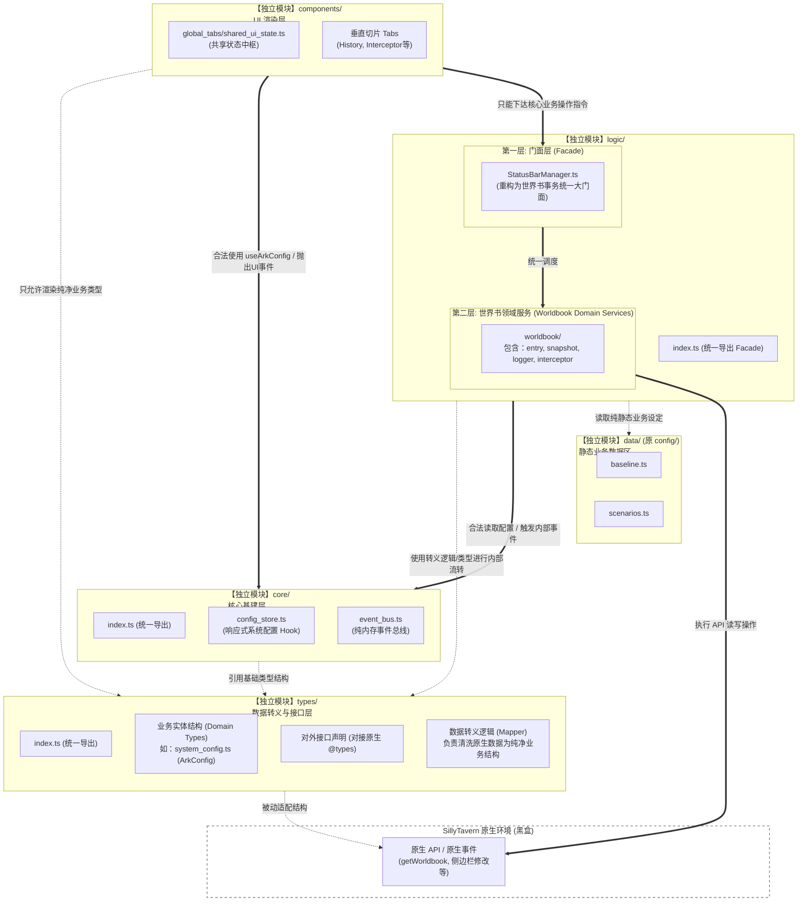

# 07 前端平级模块化与数据防线架构升级 (07_frontend_flat_modular_architecture.md)

## 1. 架构演进背景与核心痛点

本项目经历了从“单体巨石 JS”到“Vue 微后端垂直切片”的演进。然而，在初步拆分后，系统暴露出了三个亟待解决的深层架构问题，如果不加以规范，将导致未来项目扩展时重新陷入“意大利面条代码”的泥潭：

1.  **数据结构的严重污染（缺少防腐层）**：
    前端 UI（如 `Shared UI State`）和业务逻辑（`logic/`）直接且广泛地使用了酒馆宿主环境的原生裸数据结构（如 `WorldbookEntry` 甚至 `any`）。一旦原生 API 发生变动，整个前端渲染层将大面积崩溃。目前在 `shared_ui_state.ts` 和 `entry_service.ts` 中仍然随处可见对 `any` 类型的断言，这随时是一颗定时炸弹。
2.  **核心基建（Core）的定位模糊**：
    纯内存的事件总线（`event_bus.ts`）与响应式状态配置（`config_store.ts`）被嵌套在 `logic/core/` 下，导致业务逻辑与系统基建产生了物理上的隶属关系。同时，包含宿主环境写库副作用的 `logger.ts` 也混入其中，破坏了基建层的纯净性。
3.  **单点门面（Facade）的臃肿化与职责涣散**：
    原本设计的 `StatusBarManager` 试图包揽所有的逻辑入口。但实际上，无论是快照、拦截器、logger 还是开局调整，它们**本质上都是在与世界书打交道**。这些逻辑散落在四处，缺乏一个统一的“世界书领域”收束点。

为了彻底解决上述复杂度失控问题，确立了**“平级模块化（Flat Modularization）”**、**“接口防腐契约（Interface ACL）”**以及**“万法归宗世界书（Domain Convergence）”**作为本次架构升级的核心指导思想。

---

## 2. 目标架构蓝图与依赖关系规范

本次架构重构摒弃了僵化的垂直隶属关系，将核心功能提升为**五个平级的顶级独立模块**。各模块之间通过明确的依赖箭头（`import` 流向）进行交互，严禁循环依赖和越级污染。

### 2.1 系统架构与协作关系图 (System Architecture Topology)



---

## 3. 功能扩展协作规范与代码示例 (Extension Guide & Examples)

为了验证本架构的扩展性，并指导未来的协作开发，以下提供具体新增功能的协作示例及现有架构的不足分析。

### 3.1 扩展示例：新增“一键导出所有报错日志为本地文件”功能

假设我们需要在 `SettingsTab.vue` 中添加一个按钮，下载当前系统所有的报错记录。依据平级模块化架构，开发流程如下：

1.  **契约层 (Types) 定义**：
    在 `types/domain_models.ts` 中定义独立的数据结构，防止 UI 直接接触后端原生日志格式：
    ```typescript
    export interface ExportedLogFile {
        fileName: string;
        blobData: Blob;
    }
    ```
2.  **核心基建层 (Core) 调用**：
    此功能**不需要**修改 `core/` 下的 `config_store.ts` 或 `event_bus.ts`，因为这是纯业务逻辑，不属于基建。
3.  **服务层 (Service) 实现**：
    在 `logic/worldbook/logger_service.ts` (已从 core 移入) 中增加具体的组装逻辑，并将其转化为契约定义的结构返回：
    ```typescript
    // logic/worldbook/logger_service.ts
    export class LoggerService {
        // ... 原有逻辑
        public generateLogExport(): ExportedLogFile {
            const dataStr = JSON.stringify(this.debugLogQueue, null, 2);
            return {
                fileName: `ARK_LOG_${Date.now()}.json`,
                blobData: new Blob([dataStr], { type: 'application/json' })
            };
        }
    }
    ```
4.  **门面层 (Facade) 暴露**：
    在第一层入口 `logic/StatusBarManager.ts` 中增加桥接方法：
    ```typescript
    // logic/StatusBarManager.ts
    public exportSystemLogs(): ExportedLogFile {
        // 调度具体的服务执行
        return this.worldbook.logger.generateLogExport(); 
    }
    ```
5.  **前端组件 (UI) 调用**：
    `SettingsTab.vue` 导入门面执行指令，并**使用契约中定义的类型**处理结果，与底层彻底解耦：
    ```typescript
    // components/global_tabs/settings/SettingsTab.vue
    import { StatusBarManager } from '../../../logic/statusbar_manager';
    import type { ExportedLogFile } from '../../../types/domain_models';

    const downloadLogs = () => {
        const result: ExportedLogFile = StatusBarManager.getInstance().exportSystemLogs();
        // 执行浏览器原生下载逻辑...
    };
    ```

### 3.2 现有架构的不足反思与下一阶段的务实重构 (Architecture Deficiencies & Pragmatic Evolution)

结合目前项目的实际代码（例如 `shared_ui_state.ts`、`entry_service.ts` 和 `StatusBarManager.ts`），我们依然存在以下致命的结构性问题，亟需在下一阶段根除。
**注意：本阶段坚决抵制任何为了“解耦”而滥用 `implements` 或重度依赖注入的过度设计，一切以消灭 `any` 幻觉和厘清职责为核心。**

*   **毒瘤一：数据转译层 (Translation Layer) 缺失与 `any` 泛滥**
    *   **现状**：目前系统从酒馆（SillyTavern）底层拉取的原生数据（如 `WorldbookEntry`）直接流窜到了我们的 Vue 组件和缓存中。不仅导致了大量的 `any` 断言（如 `(entry as any).strategy`），更是让大模型在写代码时频频陷入“幻觉”，凭空捏造酒馆不存在的属性。
    *   **务实解决规划（防线建设）**：
        1.  **契约先行**：在 `types/` 目录下（如 `types/domain_models.ts`），使用 `export interface` 或 `type` 严格定义我们内部业务所需的**纯净数据结构**（例如 `ArkWorldbookEntry`）。这不仅仅是数据定义，更是强迫未来的大模型和开发者在编写业务前，**必须先查阅并遵循这份 API 文档**，彻底规避幻觉。
        2.  **强制转译（Translation）**：在 `logic/` 的业务入口处（如 `entry_service` 获取数据后），**必须通过转译器（Mapper）将原生脏数据转化为内部 `interface` 定义的结构**。所有内部流转的数据必须是纯净的。如果底层事件（如 `world_info_activated`）也传递了数据，同样先过一遍转译层。

*   **毒瘤二：Facade（门面）的畸形与职责越界**
    *   **现状**：目前的 `StatusBarManager.ts` 名为门面，实则在 `init()` 方法中塞满了一百多行关于 `GENERATION_ENDED` 恢复临时屏蔽条目、校验 Baseline 的原生事件监听与业务逻辑。它既当“前台”，又干着“保安”和“后勤”的脏活，导致每次添加新业务都会让门面迅速膨胀。
    *   **务实解决规划（职责剥离）**：
        1.  **门面绝对纯净化**：`StatusBarManager` 必须彻底退化为一个**毫无具体业务逻辑的 API 路由集线器**。它内部只负责 `import` 各个独立的 Service，并通过自身实例将其方法暴露出去（如 `manager.worldbook.xxx()`）。
        2.  **抽离世界书原生事件监听组件 (Worldbook Event Automator)**：将那些暗中监控酒馆聊天进度、生成状态并自动修改世界书数据的逻辑，全部抽离到一个专门的 `logic/worldbook/worldbook_automator.ts` (或其他命名) 中。门面在初始化时，只需调用一句 `automator.startWatching()` 即可。

### 3.3 新增功能的标准规范步骤 (Standard Operating Procedure for New Features)

在明确了上述的转译层与门面职责后，未来任何 Agent 在本架构下新增功能（不论是简单的按钮还是庞大的 Story Engine V2），**必须严格遵循以下步骤顺序，禁止跳步：**

1.  **【定义数据结构 (Define Data Contracts)】**：
    *   **动作**：首先在 `types/` 目录下的相关 `.ts`（或 `.d.ts`）文件中，用 `export interface` / `type` 定义好该功能涉及的输入参数、返回结果或核心实体结构。
    *   **目的**：这就是该功能的“白皮书”与 API 文档。强制让所有协作者（包括大模型）在动工前明确数据长什么样，消灭后续的 `any` 猜测。
2.  **【编写底层业务服务 (Implement Logic Services)】**：
    *   **动作**：在 `logic/` 下新建或修改对应的 `xxx_service.ts`。在其中实现具体的业务逻辑。
    *   **核心法则**：**如果该服务需要读取或修改酒馆宿主的底层数据，必须在这里调用转译层（Mapper）**，确保流向内部系统的数据符合第 1 步定义的契约结构。
3.  **【如有需要，注册专属监听器 (Register Automators)】**：
    *   **动作**：如果新功能需要长期潜伏监听酒馆的原生事件（如等待某次生成结束），请将其封装在类似 `worldbook_automator.ts` 的独立监听组件中，**绝不允许直接塞入门面 (`StatusBarManager`) 中**。
4.  **【暴露至纯净门面 (Expose to Facade)】**：
    *   **动作**：在 `StatusBarManager.ts` (或其包含的子 Facade 类) 中，极其简短地调用第 2 步中编写的 Service 方法。门面不含 `for` 循环，不含 `if` 判断。
5.  **【前端组件消费 (Consume in UI)】**：
    *   **动作**：Vue 组件仅仅 `import { manager }`，调用门面的方法，或者从 `shared_ui_state` 获取早已转译好的纯净数据进行渲染。UI 层的脚本必须极度轻薄。

---

## 4. 实施重构的涉及文件、工作量与风险预案

本次重构旨在**消除架构模糊地带**，不涉及业务逻辑的重写，仅做物理移位、门面拆分和数据类型的映射防腐。预计修改代码行数约 300 行（主要是 `import` 路径修复）。

### 4.1 核心物理重构指令
1.  **`types/` 模块防腐隔离**：
    *   **涉及文件**: 新增 `types/` 目录；移动 `config/system_config.ts` $\rightarrow$ `types/system_config.ts`；修改 `logic/worldbook/entry_service.ts` 和 `shared_ui_state.ts`。
    *   **动作**: 引入 `ArkStatusEntry` 等领域契约，在 Service 层增补 `Mapper` 拦截清洗逻辑，使 UI 层只使用纯净类型。
2.  **`core/` 基建的去层级化与纯净保障**：
    *   **涉及文件**: 提升 `logic/core/` $\rightarrow$ `core/`；移动 `logic/core/logger.ts` $\rightarrow$ `logic/worldbook/logger.ts`。
    *   **动作**: 保证 Core 的绝对无副作用性。
3.  **`logic/` 的“世界书万法归宗”整合**：
    *   **涉及文件**: 移动 `logic/interceptor/` $\rightarrow$ `logic/worldbook/interceptor/`；整合原 `StatusBarManager` 的调度代码。
    *   **动作**: 将快照、拦截、开局、日志等一切操作世界书的业务，全部收敛为第二层底层服务，并由第一层的 `StatusBarManager` 统一代理对外。
4.  **静态数据区降级为 `data/`**：
    *   **涉及文件**: 重命名 `config/` $\rightarrow$ `data/`（包含 `baseline.ts` 等）。
    *   **动作**: 明确其纯静态数据地位，仅供 `logic/` 单向读取。

### 4.2 预计风险与可能解决方向 (Risks & Mitigations)
1.  **风险：大规模 `import` 路径断裂 (构建失败)**
    *   **原因**：物理目录的横向移动和提升会导致全项目近半数文件的引入路径出错。上次的小移位导致了长达一天的大修。
    *   **解决方向**：利用 `index.ts` 桶导出 (Barrel pattern)。在每个顶层目录（如 `core/index.ts`, `types/index.ts`）统一收口。全局执行自动路径修复脚本或严格使用 IDE 重构工具。
2.  **风险：UI 模板中的属性报错**
    *   **原因**：重构 DTO 后，Vue 组件可能还在使用原生的 `entry.keys` 或 `entry.strategy.type` 进行渲染或判断。
    *   **解决方向**：在重构的第 1 步，必须使用 TypeScript 严格校验整个 `components/` 目录。在 `Mapper` 中，保留 UI 渲染绝对需要的字段，遇到飘红的模板，直接将渲染逻辑修改为对接新契约的字段。
3.  **风险：模块初始化时序死锁 (Initialization Storm)**
    *   **原因**：原先由于嵌套在 `logic` 内部，初始化加载顺序是隐式的。平级拆分后，`Core` 的配置可能尚未加载完毕，`Logic` 的日志服务就试图去写库。
    *   **解决方向**：赋予第一层门面（`StatusBarManager`）作为总编排器 (Orchestrator) 的权力。必须明确使用 `await core.configStore.init()` 确保基建就绪后，再拉起后续服务的初始化。