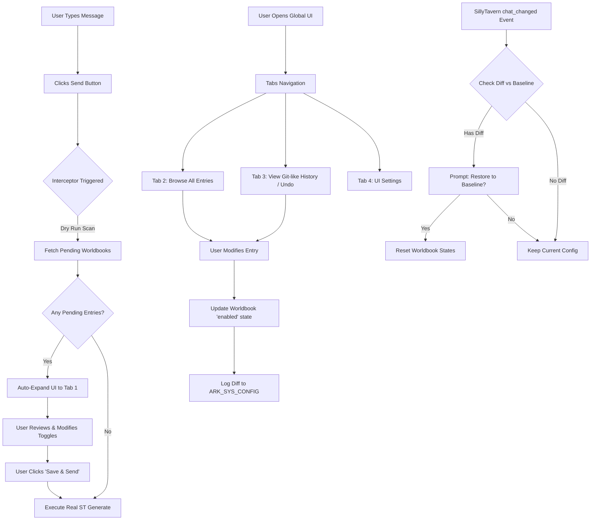

# Phase 1 Addition - 项目规划 (Master Plan)

## 0. 考古报告 (Archaeological Report)
### 1. 鸣潮参考项目学习 (`references/参考_鸣潮剧情卡/`)
- **架构**: 采用基于 Zod schema 的 MVU (MagVarUpdate) 模型防偏离。
- **预加载优化 (Prefetch)**: 在系统提示词中使用 `should_scan: true` 配合 `position: 'none'`，实现了零 Token 消耗的“绿灯”世界书激活机制。
- **现实扭曲 (Prompt Injection)**: 用户通过前端 UI 面板干涉 MVU 变量，再通过 `injectPrompts` 接口，向大模型注入最高优先级的强制设定提示词，驱动剧情发展。
- **动态词条控制**: 包含一套针对角色的 `[Pro]` 和 `[Lite]` 词条切换策略，有效降低 Token 消耗。

### 2. 当前项目状况 (`src/ARK_STATUSBAR/`)
- **UI 组件臃肿**: 现有 `StartupNavigator.vue` (挂载在 `mesid=0` 处) 是一个包含全部逻辑的巨大单体文件，未发挥 Vue 优势。
- **配置硬编码**: `BASELINE_STATE` 等世界书配置写死在 TS 中，使用 `localStorage` 存储偏好设置，难以长期维护与存档同步。
- **遗留 Bug**: 存在开局预设触发不正确及 UI 文本错误等问题。

---

## 一、 需求全面深化 (Requirements Deep Dive)

### 1. 核心目标 (Core Objectives)
构建一个**新增的全局剧情/世界书状态栏 (MVP)**，方便用户全局控制世界书并修复现有 UI 的遗留问题：
1. **全局可用性**：作为可拖拽的浮动窗口，随时可唤出，独立于 `mesid=0`。
2. **状态可视化**：简明扼要地展示当前被触发的世界书条目、剧情节点等状态。
3. **强大的调试与控制菜单**：提供直观的 UI，让用户（如博士）能够精细控制特定世界书的开启、强制触发或彻底屏蔽。
4. **数据持久化重构**：弃用 `localStorage`，将 UI 样式偏好、功能状态等直接写入系统级世界书条目（或特定 MVU 变量）中，实现跟随存档保存的持久化。
5. **遗留 Bug 修复**：保持现有开局 UI (`StartupNavigator.vue`) 的外观样式与功能逻辑不变，仅修复其文本错误与预设触发逻辑不正确的问题，并将配置文件从 ts 中解耦。

### 2. 功能清单与验收标准
- [ ] **全局浮动窗口**：新增可拖动、可折叠、不干扰阅读的全局悬浮 UI。
- [ ] **状态展示面板**：实时获取并渲染当前处于激活状态的世界书列表（含剧情名、角色在场情况等）。
- [ ] **世界书控制/调试台**：通过该面板，用户可以对世界书执行“强制开启”、“允许触发”、“禁止触发” 等操作。
- [ ] **生成拦截器 (PoC 重点)**：提供拦截机制，当 AI 准备生成回复并拼装提示词时，暂停发送流程，将收集到的“即将触发的世界书列表”交由用户审核，审核通过后才继续发往大模型。
- [ ] **操作回溯机制 (PoC 重点)**：对世界书的修改进行日志记录，并支持逐级 Undo（撤销）或恢复到基准线 (Baseline)。
- [ ] **原开局 UI 修复与逻辑加固**：
  - 修复开局预设触发不正确及部分文本错误，同时将其中的硬编码 config 移出 ts。
  - **核心匹配逻辑优化**：弃用之前通过条目“注释/名称(comment/name)”进行精准匹配的脆弱逻辑，改为匹配世界书条目的**主关键字 (primary keyword / keys)**。以增强鲁棒性，防止因为贡献者手滑写错一个标点符号（其实是省略的条目的名称）导致整个条目无法被预设激活。

---

## 二、 业务逻辑与系统架构设计 (Master Architecture)

### 1. UI 架构设计 (极简交互模式)
- **开局 UI (`StartupNavigator.vue`) 补充**：
  - 新增一个总控开关按钮：用于全局开启/关闭“世界书管理系统”（预检拦截及悬浮窗）。
  - **宿主环境整合**：尝试向酒馆原生界面的底栏（或扩展区）注入一个快捷唤醒/开关按钮，方便用户全局控制。
- **全局状态栏 (`GlobalStatusBar`)**：采用“平时克制，用时展开”的交互。
  - **常态（微缩模式）**：长期静默显示当前（或上一轮）被真实触发的“绿灯”（条件触发）世界书条目。
  - **主动展开（次级菜单）**：类似“标签页”风格的宽敞管理界面：
    - **Tab 1: 拦截预警 (重点)**：负责展示上一轮被触发的绿灯条目。当触发预检拦截时，此面板将自动展开并单独高亮当前这轮即将触发的条目供用户管理（禁用/放行）。面板内提供**【关闭发送预检拦截】**的快捷开关按钮。
    - **Tab 2: 全部条目**：浏览所有世界书条目的状态（区分“绿灯可触发”与“蓝灯常开”），并将近期触发的绿灯条目置顶。
    - **Tab 3: 更新记录 (Git历史)**：翻页显示用户做出的更改（简易 Git 记录）。
    - **Tab 4: 偏好设置**：设置 UI 样式，需与开局 UI 风格同步。此处同样提供【关闭发送预检拦截】的总开关。
  - **拦截展开（核心流程）**：当用户点击“发送消息”时，触发无痕预检（PoC 1.5）。如果检测到即将触发条目且未关闭拦截功能，UI 自动展开切换到 Tab 1。用户保存设置后再真实放行。
  - **移动端响应式设计**：必须保证悬浮窗本身足够小巧，展开后的管理面板能够向下兼容较窄的手机屏幕比例（例如采用侧边滑出或者底部弹起的 Drawer 模式，可参考现有 UI 的自适应规范）。

### 2. 世界书状态管理控制流 (简易 Git 机制)
为了彻底解决“开局冲突”和“跨对话脏数据污染”的痛点，我们将世界书的管理全面升级为一套**简易 Git 工作流**：
- **`BASELINE_STATE` (Commit 0 / `master` 基准线)**：
  这是世界书最原始、最干净的状态。
- **开局预设 (Initial Commit)**：
  当用户在 `StartupNavigator` 中点击某个开局预设时，不再只是盲目修改开关，而是**记录一条名为 `[Apply Scenario: XYZ]` 的 Commit 记录到 `[ARK_SYS_CONFIG]` 的历史栈中**，其中包含了预设带来的批量开启/关闭动作。
- **手动干预 (Subsequent Commits)**：
  在预检拦截或全局管理 UI 中，用户手动禁用或放行特定词条，也会追加为单独的 Commit 记录（如 `[User Disabled: 年]`）。
- **聊天切换防残留 (Reset `--hard`)**：
  监听酒馆的 `chat_changed` 事件（涵盖关闭、新建、切换聊天）。如果此时检测到 `[ARK_SYS_CONFIG]` 中存在 Commit 历史记录（即世界书被“弄脏”了），则主动弹出提示：“检测到当前世界书带有开局剧情或手动修改的残余状态。为防止剧情串台，是否一键还原至初始状态？”
  - 若用户确认，则**清空历史记录栈，并将所有词条重置回 `BASELINE_STATE`**。
- **简易操作撤销 (Revert)**：
  在 UI 的 Tab 3（更新记录）窗口中，用户可以翻页查看上述的历史栈，并支持一键回滚最近的 Commit，消除错误操作。

### 3. MVU 与业务解耦（防雷针）
- **明确边界**：吸取前期由于深度干预 MVU 导致“运行时序混乱与初始化风暴”的教训，Phase 1 的世界书管理系统必须在逻辑上**完全独立于 MVU 的变量更新生命周期**。我们只监听酒馆的发送动作和渲染世界书，绝对不主动去读取、修改 `[InitVar]` 或复杂的事件派发器，严防时序竞态。

### 4. 核心控制流 (Mermaid)

---

## 三、 待先行测试内容列表 (PoC List)

遵循 SOP 原则：“涉及酒馆宿主环境的新功能，必须先写独立的 `poc_*.ts` 进行验证并出具勘探报告”。

### PoC 1: 世界书拦截与暂停机制 (`poc_interceptor.js`)
- **目标**：在酒馆向大模型发送请求之前，获取即将被拼接进提示词的世界书条目列表，并能暂停发送流程等待用户确认。
- **难点**：酒馆原生事件可能无法异步阻塞。
- **测试方案**：
  1. 劫持原生界面的发送按钮（`#send_textarea` 旁的按钮）及回车键，在捕获阶段（`capture: true`）拦截事件。
  2. 确认无误后，临时解绑拦截器，模拟原生点击继续执行生成。
- **测试结果（2026-03-04）**：**成功**。
  - *原生事件阻塞法* 失败，酒馆引擎不会等待 `GENERATE_BEFORE_COMBINE_PROMPTS`。
  - *UI物理劫持法* 完美生效，成功拦截了发送流程并弹窗，放行后正常生成。
  - 通过监听 `WORLD_INFO_ACTIVATED` 成功获取到了触发的词条详情，明确了 `e.comment` 存储人类可读的名称，`e.uid` 和 `e.world` 可用于精准溯源和修改。

### PoC 1.5: 世界书拦截与暂停机制升级（提前预检，Dry Run） (`poc_dryrun_worldinfo.js`)
- **目标**：在真正的世界书被拼接并激活前，甚至在用户点击发送之前，即可通过 `getWorldInfoPrompt` 函数检测将要被激活的词条，做到“未卜先知”。
- **难点**：`getWorldInfoPrompt` 的 `is_dry_run=true` 模式不会触发 `world_info_activated` 事件，导致无法拿到具体的词条名（只有一段拼接好的文本）。
- **测试方案**：
  将 `getContext().getWorldInfoPrompt(chat, maxContext, isDryRun)` 中的 `isDryRun` 设为 `false`，传入 `[...历史记录, 当前输入文本]`，监听 `world_info_activated` 事件以截获词条列表。
- **测试结果（2026-03-04）**：**大成功**。
  - 能够完美拦截到即将触发的世界书条目详情，包含 `uid` 和 `comment`，且由于这是单向的Prompt查询，并不会触发 LLM 生成，实现了真正的无痕预检。
  - **避坑点**：传递给 `getWorldInfoPrompt` 的 `maxContext` 必须设置得足够大（例如与系统真实 `maxContext` 保持一致，如 `100000`），否则如果历史记录过长，酒馆会直接将最新的输入文本截断（或达到了条目触发上限），导致反而漏扫了最新输入触发的词条（例如仅扫出了“凯尔希”而漏掉了“年”和“夕”）。
  - **应用结论**：结合前面的 UI 劫持，我们在用户打字时或点击发送后立刻做一次高 `maxContext` 的无痕查询，把所有触发的雷点全展示在状态栏中让用户审查，确认后再真实放行。

### PoC 2: 修改回溯与持久化存储 (`poc_persistence.js`)
- **目标**：记录对世界书的修改，并实现撤销；将 UI 设置保存进世界书，脱离 localStorage。
- **测试方案**：
  1. 尝试使用 `@types/function/worldbook.d.ts` 中的 `getCharWorldbookNames` 和 `getWorldbook` 获取当前活跃世界书。
  2. 尝试查找或创建一个名为 `[ARK_SYS_CONFIG]` 的世界书条目。
  3. 将 JSON 配置（如 `theme`, `hiddenEntries`）转为字符串存入该条目的 `content` 中，并使用 `updateWorldbookWith` 保存。
- **测试结果（2026-03-04）**：**测试通过**。
  - 完全不需要编造外部函数，利用原生辅助 API 即可直接读写指定世界书。
  - 创建条目、写入 JSON 以及读取 JSON 解析均成功执行。
  - 可以把该条目的 `enabled` 固定设为 `false`，确保它纯粹作为我们的“隐藏数据库”存在，不干扰大模型生成。

### PoC 3: Vue 根节点全局挂载 (`poc_mount.ts` - 评估后认为非必要)
- **目标**：新增的全局状态栏不应依附于特定聊天楼层 (`mesid=0`)，而应在 iframe 的全局层级。
- **当前决策**：由于早期逻辑需要“挂载在最新聊天楼层”以防止丢失，现在如果我们挂载在全局层（如 `body` 下），需要确保在**切换角色卡**或**脚本关闭**时，能够自动注销 Vue 实例并移除 DOM 节点，避免“僵尸 UI”残留。由于这一步在真实开发中直接利用 Vue 的 `onUnmounted` 或在主入口中控制 `app.unmount()` 即可实现，无需单独进行独立脚本 PoC 测试。

### PoC 5: 聊天切换状态追踪与基准线恢复 (`poc_chat_changed.js`)
- **目标**：监听 `chat_changed` 事件，通过比较当前世界书状态与 `BASELINE_STATE` 的差异，弹出弹窗询问用户是否重置。
- **难点**：`chat_changed` 会在“关闭聊天”、“切换聊天”、“创建新聊天”、“切换角色卡”等多种场景下触发，极易引发重复触发或在脚本卸载时产生空指针/报错。
- **测试结果（2026-03-04）**：**发现严重阻塞机制**。
  - **大坑**：在 `chat_changed` 触发期间直接调用同步的 `confirm()` 弹窗并修改世界书，会**阻塞并导致酒馆的聊天加载进程彻底失败**。
  - **解决方案**：放弃使用原生的 `confirm()` 阻塞弹窗。改为监听 `tavern_events.CHAT_CHANGED` 事件后，仅仅在后台计算 Diff。如果发现差异，则在我们的 Vue 全局状态栏（或通过无阻塞的 Toastr / 自定义弹窗）显示一条醒目的“【恢复初始状态】”横幅提示，由用户手动点击触发恢复，彻底解耦时序冲突。

### PoC 6: 酒馆原生扩展按钮注入测试 (`poc_extension_buttons.js`)
- **目标**：不使用纯前端的 DOM 强插，而是寻找 `@types` 提供的原生 API，将“世界书状态栏”唤醒按钮注册到酒馆的某个原生界面区域。
- **测试结果（2026-03-04）**：**测试通过**。
  - 成功利用 TavernHelper 提供的 `appendInexistentScriptButtons` 注册了原生脚本按钮。
  - 通过 `getButtonEvent` 获取事件名并结合 `eventOn` 实现了点击唤醒功能。
  - 明确了事件监听的最佳实践：在正规脚本环境中使用 `eventOn(tavern_events.XXX, ...)`，TavernHelper 会在脚本卸载时自动帮我们清理内存，免去手动 `removeEventListener` 的烦恼。

---

## 四、 阶段划分与开发行动计划 (Detail Design Checklist)
1. **规划与考古阶段 (当前)**：生成此 `plan.md`，提交考古报告与宏观设计。
2. **环境勘探 (PoC 验证)**：
   - 编写 `poc_interceptor.ts` 并在控制台测试拦截发送行为。
   - 编写 `poc_persistence.ts` 验证系统世界书读写与撤销栈逻辑。
   - 编写 `poc_mount.ts` 验证全局挂载。
   - *（所有 PoC 结果需输出勘探报告供确认后才能进入正式代码编写）*
3. **原有 UI 修复与模块化**：在不动原有样式前提下，剥离 TS 配置并修复 Bug。
4. **全局状态栏开发**：依据伪代码实现 `GlobalStatusBarApp.vue` 及其子组件。
5. **整合测试**：结合 `poc` 的成功路径，整合功能并测试兼容性。
6. **合规发布**：按 Git 标准提交。

---

## 五、 MVP 反馈与 v2 迭代规划 (Feedback & Iteration)
*(基于 2026-03-05 用户测试反馈)*

### 1. UI 交互体验升级
- **可拖拽支持**：全局 UI 需要支持鼠标拖拽，移动端支持长按后拖拽。
- **常态迷你模式 (Mini Mode)**：全局 UI 应当默认常开，但在闲置或非焦点状态下，收缩为仅显示“拦截预警/历史状态”的极简模式。该模式下仅排列最近一次扫描时世界书的开启状态，并且文本要足够小、界面足够紧凑，彻底避免遮挡酒馆正文。
- **UI 主题融合**：开局 UI 和全局 UI 共用一套主题系统。增加一个“透明主题”，并统一默认主题为白色（light），总计三个预设（默认白、夜间黑、透明），并在小全局 UI 中实现统一管理。
- **自适应控制面板**：在设置里提供字体大小和窗体宽度的滑块/选项，方便不同设备（特别是移动端）用户自由调整，防止阻挡或看不清。

### 2. 系统启停与预检拦截控制
- **系统总控 (TavernHelper 扩展按钮)**：酒馆底栏处的按钮 **不仅是用于控制 UI 的显示，而是状态栏功能的总开关**。一旦在此处关闭，全局 UI 将彻底销毁，预检拦截器也同时注销。
- **UI 折叠按钮**：UI 本身的“展开/迷你”状态切换应通过 UI 界面上的一个独立小按钮来完成。
- **拦截器状态展示**：在“拦截预警”Tab 中，顶部额外增加一个“拦截器开关”方便控制（与设置页面同步）。拦截词条放行与否的按钮取消繁琐的文本，改为极简的“✅”和“❎”。

### 3. 全部条目管理 (All Entries Tab) 强化
- **搜索与筛选栏**：在头部增加文字检索输入框，以及多维度的分类筛选标签：蓝灯/绿灯条目、禁用/开启条目、人物/非人物条目。
- **修改绿灯/蓝灯底层属性**：允许用户在 UI 中不仅能打开/关闭条目，还能一键切换其蓝灯/绿灯属性（真实地修改 `strategy.type` ），并且该动作必须纳入 Git 追踪系统。
- **统一操作区**：在搜索栏下方统一放置“恢复 Baseline”和“关闭单字干员”两个快捷操作按钮，并在设置页保持同步。

### 4. Git 追踪系统补全
- **全行为覆盖**：确保用户在开局 UI 点击“应用预设”的动作也能精确推入到 Git 的历史记录栈中。
- **操作回滚 (Revert)**：在 Git 历史记录界面，给每一项追踪到的“世界书修改动作”添加回滚按钮。点击时需弹出明确的“是否确认回退到该步骤前”的提示框，确认后真实逆向修改世界书条目状态。

### 5. 开局 UI (`StartupNavigator.vue`) 功能更新
- **侧栏信息升级**：侧栏 `system_status` 显示区应该能具体展示与 Baseline 的差异，或者提供基础的 Git 历史概览（视空间而定）。
- **总控入口同步**：同样在开局 UI 侧栏增加全局 UI 及其功能（含拦截器）的启停总开关。
- **文案修改**：更新世界书管理提示文本以符合当下的新功能架构。

### 6. Baseline 工具重构与分离 (`generate_baseline.mjs`)
- 将生成脚本移动到 `src/ARK_STATUSBAR/tools/` 统一管理。
- **功能扩充**：分析 `references/tools/昨夜圆车.yaml` 导出格式，工具需要能够提取并保存条目的“蓝绿灯属性”和“开启/关闭属性”到生成的 baseline 字典中。
- **条目分类识别方案 (新共识)**：经与世界书维护者沟通，后续的世界书条目名称将采用前缀标签的形式进行规范（如 `[角色]阿米娅`、`[设定]源石`、`[国家]维多利亚`、`[组织]罗德岛` 等）。因此，生成工具不再需要手动维护“排除名单数组”，而是直接通过正则提取条目的前缀标签，作为 `category` 分类字段保存至 Baseline 中，供前端“全部条目”页面的高级筛选功能使用。

### 7. 系统配置条目名称与匹配逻辑优化
- **顶层配置化**：将持久化保存配置的系统级世界书条目名称提取为常量方便修改。例如使用完整名称 `[SYS_CONFIG]系统配置文件请勿打开` 进行条目创建。
- **模糊匹配检索**：在脚本读取配置时，只需正则匹配或检测条目名称是否以 `[SYS_CONFIG]` 开头即可识别该系统条目，增加容错性。
- **硬编码默认配置**：在代码内部硬编码一套初始的系统配置（包含默认主题、默认开关等），在缺失系统条目时直接使用该默认状态并在首次修改时再执行创建，或在创建时写入该默认状态。