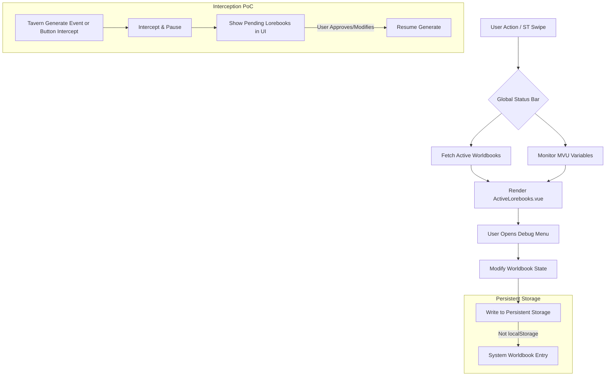

# Phase 1 Addition - 项目规划 (Master Plan)

## 0. 考古报告 (Archaeological Report)
### 1. 鸣潮参考项目学习 (`references/参考_鸣潮剧情卡/`)
- **架构**: 采用基于 Zod schema 的 MVU (MagVarUpdate) 模型防偏离。
- **预加载优化 (Prefetch)**: 在系统提示词中使用 `should_scan: true` 配合 `position: 'none'`，实现了零 Token 消耗的“绿灯”世界书激活机制。
- **现实扭曲 (Prompt Injection)**: 用户通过前端 UI 面板干涉 MVU 变量，再通过 `injectPrompts` 接口，向大模型注入最高优先级的强制设定提示词，驱动剧情发展。
- **动态词条控制**: 包含一套针对角色的 `[Pro]` 和 `[Lite]` 词条切换策略，有效降低 Token 消耗。

### 2. 当前项目状况 (`src/ARK_STATUSBAR/`)
- **UI 组件臃肿**: 现有 `StartupNavigator.vue` (挂载在 `mesid=0` 处) 是一个包含全部逻辑的巨大单体文件，未发挥 Vue 优势。
- **配置硬编码**: `BASELINE_STATE` 等世界书配置写死在 TS 中，使用 `localStorage` 存储偏好设置，难以长期维护与存档同步。
- **遗留 Bug**: 存在开局预设触发不正确及 UI 文本错误等问题。

---

## 一、 需求全面深化 (Requirements Deep Dive)

### 1. 核心目标 (Core Objectives)
构建一个**新增的全局剧情/世界书状态栏 (MVP)**，方便用户全局控制世界书并修复现有 UI 的遗留问题：
1. **全局可用性**：作为可拖拽的浮动窗口，随时可唤出，独立于 `mesid=0`。
2. **状态可视化**：简明扼要地展示当前被触发的世界书条目、剧情节点等状态。
3. **强大的调试与控制菜单**：提供直观的 UI，让用户（如博士）能够精细控制特定世界书的开启、强制触发或彻底屏蔽。
4. **数据持久化重构**：弃用 `localStorage`，将 UI 样式偏好、功能状态等直接写入系统级世界书条目（或特定 MVU 变量）中，实现跟随存档保存的持久化。
5. **遗留 Bug 修复**：保持现有开局 UI (`StartupNavigator.vue`) 的外观样式与功能逻辑不变，仅修复其文本错误与预设触发逻辑不正确的问题，并将配置文件从 ts 中解耦。

### 2. 功能清单与验收标准
- [ ] **全局浮动窗口**：新增可拖动、可折叠、不干扰阅读的全局悬浮 UI。
- [ ] **状态展示面板**：实时获取并渲染当前处于激活状态的世界书列表（含剧情名、角色在场情况等）。
- [ ] **世界书控制/调试台**：通过该面板，用户可以对世界书执行“强制开启”、“允许触发”、“禁止触发” 等操作。
- [ ] **生成拦截器 (PoC 重点)**：提供拦截机制，当 AI 准备生成回复并拼装提示词时，暂停发送流程，将收集到的“即将触发的世界书列表”交由用户审核，审核通过后才继续发往大模型。
- [ ] **操作回溯机制 (PoC 重点)**：对世界书的修改进行日志记录，并支持逐级 Undo（撤销）或恢复到基准线 (Baseline)。
- [ ] **原开局 UI 修复**：修复开局预设触发不正确及部分文本错误，同时将其中的硬编码 config 移出 ts。

---

## 二、 业务逻辑与系统架构设计 (Master Architecture)

### 1. UI 架构
- **原有开局 UI** (`StartupNavigator.vue`)：保持外观不变。仅将其中可复用的按钮、样式逻辑进行模块化提取，修正预设相关的 Bug。
- **全局状态栏 (新增)**：新建 `src/ARK_STATUSBAR/components/GlobalStatusBar/` 目录：
  - `GlobalStatusBarApp.vue`：浮窗主容器（处理拖拽、折叠）。
  - `ActiveLorebooks.vue`：当前激活的世界书简略列表。
  - `DebugMenu.vue`：次级调试菜单，包含世界书单项开关。

### 2. 核心控制流

---

## 三、 待先行测试内容列表 (PoC List)

遵循 SOP 原则：“涉及酒馆宿主环境的新功能，必须先写独立的 `poc_*.ts` 进行验证并出具勘探报告”。

### PoC 1: 世界书拦截与暂停机制 (`poc_interceptor.js`)
- **目标**：在酒馆向大模型发送请求之前，获取即将被拼接进提示词的世界书条目列表，并能暂停发送流程等待用户确认。
- **难点**：酒馆原生事件可能无法异步阻塞。
- **测试方案**：
  1. 劫持原生界面的发送按钮（`#send_textarea` 旁的按钮）及回车键，在捕获阶段（`capture: true`）拦截事件。
  2. 确认无误后，临时解绑拦截器，模拟原生点击继续执行生成。
- **测试结果（2026-03-04）**：**成功**。
  - *原生事件阻塞法* 失败，酒馆引擎不会等待 `GENERATE_BEFORE_COMBINE_PROMPTS`。
  - *UI物理劫持法* 完美生效，成功拦截了发送流程并弹窗，放行后正常生成。
  - 通过监听 `WORLD_INFO_ACTIVATED` 成功获取到了触发的词条详情，明确了 `e.comment` 存储人类可读的名称，`e.uid` 和 `e.world` 可用于精准溯源和修改。

### PoC 1.5: 世界书拦截与暂停机制升级（提前预检，Dry Run） (`poc_dryrun_worldinfo.js`)
- **目标**：在真正的世界书被拼接并激活前，甚至在用户点击发送之前，即可通过 `getWorldInfoPrompt` 函数检测将要被激活的词条，做到“未卜先知”。
- **难点**：`getWorldInfoPrompt` 的 `is_dry_run=true` 模式不会触发 `world_info_activated` 事件，导致无法拿到具体的词条名（只有一段拼接好的文本）。
- **测试方案**：
  将 `getContext().getWorldInfoPrompt(chat, maxContext, isDryRun)` 中的 `isDryRun` 设为 `false`，传入 `[...历史记录, 当前输入文本]`，监听 `world_info_activated` 事件以截获词条列表。
- **测试结果（2026-03-04）**：**大成功**。
  - 能够完美拦截到即将触发的世界书条目详情，包含 `uid` 和 `comment`，且由于这是单向的Prompt查询，并不会触发 LLM 生成，实现了真正的无痕预检。
  - **避坑点**：传递给 `getWorldInfoPrompt` 的 `maxContext` 必须设置得足够大（例如与系统真实 `maxContext` 保持一致，如 `100000`），否则如果历史记录过长，酒馆会直接将最新的输入文本截断（或达到了条目触发上限），导致反而漏扫了最新输入触发的词条（例如仅扫出了“凯尔希”而漏掉了“年”和“夕”）。
  - **应用结论**：结合前面的 UI 劫持，我们在用户打字时或点击发送后立刻做一次高 `maxContext` 的无痕查询，把所有触发的雷点全展示在状态栏中让用户审查，确认后再真实放行。

### PoC 2: 修改回溯与持久化存储 (`poc_persistence.ts`)
- **目标**：记录对世界书的修改，并实现撤销；将 UI 设置保存进世界书，脱离 localStorage。
- **测试方案**：
  1. 创建一个名为 `[ARK_SYS_CONFIG]` 的特殊世界书条目，使用 JSON 格式读写这个条目内的文本，用于保存主题和历史记录栈。
  2. 尝试执行 `updateWorldbookWith` 并将变更压栈，验证是否能成功 Undo。

### PoC 3: Vue 根节点全局挂载 (`poc_mount.ts`)
- **目标**：新增的全局状态栏不应依附于特定聊天楼层 (`mesid=0`)，而应在 iframe 的全局层级。
- **测试方案**：验证新建 `div#ark-global-mount` 并挂载 Vue 实例，确保其在切换对话 (Swipe) 或加载新聊天时不会被清理或引发“初始化风暴”。

---

## 四、 阶段划分与开发行动计划 (Detail Design Checklist)
1. **规划与考古阶段 (当前)**：生成此 `plan.md`，提交考古报告与宏观设计。
2. **环境勘探 (PoC 验证)**：
   - 编写 `poc_interceptor.ts` 并在控制台测试拦截发送行为。
   - 编写 `poc_persistence.ts` 验证系统世界书读写与撤销栈逻辑。
   - 编写 `poc_mount.ts` 验证全局挂载。
   - *（所有 PoC 结果需输出勘探报告供确认后才能进入正式代码编写）*
3. **原有 UI 修复与模块化**：在不动原有样式前提下，剥离 TS 配置并修复 Bug。
4. **全局状态栏开发**：依据伪代码实现 `GlobalStatusBarApp.vue` 及其子组件。
5. **整合测试**：结合 `poc` 的成功路径，整合功能并测试兼容性。
6. **合规发布**：按 Git 标准提交。