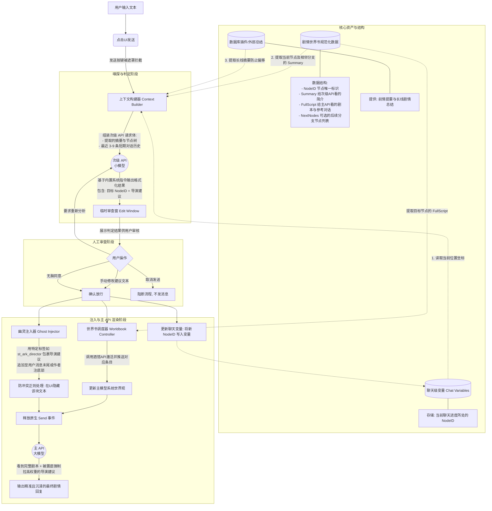

# 剧情模块 V2：双轨拦截器流水线 (Story Engine V2: Dual-Track Interceptor Pipeline)

## 1. 背景与痛点复盘

### 1.1 历史方案的局限性
*   **V1 (纯自动化)**：尝试让主大模型单次请求中完成“剧情推进判断”、“事件发生逻辑分析”和“角色扮演”，导致注意力崩溃，剧情失控或格式错乱。
*   **V1.5 (MVU 深度绑定)**：利用 MVU 和提示词模板自动注入大量世界观新闻、角色记忆。导致提示词膨胀，5000行以上的项目逻辑最终崩塌，健壮性极差。
*   **社区方案 (思维链 + 手动切换世界书)**：用户利用特定的系统预设，强迫 AI 输出数百字的“思维链（CoT）”，然后再进行对话。效果尚可，但存在三个致命缺陷：
    1.  **门槛高/沉浸感差**：用户必须自行理解剧情节点的结构（幕、节点），并手动开关世界书条目。
    2.  **预设兼容性差**：思维链的触发强依赖系统提示词的插入位置，不同预设之间“水土不服”。
    3.  **主 API 负担依然沉重**：虽然有思维链，但大模型依然需要在庞大的“幕剧本”中大海捞针，寻找接下来该输出的句子。

### 1.2 其他方案（数据库插件，mvu）的启发
隔壁的异步填表插件通过“次级 API 调用”解决了长文段总结的问题，并利用次级调用修正剧情方向。
但因为其代码长达 20000 行且存在诸多不受控更新，我们拒绝将其作为底层依赖。但其核心思想（**主次模型分离**）值得借鉴。
而在具体的实现方法上，可以学习 MVU 的 API 运用和系统提示词（System Prompt）构建方法。

---

## 2. 核心业务逻辑：双轨拦截流水线 (Shadow Proxy Protocol)

为了跳出上述所有坑，我们设计了一套全新的剧情推进管线，核心原则是：**“将剧情逻辑判断的权力交给次级小模型，将演出的剧本精准投喂给主大模型，且中间允许人类作为导演进行微调（Edit Window）。”**

### 2.1 剧情数据规范化 (The Script Engine)
将目前社区散乱的 YAML 剧本进行规范化。
UI 上（世界书管理器新增 Tab），插件自动检测可用的剧情世界书。每个节点（Node，如 RI1、RI2）都独立存在，包含其自身的梗概、所需的前置条件和关联的后续节点。

**绝妙的“Skill”比喻**：
*   **次级 API（侦察兵）**：它在判别剧情走向时，**只看到所有剧情节点的名称（Name）和短简介（Summary）**，就像面对一个 Skill 列表。它根据最新的聊天记录和历史总结，决定“下一步该启用哪个 Skill（节点）”。
*   **主 API（演员）**：当次级 API 做出决定后，插件立刻将这个被选中的节点（及其必要的关联节点）的**完整内容**，精准投喂给主 API。这样，主 API 不需要去翻找整本厚厚的剧本，它拿到手的就是写着它下一句台词的小纸条。

### 2.2 三步走：流水线全貌 (The 3-Step Pipeline)

#### Step 1: 嗅探与拦截 (The Sniffer - 次级 API 调用)
1.  用户输入文本，点击【发送】。
2.  插件拦截该发送事件，中止主模型的生成。
3.  构建次级 API 的上下文：
    *   **保留**：最近若干条对话历史（提取关键信息）。
    *   **保留**：剧情走向的节点结构图（仅含名称和简介）。
    *   **联动（可选）**：如果检测到数据库插件，读取其上下文总结条目。
4.  调用小模型（如 Gemini Flash）。
5.  **输出要求（清单化思考）**：
    *   检查剧情是否偏移？当前所处的节点？
    *   给出对主模型的“导演建议”（例如：*目前已满足撤退条件，建议引导对话走向逃脱阶段，不可生硬强制玩家服从，给予玩家动作反应的空间。*）

#### Step 2: 人工审查与确认 (The Edit Window)
1.  次级 API 运算完毕后，**屏幕中央弹出一个临时窗口**。
2.  窗口显示次级 API 对接下来剧情走向的判断和给主 API 的建议。
3.  用户有三个选择：
    *   **同意**：无需修改，直接进入主模型生成。
    *   **修改**：用户充当最高导演，微调次级 API 给出的思路或目标。
    *   **重试/取消**：认为小模型胡言乱语，重新掷骰子或取消本次生成。

#### Step 3: 无痕注入与变量落盘 (The Injector & Main API)
当用户点击【确认】后：
1.  **状态写入**：将确定要前往的剧情节点坐标（如 `RI2`），写入**当前聊天的变量（Chat Variables）**中。绝不写入 `sys_config` 导致不同存档状态串线；也不强制塞入用户的文本里破坏界面美观。
2.  **剧本投喂**：根据刚才确认的节点，控制世界书启用对应的完整节点条目。
3.  **幽灵注入“思路”**：
    *   *难点*：若直接将次级 API 的思路写入用户消息（附带 HTML/JSON 标签），可能被数据库插件的 `<recall>` 等正则系统替换暴露在 UI 上，或被作为普通文本渲染，破坏沉浸感。
    *   *方案*：利用酒馆扩展 API，在主 API 请求的最终阶段，将这段“导演思路”临时作为系统提示或不可见的注入块推送到请求的最末端。这样既保证了绝对的注意力权重，又不会弄脏本地的聊天记录。
4.  主模型开始渲染，输出纯净的高质量扮演文本。

### 2.3 业务流程图 (Mermaid)

为了更直观地展示上述双轨拦截流水线，以下是整体业务流转的结构图。本图补充展示了各个阶段背后的核心数据资产（剧情世界书的结构、上下文的组合来源等）：

---

## 3. 待解决与需 PoC（概念验证）的技术细节清单

结合双轨架构与酒馆（SillyTavern）现有生态，以下是正式编码前必须攻克的 7 大技术难点及 PoC 验证方向：

### 3.1 数据库插件的联动与防碰撞 (DB Plugin Integration)
*   **难点**：如何检查其存在，并准确获取当前聊天的总结内容？
*   **PoC 方向**：
    1.  **API 嗅探**：查阅 `@types` 或 `window` 对象，看是否有数据库暴露的全局方法（优先）。
    2.  **暴力查找**：保底方案，遍历当前角色卡绑定的世界书，查找是否存在特定的由数据库生成的条目名称/UID。
    3.  **UI 降级**：最保底方案，在 UI 设置中提供一个“我已启用数据库插件”的手动 Toggle，并由用户手动选择总结条目。

### 3.2 剧情世界书的结构化设计 (Story Worldbook Structure)
*   **难点与社区现状 (Format Chaos)**：现存大量由纯文本或 YAML 编写的“幕 (Acts)”与“节点 (Nodes)”剧情，且**格式极度不统一**。部分剧本甚至缺失独立的“剧情发生逻辑”条目，还有部分剧本包含了“剧情专属人物条目”。如何将它们无损转换为本插件能理解的结构？
*   **PoC 方向**：
    1.  **定义严格且人类可读的标准化文本模板**：我们不能要求社区大伙手写枯燥的 JSON。必须提供一套简单、直观的 Markdown 或 YAML 格式作为标准 `ArkStoryNode` 模板，该结构需包含 `NodeID`、`Summary`、`FullScript`、`NextNodes` 以及可选的 `SpecialCharacters`（剧情专属人物条目引用）。人类只需按格式描写文字即可。
    2.  **开发归一化 Agent Skill (The Normalizer Skill)**：放弃用纯代码去兼容社区过去的野格式。我们将制作一个独立的 Agent Skill，专门让具备独立上下文的大模型读取社区过去散乱的剧情条目，理解其中的隐含逻辑（有些模糊的节点连线甚至需要人类先提供简单描述），然后将其转译、输出为上述的**标准化文本模板**，随后由插件轻松解析为供程序流转的内存对象（甚至是 Mermaid 等直观形式供小模型与 UI 读取）。
    3.  **次级 API 思维链的归宿**：明确思路是作为世界书条目存在，还是挂载在聊天变量中，或是直接隐身在消息文本中？
    4.  **兼容“手动模式”**：必须保留兼容当前社区手动切换的模式（即不拦截发送，仅提供 UI 辅助查询节点与思路生成功能，通过往用户消息中注入思维链实现原先效果/提供完整提示信息引导用户修改预设实现原有功能）。

### 3.3 上下文构建器与提示词工程 (Context Builder & Prompting)
*   **难点**：如何让次级 API（小模型）看懂现在的局势，并给出有价值的判断，而不是死板的强行跳转？
*   **PoC 方向**：
    1.  **系统提示词调优**：编写并测试专门针对 Gemini Flash 的 System Prompt。它需要清晰地理解“剧情节点树”、“近期对话历史”以及“前几轮的思路总结”。
    2.  **思路 (Thoughts) 的流转**：过去存放在思维链中的“剧情思路”，需要作为一种轻量级的总结，被抓取并合并到次级 API 的上下文中，帮助小模型连贯思考。
    3.  **保留 `<weizhi>` 显示**：次级 API 判定出的 `<weizhi>`（我在哪）数据，虽然在发送给大模型时被隐藏，但在 UI 界面上必须将其解析并长驻显示，以提醒用户当前剧情进度。（此处当然也可以显示silu而非weizhi，主要是想表达UI上要有持续显示上一轮次api的剧情思路信息的能力）

### 3.4 次级 API 的稳定调用机制 (Sub-API Invocation)
*   **难点**：独立于主对话外发起生成请求。
*   **PoC 方向**：深度学习现存 MVU 项目的源码，提炼其 `generateRaw` 或相关的无痕请求封装，解决认证、网络超时（`Promise.race` 防假死）、请求体组装等基础网络问题。

### 3.5 世界书激活与主模型上下文构建 (Main Model Context Injection)
*   **难点**：到底是“激活一整幕（粗放）”还是“精确注入单一节点（精细）”？
*   **PoC 方向**：
    1.  **方案 A（粗放激活）**：直接通过原生 API 开启“第一幕”的世界书条目。优点是简单、AI 有更多前后文可以发挥；缺点是冗余大。
    2.  **方案 B（精细注入）**：关闭剧情世界书的自动触发，完全由插件构建出“当前节点 + 前后关联节点”的文本串，利用特定的注入 API (`injectprompt` 等) 在生成前强行插入。优点是 Token 极度省，大模型严格遵循；缺点是极易出现排版 Bug，潜在技术风险大。需要在 PoC 中对比两者对模型输出质量的实际影响。

### 3.6 UI 界面的信息驻留 (UI Retention)
*   **难点**：保证“幽灵注入”的内容不被数据库插件的正则吃掉，同时不破坏聊天界面的美观。
*   **PoC 方向**：
    1.  **极致隐藏**：由于上一步的 `<weizhi>` 和次级 API 的“导演思路”可以在我们的【临时审查窗】确认后，长期保存在全局状态栏（GlobalStatusBar）的专属面板中供用户随时查阅。
    2.  **放权正则**：因此，我们可以毫无顾忌地编写极其严厉的正则替换规则，将用户消息中拼接的 `<st_ark_director>...</st_ark_director>` 整个块替换为空字符串（`display:none` 或干脆从 DOM 剥离），彻底解决界面污染。

### 3.7 变量的安全修改与轻量化数据流 (Safe Variable Flow)
*   **难点**：防呆防脱节。
*   **PoC 方向**：
    1.  **剥离 MVU 依赖**：学习 MVU 的底层逻辑，但不引入其庞大的 Zod Schema。
    2.  **明确存储目标**：我们要存的仅仅是“当前剧情状态坐标（NodeID）”或极少量核心标识（或者上一轮次级api的输出信息，可以作为某种备份）。
    3.  **调用测试**：查阅 `@types/function/variables.d.ts`，跑通简单的 `getVariables` 和 `replaceVariables` 测试，并验证其在用户 Swipe（重新生成）和切换聊天时的同步鲁棒性。

### 3.8 PoC 验证的修改目标 (Target Object)
*   **指定实验对象**：本次开发将严格以 `references\参考_主线第一章至第五章\主线剧情1-5` 的世界书文本作为最初的修改/转换对象。
*   **推进路线**：我们将从解析这套现有的 YAML/纯文本世界书开始，逐步测试“解析器 -> 插件状态机 -> 次级 API 调用与上下文构建”的闭环，最终实现首个 MVP（最小可行性产品）级别的剧情推演机。

---
**本文件创建于**：2026-03-21（分支创建初始文档）
**后续更新**：如有设计变更，请在本目录下新建文档或追加更新。