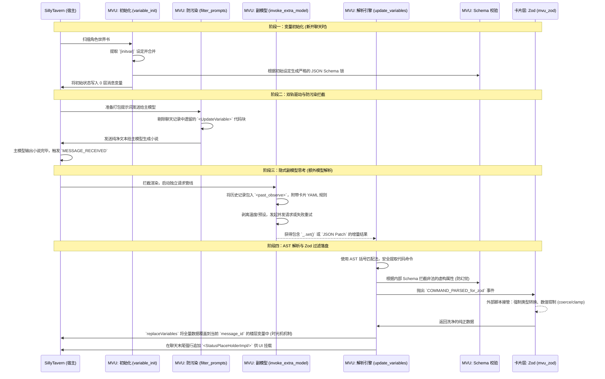
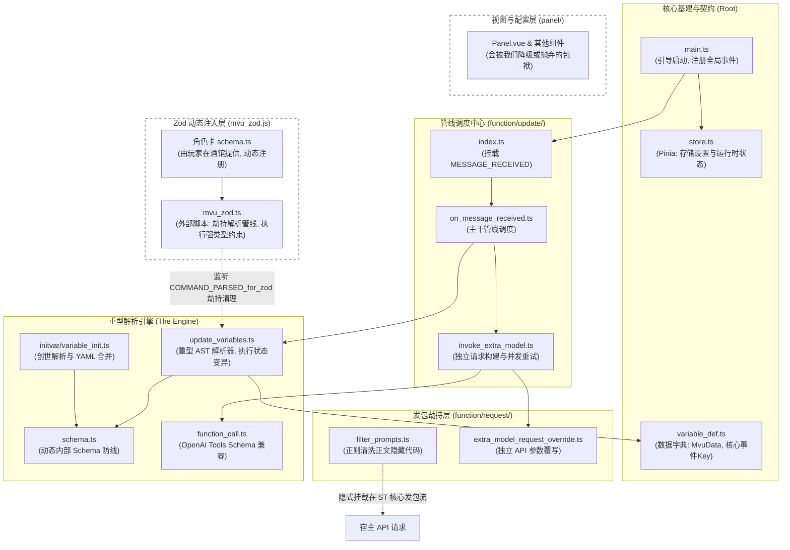

# MVU 架构全景解析 (Architecture Analysis)

为了彻底摸清 `MagVarUpdate_Ark` (MVU) 的底牌并为我们的 `V2` 引擎重构提供指导，本文件对其核心业务流和目录物理结构进行了高度概括。

## 1. 业务生命周期全景图 (Business Flow)

这张图展示了 MVU 从“新建聊天”到“变量最终落盘验证”的全流程。可以看出其最核心的成就是在极度混乱的 LLM 输出中，通过多层防线（防污染、AST 提取、内部 Schema 阻断、外部 Zod 过滤）硬生生砸出了一条高可用的数据管线。

---

## 2. 核心模块与物理目录结构图 (Project Structure)

了解以下文件的依赖关系，是我们在 `src/ARK_STATUSBAR/logic/mvu_core/` 中进行**“外科手术式删减与修改”**的基础。

## 3. 导读与后续重构建议

*   **如果需要排查报错或扩充基础字段**：立刻查看 `variable_def.ts`。所有的基底数据接口都在这里。
*   **如果需要修改或接管解析格式 (从 _.set 到完全 JSON Patch)**：对 `update_variables.ts` 动刀。这里的代码是最“重”的，也是我们引入 `jsonrepair` 等库后最能大幅度精简的地方。
*   **如果需要修改副模型的请求逻辑 (比如增加本地模型的支持)**：重点关注 `invoke_extra_model.ts` 和 `function_call.ts`。
*   **如果想要将数据持久化迁移出聊天记录 (如转入 IndexedDB)**：需要魔改 `update_variables.ts` 中末尾调用 `replaceVariables({type: 'message'})` 的部分。

## 4. 核心组件解剖与 V2 自研变量管理器架构推演 (Ongoing)

在研读 MVU 的源码后，我们决定不直接在轮子上做增删，而是**基于其核心教训，重新搭建一套高度内聚、专为剧情引擎定制的变量管理器**。以下是我们在解剖过程中得出的核心论点与 V2 应对策略：

### 4.1 数据变异引擎 (Mutation Engine) 的取舍
*   **MVU 做法**：教导 LLM 输出 `_.set()` 这样的 lodash 风格代码。在底层 (`update_variables.ts`) 写了上千行的 AST 括号解析器来安全提取这些命令，然后直接调用 `lodash` 库执行深层对象修改。同时支持了 `_.add()` 和自定义的 JSON Patch `delta` 操作来进行数学运算。
*   **痛点**：AST 字符串解析极度脆弱，且为了兼容旧 UI，代码揉杂了大量的日志拼凑逻辑 (`display_data`)。
*   **V2 策略 (拥抱 JSON 数组 + 自定义分发器)**：
    *   **抛弃**伪代码字符串，强制 LLM 输出标准的 JSON 数组（通过引入的 `jsonrepair` 容错）。
    *   **坚守数学防线**：吸取教训，由于 LLM 存在**“数学残疾”**（无法准确计算交易后的余额等绝对值），我们**绝不能**只依赖原生 JSON Patch 的 `replace`。我们必须在自研引擎中继承并重写一个极简的分发器（支持 `set`, `add`, `delete` 等操作），让 LLM 只输出变化量（如 `-150` 金币），由强类型的 TS 后端执行绝对安全的数学计算。

### 4.2 验证层与 Zod 的整合 (Validation Layer)
*   **MVU 做法**：底层自带一套动态 Schema 生成器做基础拦截。同时采用外挂脚本 (`mvu_zod.ts`) 监听事件，暴力劫持管线，用玩家编写的 Zod Schema 过滤数据后，清空原管线的命令。这种妥协是为了赋权无代码能力的普通玩家。
*   **痛点**：内外双重校验导致架构割裂，事件劫持使得代码极难追踪。
*   **V2 策略 (Zod 一等公民化)**：
    *   作为独立插件，我们将直接在源码 (`src/ARK_STATUSBAR/logic/schema/`) 中硬编码/强定义专属于我们引擎的 `ArkStorySchema`。
    *   数据流转变为绝对纯净的单向线性管线：`解析 JSON -> 遍历执行 lodash 变异 -> 将结果扔给 Zod.safeParse() -> 通过则落盘，失败则回滚`。彻底消灭为了兼容而生的事件劫持。

### 4.3 提示词反馈闭环 (Prompt Engineering)
*   **MVU 做法**：不仅提供校验，还生成极致压缩的 YAML 格式 `[mvu_update]变量更新规则`。这份规则教导了 LLM 所有的类型限制和业务逻辑（如“什么时候才加好感”），是 LLM 能输出准确结构的核心原因。
*   **V2 策略**：全盘吸收。这是代码约束反哺大模型上下文的典范。

### 4.4 远期扩展：可视化与数据驱动验证 (Data-Driven Zod)
*   **MVU 做法**：为了让玩家自定义约束，要求外部提供包含 `z.object({...})` 的 `.js` 脚本并通过 `eval` 类的机制动态执行注入。这对普通用户体验差且有脚本注入的潜在安全风险。
*   **痛点**：缺乏无代码/低代码体验，且无法安全地作为纯数据进行玩家间的配置分享。
*   **V2 远期蓝图 (元数据编译模式)**：
    *   构建可视化配置界面（类似蓝图节点），玩家在其中连线设定“血量：0-100”。
    *   导出产物为纯净、安全的标准 JSON 文件（只包含元数据，如 `{"name": "HP", "type": "number", "max": 100}`）。
    *   引擎在底层写一个“Zod 工厂函数” (`buildZodFromJson`)。开局读取到 JSON 后，在内存中动态翻译并生成真正的 Zod 实例。
    *   **成效**：完美兼顾了【底层绝对纯净安全的 Zod 校验流】与【顶层无限扩展、分享、无代码编辑的用户体验】。

### 4.5 插件全局配置层 (Global Settings) 的解耦与融合
*   **MVU 做法**：使用 `Pinia` 存储状态，并使用 `Zod` 对读取的 `extensionSettings` 进行深度校验与版本升级（`transform` 和 `prefault`）。
*   **痛点**：Pinia 强绑定 Vue 的响应式上下文，在后台独立运行的纯 TS 脚本（如拦截器）中获取状态不够解耦。
*   **V2 策略 (单例模式 + Zod 防腐层)**：
    *   **保留事件骨架**：继续坚持我们原有的 `ConfigStore`（单例类 + `CustomEvent` 事件总线）设计。这使得底层服务无需引入任何 UI 库上下文即可监听配置变更，实现真正的“高内聚低耦合”。
    *   **吸纳 Zod 灵魂**：废弃原先粗暴的 `{ ...DEFAULT_CONFIG, ...extSettings }` 浅拷贝。在 `system_config.ts` 中引入强类型的 `ArkConfigSchema`，利用 Zod 的默认值填充和类型强转功能，安全地读取和热升级旧版用户的 `settings.json`，构建完美的数据防腐层。

## 5. V2 终极数据存储架构构想 (Event Sourcing + CQRS)

基于对原生酒馆 `saveChat()` O(N) 性能雪崩（大量楼层下携带全量变量导致卡死）的反思，我们为 V2 引擎设计了这套兼顾“绝对防丢”与“极限性能”的数据底座。

### 5.1 核心思想：读写分离与事件溯源
1. **唯一真相源 (WAL 增量日志流)**：
   聊天记录的宿主（无论是 `metadata` 还是独立导出的存档文件）**不再存储每层楼的全量状态**，而是仅存储一条“不可变的增量日志流”（如 `[打怪掉血-20, 买药-50]`）。
   **关键闭环**：该日志流的头部必须**绑定存储解析此日志所需的 Schema 结构定义**（Zod 编译用的元数据），确保存档在任意酒馆实例中被导入时，结构与数据能严格对应。
2. **高速缓存引擎 (本地浏览器 DB)**：
   在浏览器端建立独立的本地数据库。游玩中的所有高频读取、复杂查询，均在本地数据库中极速完成。

### 5.2 运行机制
*   **冷启动水合 (Cold Boot Hydration)**：初次打开聊天，插件从 `metadata` 获取 Schema 和所有历史增量日志，在本地数据库（如 IndexedDB）中通过重演（Replay）瞬间构建出完整的业务数据树。
*   **热启动命中 (Warm Cache Hit)**：后续打开该聊天时，用 `ChatID` 校验本地数据库实例。若校验命中，则无需水合，直接以 0 延迟连接并接管状态机。
*   **游玩循环**：AI 输出新的状态变更（增量），引擎只将其 Append 追加至日志流中并调用 `saveMetadata()` 快速落盘，同时驱动本地数据库与前端 UI 刷新。

### 5.3 风险应对与务实降级
*   **风险：日志随聊天无限膨胀**
    *   *应对方案*：由于酒馆单聊天过长本身就会卡顿，玩家必然需要开新聊天。我们将开发**“一键跨文件剧本迁移服务”**。在切档时，将当前数据库结算出的“全量最终状态”作为新聊天的 `Init 基底数据`写入，从而彻底丢弃旧聊天的历史日志，轻装上阵。
*   **风险：Web Worker 与 SQLite 的开发门槛极高**
    *   *应对方案*：**技术降级与敏捷开发**。前期先使用浏览器原生的 `IndexedDB` 承担本地缓存角色。得益于我们既有的全局事件总线（Event Bus）架构，异步通信机制天然契合，后续等核心管线跑通且遭遇真性能瓶颈时，再逐步演进至 SQLite WASM。

### 5.4 复杂交互场景下的数据回滚与分支剔除 (Rollback & Branching)
在实际游玩中，玩家可能会频繁执行“删除特定楼层”或“在中间某层进行分支重发（Swipe）”等操作。此时，存储在引擎中的变量集必须与当前的聊天时间线绝对对齐，否则会导致严重的幽灵数据污染。
*   **核心痛点**：若玩家退回到 50 楼重新发展剧情，原先 51-60 楼写入数据库的变量增量必须被彻底作废。
*   **V2 应对策略（双路回滚机制）**：
    1.  **正向重演（Re-hydration）方案**：得益于我们将全量日志流保留在不可变存储中，当检测到聊天楼层发生截断或分支偏移时，引擎可以简单粗暴地丢弃当前的内存数据库缓存，重新提取从 0 楼到当前断点的有效日志，在毫秒级内瞬间重走一遍数据解析与应用流程。这是最不易出 Bug 的绝对安全做法。
    2.  **逆向补丁（Reverse-Patching）方案**：在生成 JSON Patch 的同时，反向生成撤销补丁（Undo Patch）。当玩家后退楼层时，精准地将超出的楼层补丁逆向打回。
    3.  **落地选型**：我们将优先采取**“正向重演”**机制。因为前端解析 JSON 数组并在内存中执行 Lodash 运算的速度极快（数万条增量不到 1 秒），且代码实现复杂度远低于维护双向补丁树，能够最高效、最稳定地确保“多余楼层中的错误数据被绝对剔除”。

## 6. 模型并发与多 API 调用解析 (Multi-API & Orchestration)

MVU 在处理独立变量更新时，展现了极高的工程韧性。其双轨独立调用的核心逻辑如下：
1. **上下文物理隔离** (`filter_entries.ts`, `filter_prompts.ts`)：在发包前拦截酒馆核心管线。主模型只吃小说上下文，强制剥离所有 `[mvu_update]` 的世界书规则；副模型只吃 `<past_observe>` 和变量规则，强制剥离多余的小说剧情。
2. **参数动态覆写** (`extra_model_request_override.ts`)：在调用 `SillyTavern.generateRaw()` 时，强制注入独立的低温度 (Temperature) 和独立的模型 API，确保逻辑计算的确定性。
3. **并发赛马容错** (`invoke_extra_model.ts`)：面对廉价/低智模型，采用 `Promise.any()` 并发发送 3 个请求，谁先返回正确格式即采用，大幅降低单次请求幻觉导致的失败率。

*   **V2 远期多智能体 (Multi-Agent) 演进**：我们未来若要实现“记忆召回 -> 剧情规划 -> 变量记录 -> 格式转换”的单轮多步操作，不能再用这种硬编码的调用。必须开发一个基于 `Promise.all` 拓扑的**流水线编排器 (Workflow Orchestrator)**，将上述流程抽象为解耦的微服务 Agent 节点。

## 7. 兼容与兜底：不可或缺的单模型模式 (Single-Model Fallback)

虽然理想状态下“主模型写文、副模型算数”是最干净的架构，但对于 MVP 阶段或本地模型算力有限的玩家而言，**“双次发包”带来的延迟是毁灭性的**。
*   **同车接送的必要性**：MVU 允许 `随AI输出` 模式，即主模型在写完小说正文后，直接在末尾输出 `<UpdateVariable><JSONPatch>...</JSONPatch></UpdateVariable>`。这种在一个请求中兼顾文笔与数据的做法，是保证低配环境体验的唯一出路。
*   **V2 底层共识**：我们的系统必须同时支持**“独立模型计算”**和**“随正文输出提取”**两种模式。在处理文本提取时，我们将继续保留正则抓取区块的能力，并借助 `jsonrepair` 进行极限容错，作为对所有不支持 Function Calling 的底层模型的强力兜底。
