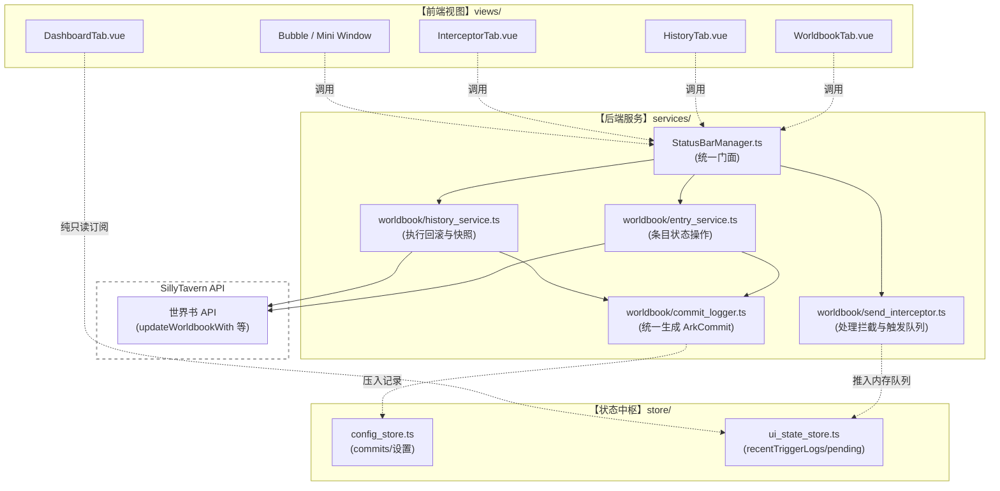

# Phase 2 迁移与底层净化 Master Plan (V2 Engine)

## 1. 架构演进背景与核心痛点
本项目的规模已达 **22,433 行代码**，其中 `data` 和 `services/mvu_core` 占据了巨大比重。
在先前的开发与本次尝试将 Sandbox UI（约 4000 行纯视觉代码）移植到主干工程时，暴露出极为严重的**职责边界击穿**问题：
* **前端业务泄漏**：`CommitHistoryPanel.vue` (位于 `views/history`) 内部手写了 `applyInverseChanges`，直接解析 JSON Patch 差异并调用原生 `updateWorldbookWith` 进行底层数据回滚，甚至直接 `.filter` 裁剪 `configStore.commits` 数组。
* **伪装的 Hook 毒瘤**：`useWorldbookActions.ts` (位于 `views/worldbook`) 名为前端 Hook，实则是“微后端”，直接包揽了世界书条目的创建、修改、以及手动拼接 `ArkCommit` 历史记录的写库操作。
* **概念混淆**：`InterceptorTab.vue` 同时承担了“当前拦截预警 (`pendingEntries`)”和“上一轮触发记录 (`lastTriggeredEntries`)”的展示。而新的 `DashboardTab` 和 `MiniWindow` 又被要求展示“近期触发记录”，导致同一业务概念散落在不同组件，且未形成闭环的后端流。

**核心矛盾**：庞大的 Vue 组件既管渲染又管写库。如果不先做“刮骨疗毒”就直接套用新版 UI，整个状态树将会完全失控，沦为意大利面条。

## 2. 目标架构蓝图与依赖关系规范

遵循 `TECH_STACK.md` 强制要求，必须将底层读写与历史记录生成全部下沉。

## 3. 功能扩展协作规范与重构步骤

### 阶段 1：底层逻辑洗牌 (Service Refactoring)
**任务：将所有被越界写入 Vue 和 Hooks 的数据库操作下沉。**
*   **动作 1 (History 净化)**：新建 `src/ARK_STATUSBAR/services/worldbook/history_service.ts`，将 `CommitHistoryPanel.vue` 中的 `applyInverseChanges` 和 `batchRevertCommits` 等逻辑移入。前端仅保留 `await manager.history.revertCommit(id)`。
*   **动作 2 (Entry 净化)**：扩展 `entry_service.ts`，将 `useWorldbookActions.ts` 和 `InterceptorTab.vue` 中涉及具体条目修改（`updateWorldbookWith`）和 `ArkCommit` 拼装的代码移入。做到 Commit 的生成完全在 Service 闭环。
*   **动作 3 (Trigger Queue)**：在 `send_interceptor.ts` 中维护 `releaseInterceptAndSend` 后的日志推入。将 `lastTriggeredEntries` 的概念彻底转化为并入 `ui_state_store` 的 `recentTriggerLogs` (内存队列，暂时不碰 IndexedDB 落盘)。

### 阶段 2：预警系统与主页重塑 (Dashboard & Interceptor)
*   **DashboardTab 接入**：彻底舍弃 `localStorage` 污染，直接读取 `ui_state_store.recentTriggerLogs` 渲染近期记录列表。
*   **InterceptorTab 换肤**：套用 `InterceptorTab_Design.vue` 模板。剥离原有的“上一轮触发记录”，仅绑定 `pendingEntries`。按钮绑定重构后的 Service 接口。
*   **悬浮窗与气泡对接**：`MiniWindow` 平常展示近期记录；拦截时切入 FULL 态展示 `InterceptorTab`。`BubbleWindow` 支持双击切换为 `MiniWindow`，被动拦截时仅弹出菜单。

### 阶段 3：静态配置与管理页面的降维平移 (Settings & Worldbook & History)
*   **SettingsTab**：用沙盒的 Switch 和 Slider 替换老旧表单，直接双向绑定 `configStore`。
*   **WorldbookTab (LoreEntriesTab)**：用沙盒的 Accordion 列表设计替换原有组件，抛弃旧的动态 Schema 脏逻辑，绑定洗净后的 `StatusBarManager.worldbook` 接口。
*   **HistoryTab**：应用垂直时间线设计稿 `HistoryTab_Design.vue`，对接 `configStore.commits` 以及重构后的纯净 `history_service.ts` 接口。

## 4. 实施重构的工作量与风险预案

*   **工作量估算**：涉及 20+ 个核心文件的读写与解耦，整体代码影响行数约 1500 行，预计需要划分为 4-5 个连续的原子操作周期。
*   **风险预案 1 (依赖循环)**：在抽离 `history_service.ts` 时，如果它需要访问 `configStore` 来获取 `commits`，可能与 `StatusBarManager` 的初始化顺序冲突。
    *   *预案*：严格采用依赖注入或 Getter 模式传递 `configStore`，不在文件顶层直接解析。
*   **风险预案 2 (状态丢失)**：将 `lastTriggeredEntries` 改为 `recentTriggerLogs` 时，如果热重载导致 Vue 组件卸载重装，可能会丢失瞬间的事件触发。
    *   *预案*：保证 `ui_state_store` 在外层壳（或全局）有稳定的订阅防丢失机制，拦截日志流通过 `CustomEvent` 广播。