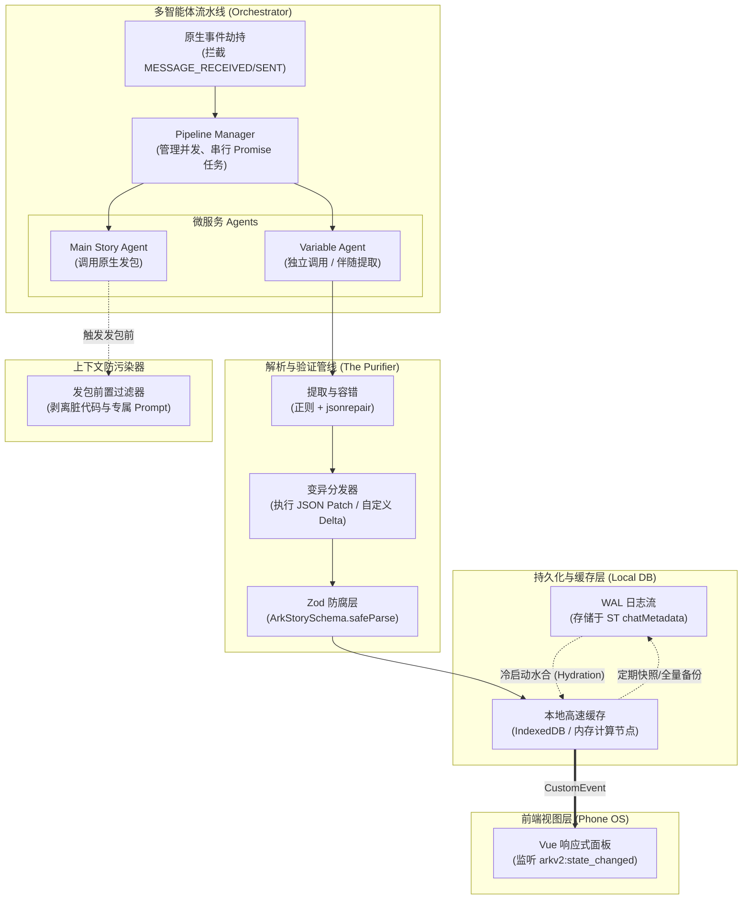
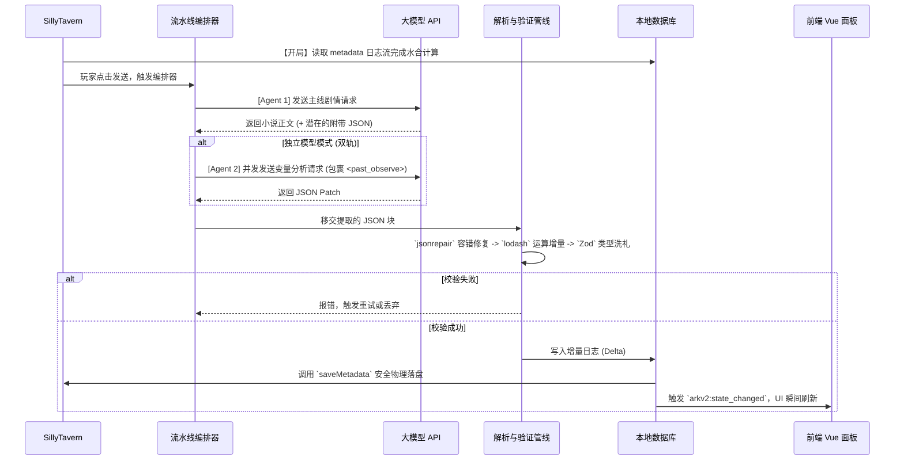

# V2 剧情变量引擎架构规划 (V2 Engine Architecture Plan)

在深度解剖了 MVU 框架的技术债与核心智慧后，本规划旨在为我们的方舟剧情引擎 V2 版本提供一份完全可落地的架构施工图。本规划摒弃了对外部环境的妥协，致力于打造一个**“高内聚、纯数据驱动、多智能体协作、自带本地高速缓存”**的专业级 RPG 状态机。

---

## 1. 软件框架拓扑图 (Software Framework)

本图展示了 V2 引擎各模块在 Service 层与 UI 层之间的相对位置及流向编排。

---

## 2. 核心运行流程图 (Runtime Flow)

展示在一个玩家交互回合内，各个组件如何进行完美的异步协作与落盘。

---

## 3. 核心组件开发规划与学习索引

为了在后续开发中不至于“不知从何抄起”，我们在每个组件下方备注了对应的 MVU 参考文件。开发时可直接对照这些“标本”进行学习与改写。

### 3.1 任务流水线编排器 (Workflow Orchestrator)
*   **功能介绍**：取代传统的离散事件监听，接管玩家发送动作后的全生命周期。支持并发调用多个微型模型（如专门负责算数的低智模型、专门写文的高智模型），并管理其依赖关系（如必须等小说写完才算血量）。
*   **参考标本**：
    *   `mvu_core/function/update/on_message_received.ts` (主控流)
    *   `mvu_core/function/update/invoke_extra_model.ts` (独立调用与并发赛马机制)
*   **实现要点**：利用 `Promise.all` 组织并发结构，利用 `SillyTavern.generateRaw()` 执行底层无感发包。
*   **工作规模**：中等 (~300 行代码)。
*   **潜在风险**：过度占用并发请求可能导致 API 代理商触发 429 频率限制。需做好请求队列与超时熔断控制。

### 3.2 数据解析与变异引擎 (Parser & Mutation Engine)
*   **功能介绍**：废弃 `_.set()` 伪代码，强制接收并处理 JSON Patch 或带有自定义 `op: 'delta'` 的 JSON 数组。完成对目标状态树的数学运算与节点变异。
*   **参考标本**：
    *   `mvu_core/function/update_variables.ts` (核心的 Switch-Case 变异逻辑)
    *   `mvu_core/function/function_call.ts` (对于 OpenAI 工具调用的 JSON 抽取)
*   **实现要点**：引入 `jsonrepair` 作为文本提取的第一道护城河。保留并精简 `switch (op)` 分支，专注于 `replace`, `insert`, `remove`, `delta` 核心指令。
*   **工作规模**：较大 (~400 行代码)。需对海量边界情况做测试。
*   **潜在风险**：非结构化模型依然可能输出引擎无法解析的格式。必须有完善的 Try-Catch 和回退策略。

### 3.3 强类型防腐管道 (Zod Validation Pipeline)
*   **功能介绍**：取代 MVU 繁琐的内部动态 Schema，将我们针对方舟剧情硬编码的 Zod 实例作为最后一道也是唯一一道防线。
*   **参考标本**：
    *   `mvu_core/function/schema.ts` (反面教材：看它如何痛苦地推演 Schema)
    *   `mvu_zod.ts` (正面教材：看它如何用 Zod 劫持并清洗数据)
*   **实现要点**：编写 `ark_state_schema.ts`。在解析引擎算完数据后，直接调用 `.safeParse()` 进行数值钳制和默认值补全。
*   **工作规模**：小 (~100 行代码)，但需要极强的业务逻辑梳理能力。
*   **潜在风险**：如果 Schema 规定得过于严格（无 `.prefault` 兜底），可能导致大面积的合法更新被误杀。

### 3.4 上下文防污染器 (Prompt Isolation & Filter)
*   **功能介绍**：在向大模型发送对话记录前，如果记录中包含了用于“随AI输出”模式的代码残骸，必须将其正则抠除，确保大模型看到的只是纯粹的小说上下文。
*   **参考标本**：
    *   `mvu_core/function/request/filter_prompts.ts` (清理正文代码)
    *   `mvu_core/function/request/filter_entries.ts` (隔离专属世界书提示词)
*   **实现要点**：利用酒馆发包前置拦截 API 或重写请求体，精准剔除特定的代码区块标签（如 `<ark_delta>`）。
*   **工作规模**：极小 (~50 行代码)。
*   **潜在风险**：正则写得过于宽泛，不小心把玩家原本就想说的话给屏蔽了。

### 3.5 增量数据持久化层 (Local DB & Event Sourcing)
*   **功能介绍**：摒弃将全量变量写在单层聊天楼层的做法。使用 IndexedDB 在本地维护全量缓存，同时将不可变的“增量变更日志流（WAL）”存储至酒馆的 `metadata` 或独立存档中。
*   **参考标本**：
    *   `mvu_core/function/cleanup/cleanup_variables.ts` (反面教材：了解为什么要避免它的“删数”逻辑)
*   **实现要点**：封装一个原生的 IndexedDB 工具类，包含 `初始化水合 (hydrate)`、`追加密码 (append)` 和 `回退截断 (rollback)` 三个核心方法。
*   **工作规模**：极大 (~500 行代码)。涉及异步存储与生命周期管理，是全村最硬的骨头。
*   **潜在风险**：浏览器缓存机制的复杂性可能导致读写竞态；水合运算在几万条极长日志下可能产生明显的冷启动耗时。