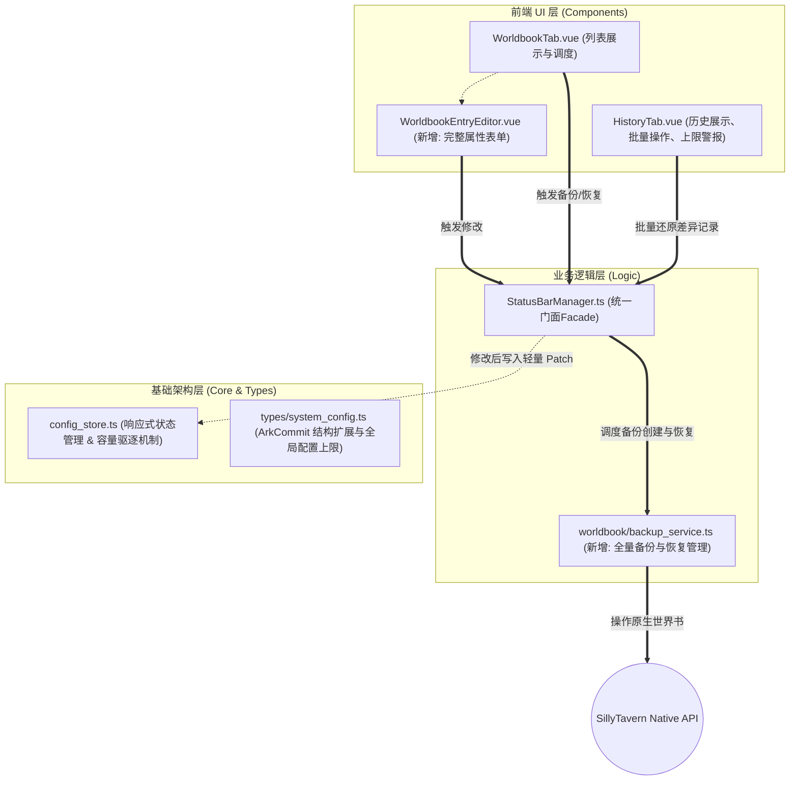

# Master Plan: 世界书备份与完整属性编辑机制 (feature/worldbook-backup-and-edit)

## 1. 架构演进背景与核心痛点
*   **当前痛点**：
    1.  `WorldbookTab.vue` 当前只能修改条目的类型(蓝/绿灯)和开关(enabled)，缺乏对 `WorldbookEntry` 中其它属性（如内容、位置、延迟、粘性等）的完整编辑能力，代码高度耦合在长达 500 行的容器中，可维护性差。
    2.  `HistoryTab.vue` 记录的 `ArkCommit` 仅包含 `from: boolean, to: boolean`，无法描述复杂属性的变更。若简单记录完整对象快照，会使存储在 `localStorage` 或 JSON 中的 `SillyTavern.extensionSettings` 急剧膨胀，导致酒馆性能劣化甚至崩溃 (QuotaExceededError)。
    3.  原先的“快照”功能仅保存了条目的启用状态，一旦发生条目内容删除或灾难性错误，无法真正“回滚”世界书内容。
*   **架构演进目标**：
    1.  引入 **独立全量备份机制**：作为最终安全兜底。利用酒馆底层能力（`createWorldbook`），新建实体文件作为快照，将大体积内容安全存储在系统硬盘中，彻底释放插件自身配置存储压力。
    2.  引入 **JSON Patch (路径差异) 记录机制**：使 `ArkCommit` 作为轻量级的撤销/回滚队列，只记录被修改属性的路径 (path) 和修改前的值 (from)，实现按需无损恢复。
    3.  引入 **历史记录和全量备份的上限驱逐机制 (Cap & LRU Eviction)** 辅以 **防误删置顶 (Pin)**：保持插件性能的长期稳定性。
    4.  **UI 模块化拆分**：将世界书完整编辑表单拆分成独立的子组件，实现性能分区渲染。

## 2. 目标架构蓝图与依赖关系规范



## 3. 核心机制设计与协作规范

### 3.1 `system_config.ts` 中的 `ArkCommit` 结构重构 (轻量级 JSON Patch)
*   为了防止配置膨胀，放弃记录全量条目，而是记录 JSON Path。
*   新增配置上限参数 `maxHistoryCommits`, `maxHeavyHistoryCommits` 等。
*   **新结构示例**：
```typescript
export interface ArkCommitChange {
  uid: number;       // 被修改条目的 UID
  comment: string;   // 条目名称（用于UI展示）
  path: string;      // 修改属性的路径，例如 "content", "strategy.scan_depth", "enabled"
  from: any;         // 修改前的旧值（由于是恢复所需，仅记录 from 即可覆盖回去）
  // 移除原先的 to: boolean，因为新值已经在现在的世界书中了
}

export interface ArkCommit {
  id: string;
  timestamp: number;
  description: string;
  worldbook?: string; 
  changes: ArkCommitChange[];
  isPinned?: boolean; // 新增：是否被用户置顶（防自动剔除保护）
  isHeavy?: boolean;  // 新增：标识这是否是一次涉及长文本(content)等高开销字段的提交
}
```

### 3.2 容量驱逐机制与置顶保护 (Eviction Policy & Pin)
*   在 `config_store.ts` 处理 `ArkCommit` 队列时：
    1.  当普通历史记录数量超过上限（如 100），自动移除最老的一条。
    2.  如果这条最老的记录 `isPinned === true`，则跳过它，去删除下一条最老的非置顶记录。
    3.  针对标记为 `isHeavy === true` 的长文本修改记录，拥有独立的更严格的上限（如 20 条）。触发警戒线时在 UI 层发出警告。

### 3.3 业务层：`backup_service.ts` 的独立性
*   负责处理全量备份的创建、恢复和查询。
*   创建时使用统一前缀：`[ARK_BACKUP_YYYYMMDD_HHMMSS]_原世界书名`。
*   提供备份总量上限管控服务：在系统配置（ArkConfig）中增加可配置的全局备份数量上限（如 `maxTotalBackups`，默认 20个）。扫描带此前缀的世界书总数，如果触及或超过上限，则阻止继续备份或在前端发出强烈的预警引导清理。

### 3.4 前端拆分与交互 (WorldbookEntryEditor.vue)
*   **按需加载/展开**：在 `WorldbookTab` 的原列表中点击“编辑”按钮，内联展开 `WorldbookEntryEditor` 子组件。
*   **按类编排表单**：把原本扁平的各种属性（激活策略、插入位置、内容、粘性/冷却等）分类成选项卡或折叠面板（类似酒馆原生面板），避免表单过长。
*   **提交差异计算**：点击“保存”时，计算原 `entry` 与现表单数据的差异，生成 `changes` 数组并触发 `Manager`。

## 4. 实施重构的具体步骤与风险预案

*   **Step 1. 数据结构扩展**：修改 `system_config.ts` 中的 `ArkCommit` 接口及增加 `ArkConfig` 上限参数，补充 `ark_events.d.ts` 相关类型。
*   **Step 2. 全量备份服务**：在 `logic/worldbook/` 新增 `backup_service.ts`，封装 POC 验证过的代码逻辑，并注册到 `StatusBarManager`。
*   **Step 3. 历史记录核心逻辑调整**：
    *   在 `config_store.ts` 中实现历史记录的上限驱逐和 `isPinned` 免死金牌逻辑。
    *   修改 `HistoryTab.vue` UI：支持基于 `path` 的差异文本展示；添加对置顶按钮的支持；添加针对过载 (`isHeavy` 过多) 和 备份过多 的黄色警告框；调整反向恢复逻辑以支持基于路径的覆盖。
*   **Step 4. 世界书条目编辑器构建**：
    *   创建 `WorldbookEntryEditor.vue` 并引入 `WorldbookTab.vue` 中。
    *   实现将编辑器内的改动差异提取为 JSON Patch 形式，并在 `toggleEntry` 和新改动方法中发出 `ArkCommit`。

**潜在风险与解决预案**：
1.  **风险：差异回滚导致数据类型错误**。酒馆 API 并不严格校验数据。
    *   **预案**：我们在 `applyInverseChanges` 执行覆盖前，可以借助 `lodash` 的 `set` 函数安全地把 `from` 的值恢复到原始路径。
2.  **风险：长文本 `content` 内容的 `from` 字段中含有特殊字符或破坏 JSON 的结构**。
    *   **预案**：只要是通过标准 JS 对象操作修改 `ArkCommit` 并经由 `configStore` 保存的，JSON 序列化会正确转义特殊字符，理论上不会破坏外层 JSON。考虑到极个别情况，可以考虑限制 `from` 的最大长度。