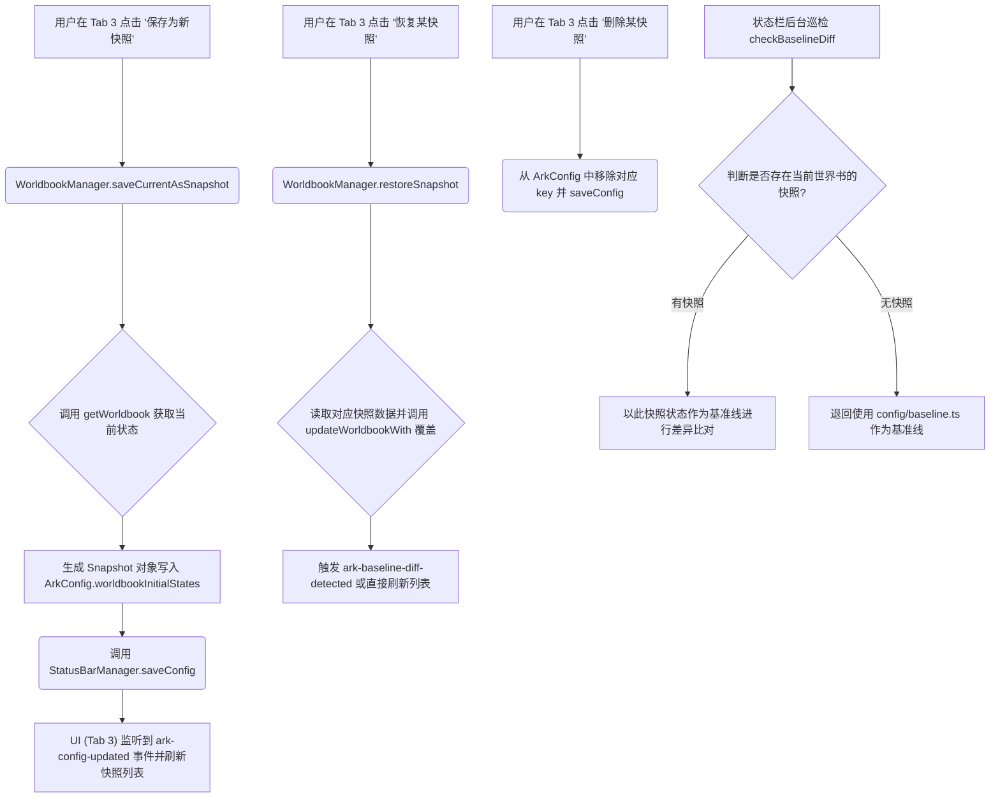

# 05 业务逻辑图表与拆分细则 (05_refactor_business_logic_chart.md)

本文件是对重构计划的**具象化业务逻辑图解与防线约束**。在进行任何 `src/` 下的代码修改前，必须以此文件中的数据流、组件树和 API 边界为准绳。特别是补齐了之前遗漏的**快照生命周期管理**和**Vue组件通信单向数据流**。

---

## 1. 核心架构与数据流图谱

### 1.1 存储引擎与快照生命周期 (Storage & Snapshot Flow)
*此部分解决 `statusbar_manager` 的解耦以及快照功能不可用的致命遗漏。*

**数据载体：** `SillyTavern.extensionSettings['ark_statusbar_settings']` (完全取代了旧的 `[SYS_CONFIG]` 世界书条目)。
**类型定义：** 由 `src/ARK_STATUSBAR/config/system_config.ts` 统一管理 (`ArkConfig`)。

**快照生命周期 (Snapshot Lifecycle) 及 Baseline 覆盖规则:**


### 1.2 跨世界书检测与全局挂载控制 (Worldbook Cross-Detect & Global Mount)
*此部分解决无法溯源触发条目，以及混淆“角色绑定”与“全局挂载”的问题。*

**数据流与 API 调用：**
1. **拦截阶段 (Tab 1)**：
   - 拦截器监听到 `world_info_activated`。
   - **过滤修改**：取消原先的 `e.world === targetWorldbook` 限制，全盘接收。
   - UI 渲染时，对于每个被激活的条目 `entry`，在底部使用 `entry.world` 字段标识来源。
2. **世界书挂载与分类管理 (Tab 2 顶层)**：
   - **获取全服列表**：`getWorldbookNames()`。
   - **获取全局挂载 (Global Mount) 列表**：`getGlobalWorldbookNames()`。
   - **获取当前角色绑定 (Char Bound) 列表**：`getCharWorldbookNames('current')`。
   - **UI 展示逻辑**：将所有世界书分为三类展示：“角色专属绑定 (不可在此卸载)”、“已全局挂载 (可在此卸载)”、“未挂载池 (可在此挂载)”。
   - **全局挂载交互**：用户点击“挂载”时，将目标名称推入数组，调用 `rebindGlobalWorldbooks(newArray)`。用户点击“取消”时，从数组剔除并调用该方法。
	- **[缺失的重大异步逻辑] 抽屉展开时的数据按需加载 (On-Demand Fetching)**：
     由于现在 Tab 2 涉及多本世界书，不能像以前那样在组件 `onMounted` 时一次性只加载 `targetWorldbook` 的条目。必须在用户**点击展开某个世界书的 Accordion 抽屉时**，异步调用 `getWorldbook(worldName)` 获取该书的内部条目，并缓存在一个 `Record<string, WorldbookEntry[]>` 字典中，以防止网络请求风暴和 UI 卡顿。
   - **[数据结构补全] 世界书置顶支持**：03规划中明确提到“被用户标记(置顶)的世界书”，因此需要在 `ArkConfig` 中额外补充 `pinnedWorldbooks: string[]` 字段，以区分于原来的条目置顶 `pinnedEntries`。
   
### 1.3 操作迁移与环境专区 (Tab 3 重构细节)
**核心动作：**
根据 03 规划，原先拥挤在 Tab 2 顶部的**重量级操作按钮必须全部迁移至 Tab 3**：
1. **“关闭单字干员”** (调用 `WorldbookManager` 的对应单字关闭逻辑，但需注意现在可能涉及多本挂载的世界书，默认只操作 `targetWorldbook` 还是全部？——此处业务逻辑规定：**默认仅对当前角色绑定的主世界书执行单字干员关闭**)。
2. **“恢复初始状态”** (调用 `WorldbookManager.resetToBaseline()`)。
3. **新增的快照管理面板** (列出所有已保存的快照，提供恢复和删除按钮)。
---

## 2. Vue 组件树与响应式单向数据流 (UI Hierarchy & Reactivity)

### 2.1 整体组件拆分拓扑
```text
src/ARK_STATUSBAR/components/
├── GlobalStatusBar.vue (仅作为容器，管理外层拖拽与 ActiveTab 状态)
│   │
│   ├── global_tabs/InterceptorTab.vue (Tab 1: 拦截队列)
│   │   └─ Props: config, interceptorWarnings
│   │   └─ Emits: release-send
│   │
│   ├── global_tabs/WorldbookManagerTab.vue (Tab 2: 全局挂载与条目管理 - 抽屉式)
│   │   └─ Props: config, groupedWorldbooks, globalMountedBooks
│   │   └─ Emits: update-entry-state, global-mount-toggle
│   │
│   ├── global_tabs/HistoryAndManageTab.vue (Tab 3: 历史、快照、重置管理)
│   │   └─ Props: config
│   │   └─ Emits: save-snapshot, restore-snapshot, delete-snapshot, restore-baseline
│   │
│   └── global_tabs/SettingsTab.vue (Tab 4: 基础设置)
│       └─ Props: config
│       └─ Emits: update-config
│
├── StartupNavigator.vue (开局 UI 主容器)
│   │
│   └── startup_tabs/StartupSettingsPanel.vue (右侧滑出的设置面板)
│       └─ Props: config
│       └─ Emits: update-config
```

### 2.2 严守防线：绝对的单向数据流
**问题回顾**：在1月份的旧架构中，子组件内部直接调用了 `StatusBarManager.getInstance().currentConfig`，导致 Vue 的 Proxy 响应式追踪断链，更改无法即时反映到其他组件，甚至引发死循环刷新。

**核心约束**：
1. **顶层获取**：只有 `GlobalStatusBar.vue` 和 `StartupNavigator.vue` （或单独的状态管理 Hook）有权监听 `ark-config-updated` 事件，或直接持有 `config` 的响应式 `ref`。
2. **向下传递**：所有深层数据（如当前主题、开关状态、快照列表）必须通过 `defineProps<{ config: ArkConfig }>()` 传给各 Tab 子组件。
3. **向上提交**：子组件如果需要修改配置（例如用户在 SettingsTab 里点击“开启调试模式”），**绝不可直接赋值修改 Prop**。必须通过 `defineEmits<{ (e: 'update:config', update: Partial<ArkConfig>): void }>()` 将意图抛给父容器。
4. **统一持久化**：父容器在 `onUpdateConfig(update)` 函数中，调用 `StatusBarManager.getInstance().saveConfig(update)`。这样可以确保内存、UI、扩展存储三者的 100% 绝对同步。

---

## 3. 细化的子模块工作流 (即将执行)

| 阶段 | 模块 / 文件 | 核心功能界定与责任 |
| :--- | :--- | :--- |
| **完成** | `system_config.ts` | 提供 `ArkConfig` 结构的静态类型支持和 `DEFAULT_CONFIG` 常量，彻底解耦 `statusbar_manager` 对类型定义的纠缠。 |
| **完成** | `statusbar_manager.ts` (迁移段) | 实现 `extensionSettings` 的读写。当检测到旧的 `[SYS_CONFIG]` 世界书时，完成 JSON 解析并进行 `deleteWorldbookEntries` 安全清理，向控制台抛出全中文进度日志。 |
| **Pending** | `worldbook_manager.ts` (快照段) | 增加三个原子 API: `saveCurrentAsSnapshot(name, desc)`、`deleteSnapshot(id)`、`restoreSnapshot(id)`。不再硬绑定 Baseline。 |
| **Pending** | `theme.scss` & Global Styles | 在 `:root` 中声明全局色卡，在 `.ark-statusbar-root` 限定 `font-family` 与 `14px` 基础字号。Vue 组件彻底移除多余的重叠 `scoped`。 |
| **Pending** | `StartupSettingsPanel.vue` | 将开局右侧菜单物理抽离。接入 Prop/Emit 单向流。 |
| **Pending** | `WorldbookManagerTab.vue` | 顶端渲染两个核心栏区：“当前角色绑定世界书”与“全局挂载世界书池”。通过 `getGlobalWorldbookNames` 进行对比渲染。对展开的词条列表渲染基于 `entry.world` 分组的抽屉 (Accordion)。 |
| **Pending** | `HistoryAndManageTab.vue` | 分离出“修改记录”和“快照管理”两个子区块，实现快照的增删改查 UI。 |