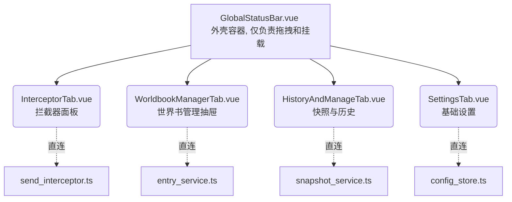

# 06 业务逻辑层与组件边界重构规划 (06_logic_refactor_plan.md)

## 1. 历史痛点分析与重构动机

在先前的重构中（尤其是针对 `GlobalStatusBar.vue` 的拆分尝试），我们犯下了一个典型的“形式主义拆分”错误：**只把 UI 的皮（HTML/CSS）切开了，但将庞大且耦合的业务逻辑依然堆积在父容器中。**
同时，后端的 `src/ARK_STATUSBAR/logic/` 目录下，`statusbar_manager.ts` 和 `worldbook_manager.ts` 这两个文件已经膨胀成了无所不包的 God Object（上帝对象），它们之间甚至存在双向依赖（循环调用）。

**当前架构的乱象（The Mess）：**
1. **职责不清**：`statusbar_manager.ts` 不仅管理配置（Config），还接管了拦截器生命周期（Interceptor）、Token 计算干跑、以及调试日志的入库。
2. **越权调用**：`worldbook_manager.ts` 在执行“生成快照”或“应用剧本”时，居然主动去调用 `StatusBarManager.getInstance().saveConfig()` 来修改历史记录。
3. **数据流畸形**：为了向深层组件传递状态，使用了极度冗长的 Vue `emit` 管道。子组件如果想改变一个配置，必须 `emit` 到顶层，顶层再去调用 Backend，这完全违背了现代状态管理（如 Vuex/Pinia 理念）的直连原则。
4. **扩展性极差**：`StartupNavigator.vue` (600+行) 包含大量的剧情节点渲染逻辑，如果不将数据清洗逻辑下沉，未来加入新的剧情树时，组件将会彻底爆炸。

## 2. 全新架构蓝图 (The Blueprint)

本次重构旨在彻底理清后端逻辑的职责边界，建立单一数据源（SSOT, Single Source of Truth），并让前端组件从“大管家”降级为纯粹的“渲染器+操作触点”。

### 2.1 后端逻辑模块重划分 (Logic Layer)

我们将把原先臃肿的 `logic/` 目录彻底拆解为职责单一、高内聚的服务模块：

```text
src/ARK_STATUSBAR/logic/
├── core/                        # 系统核心与状态管理 (SSOT)
│   ├── config_store.ts          # 【新建】负责管理 ArkConfig 的响应式状态与持久化 (取代 StatusBarManager 中关于配置的部分)
│   └── logger.ts                # 【新建】负责调试日志队列和输出 (取代 StatusBarManager 中的日志系统)
│
├── interceptor/                 # 拦截器与干跑生命周期
│   └── send_interceptor.ts      # 【新建】负责监听键盘/按钮，执行双轨 DryRun 计算 (取代 StatusBarManager 中拦截器部分)
│
├── worldbook/                   # 世界书原子操作集 (纯粹的功能函数，不碰状态栏配置)
│   ├── snapshot_service.ts      # 【新建】负责快照的生成与恢复
│   └── entry_service.ts         # 【新建】负责单字关闭、条目开关等基础操作
│
└── scenario/                    # 剧本与开局系统
    └── scenario_applier.ts      # 【新建】负责解析和执行开局剧本替换
```

**关键设计约束：**
- **严禁双向依赖**：`worldbook/` 下的任何服务**不得**直接 import `config_store.ts` 去写修改记录（Commits）。修改记录必须通过一套统一的事件总线或回调机制，由调用方（如某个执行具体业务的 Service）来决定是否记录，或者由 `logger.ts` 抽象处理。
- **配置的响应式直通**：`config_store.ts` 将提供一个类似于 Pinia `useStore` 的全局可订阅/响应式对象 `useArkConfig()`。任何 Vue 子组件都可以直接 `import` 并读取/修改它，彻底抛弃繁琐的层层 `props` 和 `emit`。

### 2.2 前端视图层组件解耦 (Component Layer)

在逻辑层地基打牢后，前端的拆分将变得顺理成章：



**前端解耦原则**：
1. **组件自治**：每个 Tab 组件自己去 import 对应的 `logic/*` 服务。自己触发方法，自己获取结果。
2. **样式隔离**：将与特定 Tab 绑定的 `.scss` 或 `<style scoped>` 彻底隔离，严禁污染全局。

## 3. 分步执行计划 (Execution Steps)

为防止重蹈覆辙，以下步骤必须**严格按照顺序，每次只执行一步，每步包含严密的测试环节**。

### 📌 Phase 1: 基础设施重构 (The Foundation)
这一阶段暂时不碰 Vue 组件，重点重构后端的 `.ts` 文件。

- **Step 1: 提取 `config_store.ts`**
  - **任务**: 从 `statusbar_manager.ts` 中剥离关于 `ArkConfig` 的加载、保存、迁移逻辑。
  - **产出**: 建立全局共享的响应式配置对象引用。

- **Step 2: 提取 `logger.ts` 与事件解耦**
  - **任务**: 剥离日志队列功能。移除 `worldbook_manager.ts` 对 `statusbar_manager.ts` 修改记录 (`commits`) 的硬编码写入，改用事件总线或回调。

- **Step 3: 提取 `send_interceptor.ts`**
  - **任务**: 将最复杂的 `executeDualTrackDryRun` 和键盘事件监听剥离为独立类，仅暴露订阅干跑结果的接口。

- **Step 4: 拆解 `worldbook_manager.ts`**
  - **任务**: 将其拆分为 `entry_service.ts`（原子操作）和 `snapshot_service.ts`（快照逻辑）。

### 📌 Phase 2: 组件边界重塑 (The Assembly)
当底层 `logic` 完全组件化后，开始动 Vue。

- **Step 5: 改造 `SettingsTab.vue`**
  - **任务**: 接入 `config_store.ts`，彻底移除父组件传下的 `props` 和 `emit`。完成样式补齐。

- **Step 6: 改造 `WorldbookManagerTab.vue`**
  - **任务**: 接入 `entry_service.ts`。实现内部的请求节流和状态自治。

- **Step 7: 改造 `HistoryAndManageTab.vue`**
  - **任务**: 接入 `snapshot_service.ts`。

- **Step 8: 改造 `InterceptorTab.vue` & 父容器清洗**
  - **任务**: `InterceptorTab.vue` 直接监听 `send_interceptor.ts` 的事件。最后，清空 `GlobalStatusBar.vue` 中的所有冗余业务逻辑，使其真正成为一个只有百行级别的拖拽物理外壳。

### 📌 Phase 3: 开局引导界面瘦身 (The Startup Refactor)
针对目前依旧臃肿的 `StartupNavigator.vue` (600+行) 及其附带逻辑进行清洗。

- **Step 9: 拆解 `scenario_applier.ts` 与开局逻辑下沉**
  - **任务**: 之前 `StartupNavigator.vue` 里写死了 `SillyTavern.chat[0].swipes` 这种底层酒馆 API 调用和环境校验。我们将新建 `src/ARK_STATUSBAR/logic/scenario/scenario_applier.ts`。
  - **职责**: 把 `applyScenario` (一键替换世界书并写入 commit)、切换首条消息 Swipe 的脏活全部移交到 `scenario_applier.ts`。`StartupNavigator.vue` 只负责 `@click="ScenarioApplier.apply(scenario.swipeId)"`。

---
**验收标准（Acceptance Criteria for each step）:**
- 绝不破坏 `index.ts` 的入口挂载逻辑。
- 不影响现有的酒馆通信接口调用。
- **文件体积指标**：任何新建或重构的 `.ts` 或 `.vue` 文件，包含模板在内尽量控制在 300 - 500 行左右。超出即意味着存在边界划分问题，需立即报告。