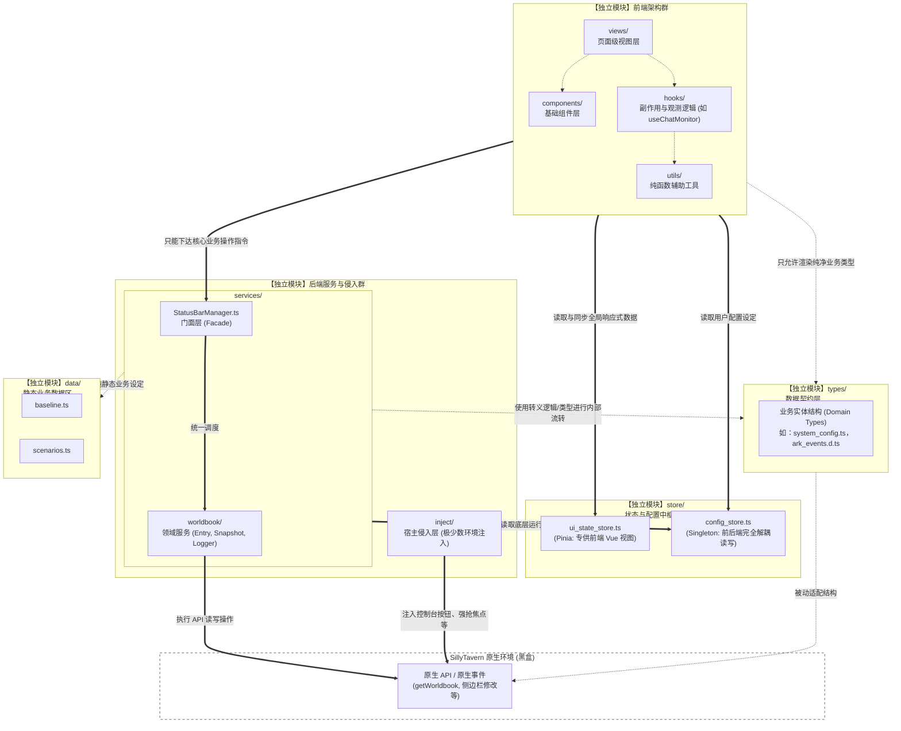

# 项目技术与架构规范 (TECH_STACK)

本文档定义了项目中具象化的编码规范和技术选型约定，是对 `AGENTS_README.md` 的技术补充。所有 Agent 在编写相关逻辑时，必须严格遵守本文件中的约定。

## 1.系统架构总括 (ARCH)

### 1.1 技术栈选型
*   **宿主环境**: SillyTavern (酒馆)
*   **依赖扩展**: Tavern Helper (酒馆助手)
*   **前端框架**: Vue 3 (Composition API) + TypeScript
*   **构建工具**: Webpack (打包成单一 JS/HTML，直接被宿主 `load` 执行)
*   **状态与数据**: 
    *   全局与界面配置：持久化存储于原生环境的 `SillyTavern.extensionSettings['ark_statusbar_settings']`，彻底取代原先的 `[SYS_CONFIG]` 隐藏世界书条目机制（正在重构迁移中）。
    *   调试导出：日志数据限长后写入 `[SYS_DEBUG]` 世界书。
    *   *(规划中)* 剧情进度坐标：存储于 `@types/function/variables.d.ts` 中的**聊天级变量 (Chat-scoped Variables)**。

### 1.2 模块结构划分 (当前：平级模块化微后端架构)



基于 Vue 3 + TS 扩展插件环境的现代标准前端目录规范（第一阶段基底重构已落地）：

*   **`src/ARK_STATUSBAR/views/` (页面级视图层)**
    *   装载占据主要视野的大型功能模块，如 `WorldbookTab.vue`、`HistoryTab.vue`。
    *   负责拼装下方的小组件，并负责与后端服务 (`services`) 交互处理核心业务。
*   **`src/ARK_STATUSBAR/components/` (通用基础组件层)**
    *   装载“无脑 (Dumb)”的、可高度复用的 UI 积木，如带有方舟样式的 `<ArkButton>`、定制输入框等。
    *   仅负责接受 `props` 和抛出 `emit`，严禁在此层包含重度业务逻辑。
*   **`src/ARK_STATUSBAR/utils/` (纯函数辅助工具层)**
    *   作为纯净数据加工厂。例如现有的 `identity.ts`、数据格式化工具等。
    *   **红线**：不需要响应式状态，完全不依赖 Vue 环境。
*   **`src/ARK_STATUSBAR/hooks/` (副作用与组合式响应层)**
    *   所有借助 Vue `ref`、`watch` 或生命周期的复用逻辑。通常以 `use` 开头，如目前已完成解耦重构的 `useChatMonitor`（观测 DOM 并抛出挂载事件）、`useTavernControls`（插入原生控制按钮）和正在使用的 `useDraggablePhysics`。
    *   **红线**：Hook 仅负责向外抛出事件回调或响应式变量，绝对不能在 Hook 内部执行 Vue 组件的实例化 (`createApp`) 或强行业务发包。
*   **`src/ARK_STATUSBAR/services/` (核心业务拦截与服务层)**
    *   处理 Zod 拦截校验、世界书条目读写落盘等核心数据流转的中枢。
    *   **第一层 (Facade)**: 统一对外接口类（如 StatusBarManager），封装底层杂乱执行流，供前端单点调用。
    *   **第二层 (Domain Services)**: 直接拥有操作宿主环境 (原生世界书) 的权限，并在边界处严格执行转译防腐。
*   **`src/ARK_STATUSBAR/store/` (全局状态与配置枢纽)**
    *   **UI 共享状态 (`ui_state_store.ts`)**: 使用 Pinia Store 集中管理跨组件的全局响应式变量，保证各级 Vue 组件内存同频。
    *   **系统配置状态 (`config_store.ts`)**: 坚持单例模式与事件总线，解耦 Vue 上下文，专供后台纯 TS 脚本高速读取。
*   **`src/ARK_STATUSBAR/types/` (系统契约与防腐层)**
    *   存放全部核心的 TypeScript Interface (如 `ArkConfig`, `ArkCommit`) 以及自定义事件接口 (`ark_events.d.ts`)。
    *   **红线**：强制执行数据校验，杜绝鸭子类型 (Duck Typing) 和 `any` 的滥用。

### 1.3 模块边界与扩展接口规范 (Module Boundaries & Extension Rules)
为了防止代码腐化为庞大的面条代码或“上帝对象”，本项目确立了**平级模块化 (Flat Modularization)** 与 **数据接口防腐 (Interface ACL)** 边界。所有 Agent 必须遵照执行：
*   **1. 严格的单向或平级依赖限制**:
    *   `Views`/`Components` (UI)、`Services` (业务) 均可平级、合法且直接地调用 `Types` (契约) 与 `Store` (基建)。
    *   `Views` (UI) 若需执行业务修改（如应用剧情、写入快照），**只能**调用 `Services` 层提供的统一门面方法（如 `StatusBarManager` 的方法）。
    *   **绝对禁止**：UI 直接 import 底层的具体 Service（如 `entry_service.ts`）；禁止逆向依赖（如 `Store` 去引用 `Services` 或 `Views`）。
*   **2. 数据结构防腐映射 (Mapper)**:
    *   从 `Services` (服务层) 返回给前端视图或 `ui_state_store` 的数据，在规划中必须被清洗为 `Types` 中自定义的业务实体（如 `UIWorldbookEntry`），严禁酒馆原生结构向上传染前端模板。
*   **3. 状态管理层的绝对纯净**:
    *   `store/` 下只能存放诸如 `config_store.ts` 等无副作用的纯状态/配置管理。一旦包含调用宿主底层且带落盘副作用的操作（如 `logger` 写入世界书），必须将其划入 `Services` 下作为业务服务，严禁挂载于 `Store`。
*   **4. 高度自治的前端组件与响应式防撕裂**:
    *   通过基于 Pinia 的 `ui_state_store.ts` 以及底层的 `ark:worldbook-data-changed` 总线事件，实现跨层级组件内存同频，抛弃陈旧混乱的 `emit` 事件瀑布流。

### 1.4. 新增功能开发规范——强制 4 步走：
任何 Agent 在本项目下新增涉及后端数据的功能时，必须严格遵守以下流转顺序：
1.  **【定义数据结构】**：在 `types/` 目录下用 `interface` 注册新功能所需的数据结构（作为大模型防幻觉参考文档），并在 `ark_events.d.ts` 注册内部事件。
2.  **【编写底层转译与服务】**：在 `services/` 下新建 Service。如果涉及读取/修改事件返回的原生酒馆数据（非酒馆助手api返回数据），必须在此处完成“原生数据 $\leftrightarrow$ 内部接口结构”的 Mapper 转译映射防腐。
3.  **【注册专属监听器】**：如果功能包含对原生事件（如 `CHAT_CHANGED`）的长期监控反应，必须将其写在专属的 `automator` 或 `hooks` 中，**严禁**塞入 `StatusBarManager`。
4.  **【暴露给门面并被前端调用】**：在 `StatusBarManager` 等 Facade 中仅仅暴露一个极简的调度桥接函数。Vue 前端直接调用 Facade 方法或从 `ui_state_store` 拿取纯净数据。

## 2. 跨模块事件通信 (Event System)

### 2.1 原则与背景
为了打破历史遗留的自制 `ArkEventBus` 所带来的模型“知识盲区”并兼顾类型安全，项目已全面迁移至**基于强类型的原生 `CustomEvent`** 模型。

通过扩展全局 `DocumentEventMap` (见 `src/ARK_STATUSBAR/types/ark_events.d.ts`)，我们实现了利用浏览器原生 `document.addEventListener` 和 `document.dispatchEvent` 进行的模块间解耦通信，同时保证了 `TypeScript` 的编译期拦截能力。

### 2.2 强制规范 (MUST DO)

*   **禁止自造轮子**：绝对禁止引入或实现类似 `mitt` 或自己手写的 EventBus 实例。所有跨模块通信**必须**使用原生的 `CustomEvent`。
*   **必须在声明中注册**：在发送或监听任何一个全新的自定义事件前，**必须**先在 `src/ARK_STATUSBAR/types/ark_events.d.ts` 中的 `DocumentEventMap` 接口里添加带有完整注释的强类型定义。
    *   格式必须使用命名空间前缀 `ark:`，并在 `detail` 泛型中定义数据结构：
        ```typescript
        'ark:my-new-event': CustomEvent<{ foo: string; bar: number }>;
        ```
*   **发送事件**：
    必须严格包裹在 `CustomEvent` 对象中并使用 `detail` 承载数据：
    ```typescript
    document.dispatchEvent(
      new CustomEvent('ark:log-debug', { detail: { message: 'hello', isDryRun: true } })
    );
    ```
*   **监听与解绑防漏**：
    由于原生 DOM 事件容易导致内存泄漏（特别是热重载或 Vue 组件销毁时），**必须遵循严格的配对解绑规范**。
    ```typescript
    // 正确的做法：将回调显式赋值给具备具体类型的变量，用于精准解绑
    let myListener: (e: CustomEvent) => void;

    onMounted(() => {
      myListener = (e: CustomEvent) => {
        console.log(e.detail.message);
      };
      // 直接作为 EventListener 传入
      document.addEventListener('ark:log-debug', myListener);
    });

    onUnmounted(() => {
      // 必须在这里解绑，防止热重载堆积！
      document.removeEventListener('ark:log-debug', myListener);
    });
    ```

---
*更多模块的具象规范将随工程进展补充于此...*
