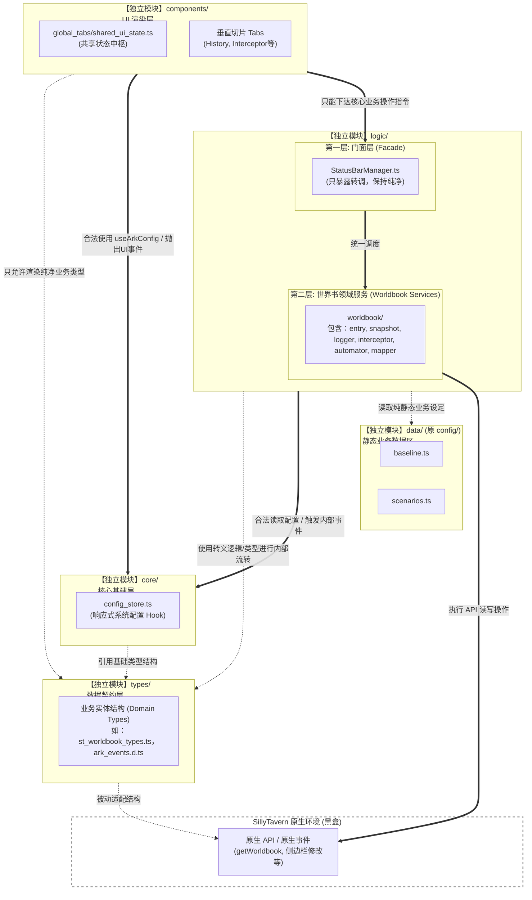

# 项目技术与架构规范 (TECH_STACK)

本文档定义了项目中具象化的编码规范和技术选型约定，是对 `AGENTS_README.md` 的技术补充。所有 Agent 在编写相关逻辑时，必须严格遵守本文件中的约定。

## 1.系统架构总括 (ARCH)

### 1.1 技术栈选型
*   **宿主环境**: SillyTavern (酒馆)
*   **依赖扩展**: Tavern Helper (酒馆助手)
*   **前端框架**: Vue 3 (Composition API) + TypeScript
*   **构建工具**: Webpack (打包成单一 JS/HTML，直接被宿主 `load` 执行)
*   **状态与数据**: 
    *   全局与界面配置：持久化存储于原生环境的 `SillyTavern.extensionSettings['ark_statusbar_settings']`，彻底取代原先的 `[SYS_CONFIG]` 隐藏世界书条目机制（正在重构迁移中）。
    *   调试导出：日志数据限长后写入 `[SYS_DEBUG]` 世界书。
    *   *(规划中)* 剧情进度坐标：存储于 `@types/function/variables.d.ts` 中的**聊天级变量 (Chat-scoped Variables)**。

### 1.2 模块结构划分 (当前：平级模块化微后端架构)



*   **`src/ARK_STATUSBAR/types/` (系统契约与防腐层)**
    *   独立存放 `system_config.ts` (如 ArkConfig, ArkCommit) ，事件强类型定义`ark_events.d.ts`，以及 `st_worldbook_types.ts` 等领域模型，作为跨模块流转数据的唯一合法接口契约（DTO）。
    *   作为所有业务依赖的数据标准“白皮书”，严禁鸭子类型 (Duck Typing) 与随意使用 `any`。
*   **`src/ARK_STATUSBAR/core/` (纯净核心基建)**
    *   包含响应式配置中心 (`config_store.ts`) 与纯内存事件总线 (`event_bus.ts`)。
    *   已移出所有具有写库副作用（如 `logger`）的业务代码，允许上层 UI 平级调用。
*   **`src/ARK_STATUSBAR/data/` (静态业务数据区)**
    *   只存放纯静态配置（如 `baseline.ts`, `scenarios.ts`），供业务逻辑单向读取。
*   **`src/ARK_STATUSBAR/logic/` (后端业务门面与服务)**
    *   **第一层 (Facade)**: `StatusBarManager.ts` 等统一对外接口类，封装底层杂乱的执行流，供前端组件单点调用。严禁在 Facade 内写入任何实质性业务逻辑 (if/for/原生事件监听)。
    *   **第二层 (Domain Services)**: 按领域（如 `worldbook/`）垂直划分的底层服务，包含 `entry_service`, `snapshot_service`, `logger`, `interceptor`, `mapper` 和专门的原生事件监听器 `worldbook_automator`。它们唯一拥有直接操作宿主环境 (SillyTavern 原生世界书) 的权限，并在读写边界处严格执行 Mapper 转译防线。
*   **`src/ARK_STATUSBAR/components/` (微后端 UI 切片)**
    *   外壳 (`GlobalStatusBar.vue`) 仅做拖拽挂载，具体业务按功能分布至 `global_tabs/` 内。
    *   **响应式数据中枢 (`shared_ui_state.ts`)**: 通过监听 `worldbook:data_changed` 总线事件及 `WORLDINFO_UPDATED` 等原生事件，实现后端数据库（SSOT）到前端界面的单向数据自动刷新。严禁各 Tab 手动修改缓存！

### 1.3 模块边界与扩展接口规范 (Module Boundaries & Extension Rules)
为了防止代码腐化为庞大的面条代码或“上帝对象”，本项目确立了**平级模块化 (Flat Modularization)** 与 **数据接口防腐 (Interface ACL)** 边界。所有 Agent 必须遵照执行：
*   **1. 严格的单向或平级依赖限制**: 
    *   `Components` (UI)、`Logic` (业务) 均可平级、合法且直接地调用 `Types` (契约) 与 `Core` (基建)。
    *   `Components` (UI) 若需执行业务修改（如应用剧情、写入快照），**只能**调用 `Logic` 层提供的统一门面方法（如 `StatusBarManager` 的方法）。
    *   **绝对禁止**：UI 直接 import 底层的 Service（如 `entry_service.ts`）；禁止逆向依赖（如 `Core` 去引用 `Logic` 或 `Components`）。
*   **2. 数据结构防腐映射 (Mapper)**: 
    *   从 `Logic` (服务层) 返回给 `Components` 渲染中枢 (`shared_ui_state`) 的数据，在规划中必须被清洗为 `Types` 中自定义的业务实体（如 `ArkStatusItem`），严禁酒馆原生结构（`WorldbookEntry` 或 `any`）向上传染前端模板。
*   **3. 基础设施层 (Core) 的绝对纯净**: 
    *   `core/` 下只能存放诸如 `config_store.ts` 等无副作用的纯技术组件。一旦包含调用宿主底层且带修改副作用的操作（如 `logger` 写入世界书落盘），必须将其划入 `Logic` 下作为业务服务，严禁挂载于 `Core`。
*   **4. 高度自治的前端组件与响应式防撕裂**: 
    *   各个 Tab 子组件负责独立的视图呈现，拒绝形式主义的“胖容器”。
    *   通过基于 Vue 的 `shared_ui_state.ts` 以及底层的 `worldbook:data_changed` 事件，实现组件间内存同频，抛弃陈旧的 `emit` 事件瀑布流。

### 1.4. 新增功能开发规范——强制 4 步走：
任何 Agent 在本项目下新增涉及后端数据的功能时，必须严格遵守以下流转顺序：
1.  **【定义数据结构】**：在 `types/` 目录下用 `interface` 注册新功能所需的数据结构（作为大模型防幻觉参考文档），并在`ark_events.d.ts`注册内部事件。
2.  **【编写底层转译与服务】**：在 `logic/` 下新建 Service。如果涉及读取/修改事件返回的原生酒馆数据（非酒馆助手api返回数据），必须在此处完成“原生数据 $\leftrightarrow$ 内部接口结构”的 Mapper 转译映射防腐。
3.  **【注册专属监听器】**：如果功能包含对原生事件（如 `CHAT_CHANGED`）的长期监控反应，必须将其写在专属的 `automator` (如 `worldbook_automator.ts`) 中，**严禁**塞入 `StatusBarManager`。
4.  **【暴露给门面并被前端调用】**：在 `StatusBarManager` 等 Facade 中仅仅暴露一个极简的调度桥接函数。Vue 前端直接调用 Facade 方法或从 shared_ui_state 拿取纯净数据。

## 2. 跨模块事件通信 (Event System)

### 2.1 原则与背景
为了打破历史遗留的自制 `ArkEventBus` 所带来的模型“知识盲区”并兼顾类型安全，项目已全面迁移至**基于强类型的原生 `CustomEvent`** 模型。

通过扩展全局 `DocumentEventMap` (见 `src/ARK_STATUSBAR/types/ark_events.d.ts`)，我们实现了利用浏览器原生 `document.addEventListener` 和 `document.dispatchEvent` 进行的模块间解耦通信，同时保证了 `TypeScript` 的编译期拦截能力。

### 2.2 强制规范 (MUST DO)

*   **禁止自造轮子**：绝对禁止引入或实现类似 `mitt` 或自己手写的 EventBus 实例。所有跨模块通信**必须**使用原生的 `CustomEvent`。
*   **必须在声明中注册**：在发送或监听任何一个全新的自定义事件前，**必须**先在 `src/ARK_STATUSBAR/types/ark_events.d.ts` 中的 `DocumentEventMap` 接口里添加带有完整注释的强类型定义。
    *   格式必须使用命名空间前缀 `ark:`，并在 `detail` 泛型中定义数据结构：
        ```typescript
        'ark:my-new-event': CustomEvent<{ foo: string; bar: number }>;
        ```
*   **发送事件**：
    必须严格包裹在 `CustomEvent` 对象中并使用 `detail` 承载数据：
    ```typescript
    document.dispatchEvent(
      new CustomEvent('ark:log-debug', { detail: { message: 'hello', isDryRun: true } })
    );
    ```
*   **监听与解绑防漏**：
    由于原生 DOM 事件容易导致内存泄漏（特别是热重载或 Vue 组件销毁时），**必须遵循严格的配对解绑规范**。
    ```typescript
    // 正确的做法：将回调显式赋值给具备具体类型的变量，用于精准解绑
    let myListener: (e: CustomEvent) => void;

    onMounted(() => {
      myListener = (e: CustomEvent) => {
        console.log(e.detail.message);
      };
      // 直接作为 EventListener 传入
      document.addEventListener('ark:log-debug', myListener);
    });

    onUnmounted(() => {
      // 必须在这里解绑，防止热重载堆积！
      document.removeEventListener('ark:log-debug', myListener);
    });
    ```

---
*更多模块的具象规范将随工程进展补充于此...*
