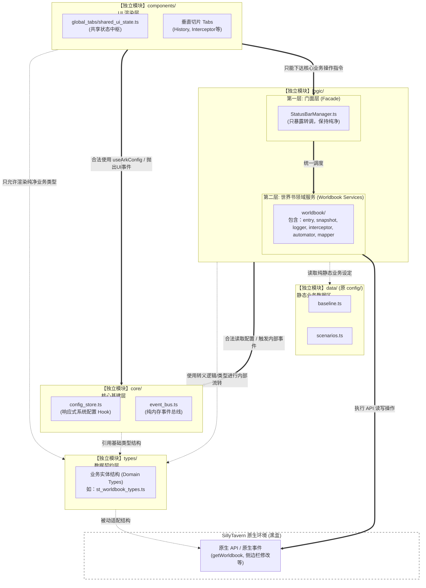

# 系统架构与防线规约 (ARCH)

## 1. 技术栈选型
*   **宿主环境**: SillyTavern (酒馆)
*   **依赖扩展**: Tavern Helper (酒馆助手)
*   **前端框架**: Vue 3 (Composition API) + TypeScript
*   **构建工具**: Webpack (打包成单一 JS/HTML，直接被宿主 `load` 执行)
*   **状态与数据**: 
    *   全局与界面配置：持久化存储于原生环境的 `SillyTavern.extensionSettings['ark_statusbar_settings']`，彻底取代原先的 `[SYS_CONFIG]` 隐藏世界书条目机制（正在重构迁移中）。
    *   调试导出：日志数据限长后写入 `[SYS_DEBUG]` 世界书。
    *   *(规划中)* 剧情进度坐标：存储于 `@types/function/variables.d.ts` 中的**聊天级变量 (Chat-scoped Variables)**。

## 2. 模块结构划分 (当前：平级模块化微后端架构)
本项目已从单体应用彻底演进为五大平级模块，严禁反向依赖与层级污染：

*   **`src/ARK_STATUSBAR/types/` (系统契约与防腐层)**
    *   独立存放 `system_config.ts` (如 ArkConfig, ArkCommit) 以及 `st_worldbook_types.ts` 等领域模型，作为跨模块流转数据的唯一合法接口契约（DTO）。
    *   作为所有业务依赖的数据标准“白皮书”，严禁鸭子类型 (Duck Typing) 与随意使用 `any`。
*   **`src/ARK_STATUSBAR/core/` (纯净核心基建)**
    *   包含响应式配置中心 (`config_store.ts`) 与纯内存事件总线 (`event_bus.ts`)。
    *   已移出所有具有写库副作用（如 `logger`）的业务代码，允许上层 UI 平级调用。
*   **`src/ARK_STATUSBAR/data/` (静态业务数据区)**
    *   只存放纯静态配置（如 `baseline.ts`, `scenarios.ts`），供业务逻辑单向读取。
*   **`src/ARK_STATUSBAR/logic/` (后端业务门面与服务)**
    *   **第一层 (Facade)**: `StatusBarManager.ts` 等统一对外接口类，封装底层杂乱的执行流，供前端组件单点调用。严禁在 Facade 内写入任何实质性业务逻辑 (if/for/原生事件监听)。
    *   **第二层 (Domain Services)**: 按领域（如 `worldbook/`）垂直划分的底层服务，包含 `entry_service`, `snapshot_service`, `logger`, `interceptor`, `mapper` 和专门的原生事件监听器 `worldbook_automator`。它们唯一拥有直接操作宿主环境 (SillyTavern 原生世界书) 的权限，并在读写边界处严格执行 Mapper 转译防线。
*   **`src/ARK_STATUSBAR/components/` (微后端 UI 切片)**
    *   外壳 (`GlobalStatusBar.vue`) 仅做拖拽挂载，具体业务按功能分布至 `global_tabs/` 内。
    *   **响应式数据中枢 (`shared_ui_state.ts`)**: 通过监听 `worldbook:data_changed` 总线事件及 `WORLDINFO_UPDATED` 等原生事件，实现后端数据库（SSOT）到前端界面的单向数据自动刷新。严禁各 Tab 手动修改缓存！

## 3. 给 Agent 的最高开发规范：新增功能的强制 4 步走

任何 Agent 在本项目下新增涉及后端数据的功能时，必须严格遵守以下流转顺序：
1.  **【定义数据结构】**：在 `types/` 目录下用 `interface` 注册新功能所需的数据结构（作为大模型防幻觉参考文档）。
2.  **【编写底层转译与服务】**：在 `logic/` 下新建 Service。如果涉及读取/修改事件返回的原生酒馆数据（非酒馆助手api返回数据），必须在此处完成“原生数据 $\leftrightarrow$ 内部接口结构”的 Mapper 转译映射防腐。
3.  **【注册专属监听器】**：如果功能包含对原生事件（如 `CHAT_CHANGED`）的长期监控反应，必须将其写在专属的 `automator` (如 `worldbook_automator.ts`) 中，**严禁**塞入 `StatusBarManager`。
4.  **【暴露给门面并被前端调用】**：在 `StatusBarManager` 等 Facade 中仅仅暴露一个极简的调度桥接函数。Vue 前端直接调用 Facade 方法或从 shared_ui_state 拿取纯净数据。

## 4. 防线规约 (Redlines & Guardrails)

### 4.1 宿主生态安全防线
*   **避免污染 DOM/全局**: 组件挂载时必须指定唯一的类名容器（如 `ark-global-statusbar-mount-point`），卸载 (`pagehide`) 时必须清理残留样式与监听器。
*   **“初始化风暴”防御**: 酒馆的 MVU 或全局脚本极易在页面刷新、多次 Swipe 时被重复调用，导致陷入死循环。对于全局状态读取（例如 `getWorldbook` 和初始化后端配置），应当加锁或者通过 `turn === 0` 等机制保护。
*   **防呆拦截器**: 使用 `removeEventListener` 时，必须结合 `finally` 代码块确保一定会执行解绑（如我们在 `executeDualTrackDryRun` 升级中所做的那样）。
*   **原生 API 假死保护**: 调用宿主异步 API（如 `worldInfoFn` 或 `generateFn`）时，**必须套上一层 `Promise.race` 超时锁**，以防在移动端或弱网环境下导致永久卡死。

### 4.2 严格类型与数据防腐防线 (Typescript & Mapper Redlines)
*   **严禁使用鸭子类型 (Duck Typing) 污染原生对象**:
    *   在调用宿主底层 API（如 `getWorldbook()`）时，严禁使用 `(entry as any).strategy = {}` 这种强行注入、覆盖或臆测不存在属性的暴民代码。这极易在保存回写时导致底层系统崩溃。
    *   **核心法则**：需要修改酒馆数据时，必须在转译层闭环里，仅针对实际需要的字段进行**局部更新回写**，绝不能将经过修改的（甚至是残缺的）转译后对象全量覆写回原生环境。
*   **严禁 `any/unknown` 逃逸污染业务与 UI**:
    *   酒馆的原生数据结构复杂且可能随版本变动。必须在读取数据的入口处（Service 层），强制通过 `Mapper` 将其清洗为 `types/` 下定义的纯净业务结构（如 `ArkWorldbookEntry`）。
    *   所有流转到 UI 组件（如 `shared_ui_state`）的数据必须是经过严格校验的内部 DTO，彻底斩断对 `entry.strategy?.type` 这种原生深层嵌套属性的直接依赖，消除 AI 幻觉和运行期报错的隐患。
*   **类型定义即最高 API 文档**:
    *   `types/` 目录下的接口定义（如 `st_worldbook_types.ts` 和 `system_config.ts`）是本项目的“白皮书”。遇到 TS 编译报错时，**必须查阅这些类型定义来寻找安全的访问路径（如 `?.` 可选链），绝不允许为了消灭飘红而将对象退化为 `any` 去绕过编译器**。

### 4.3 剧情引擎 V2 架构防线 (规划中)
*   **解耦防线**: 
    *   **严禁**将大量的“节点关系图谱”或长篇幕间设定直接塞入主模型的系统提示词中。
    *   **严禁**要求用户手动修改酒馆本体的预设来适配本插件。
*   **存储防线**:
    *   **剧情的坐标（节点 ID）** 绝不允许写入全局 `sys_config`。必须存储于与“当前聊天会话”强绑定的酒馆变量中。这是保证用户随意切换聊天、Swipe 回滚时，进度能 100% 自动同步的**唯一方法**。
    *   **剧情的分析“思路 (CoT)”** 绝不允许直接暴露在用户的渲染层。必须利用酒馆扩展 API，在即将向主模型发起请求的最终时刻，幽灵注入（Inject）或将文本存入带有隐藏标签的不可见包裹块中，并且确保屏蔽规则要在数据库插件等其他拦截器之前生效。
*   **小模型（次级 API）自由度收束**:
    *   小模型的系统提示词必须包含“演绎建议清单”，只能给出客观推导方向（如：“建议推进至撤退环节”），**严禁**替主模型直接编写角色台词与具体动作。