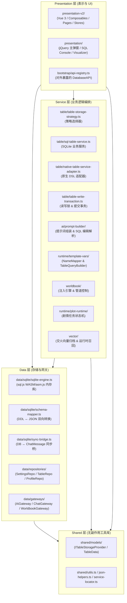
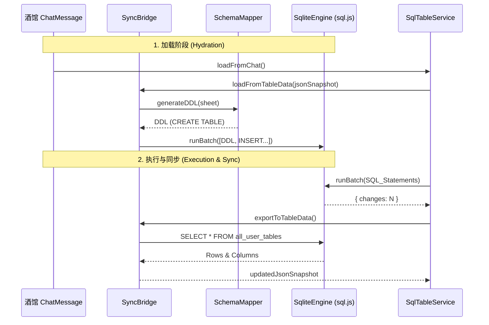

# ACU (shujuku) 项目架构分析文档 (ARCHITECTURE.md)

> **目标系统**: `D:\LLM\self_programming\shujuku` (ACU 数据库扩展 / 结构化表格存储引擎)  
> **分析工具**: Codebase Memory MCP (`codebase-memory-mcp`)  
> **方法论指导**: `codebase-design` (深层模块、接缝 Seam、适配器 Adapter、杠杆率 Leverage)

---

## 1. 系统概览与定位 (System Overview & Identity)

`shujuku`（全称 **Auto Card Updater / ACU**，又称“数据库扩展”）是一个运行于 SillyTavern（酒馆）宿主环境中的高度复杂扩展与油猴 UserScript 系统。

其核心功能是在大语言模型（LLM）角色扮演（RP）对话中，提供**强类型结构化数据持久化、关系型数据库（SQLite 内存引擎）、动态 SQL/ORM 模板变量计算、剧情状态机推进、世界书接管注入以及向量记忆检索**能力。

---

## 2. 三层架构与模块边界 (Three-Layer Architecture)

经过 `001-three-layer-refactor` 重构，`shujuku` 确立了严格的四级单向依赖目录架构：

```text
shared ← data ← service ← presentation
```



### 2.1 各层职责定义

| 层级 | 源码路径 | 职责范围 | 依赖约束 |
|---|---|---|---|
| **Shared** | `src/shared/` | 基础类型契约 (`ITableStorageProvider`)、常量、零依赖工具函数、JSON/HTML 辅助、单例服务注册表 (`service-locator`) | **无任何依赖** |
| **Data** | `src/data/` | 内存数据库引擎 (`SqliteEngine`)、Schema 映射器 (`SchemaMapper`)、数据同步桥 (`SyncBridge`)、宿主 API 网关 (`gateways/`)、持久化仓库 (`repositories/`) | 仅依赖 `shared` |
| **Service** | `src/service/` | 存储策略切换 (`TableStorageStrategy`)、AI 提示词编排 (`PromptBuilder`)、编辑解析与重试调度 (`UpdateOrchestrator`)、ORM 模板变量求值 (`TableQueryBuilder`)、世界书接管管线 (`WorldbookPipeline`)、剧情推进状态机 (`PlotTaskEngine`)、向量记忆归档 (`VectorIndex`) | 依赖 `shared` + `data` |
| **Presentation** | `src/presentation/`<br>`src/presentation-v2/` | UI 组件、页面、主弹窗、可视化表格编辑器 (`Visualizer`)、SQL 控制台、Vue 3 Composables / Pinia Stores、对外 API 注册表 (`api-registry`) | 可依赖所有底层 |

---

## 3. 深层模块与接缝设计分析 (Deep Module & Seam Analysis)

依据 `codebase-design` 原则，`shujuku` 包含数个高杠杆率（Leverage）与强局部性（Locality）的**深层模块（Deep Modules）**：

### 3.1 存储策略模块 (`ITableStorageProvider` Seam)
* **接口 (Interface)**: `ITableStorageProvider` 提供了极为简洁的抽象（`loadFromChat`, `saveToChat`, `getCurrentData`, `applyEdits`, `executeQuery`, `executeMutation`）。
* **内部深度 (Implementation Depth)**:
  * **SQLite 适配器 (`SqlTableService`)**: 掩盖了底层 `sql.js` 内存初始化、DDL 自动生成、表名防注入转义、事务回滚、NameMapper 所有权续租、JSON 二维数组视图导出等数十个复杂步骤。
  * **原生适配器 (`NativeTableServiceAdapter`)**: 掩盖了二维数组 DSL（`insertRow`/`updateRow`/`deleteRow`）的正则解析与差异对比。
* **杠杆率 (Leverage)**: 7 个 UI 一级页面与所有的 AI 触发管线，仅需调用 `getStorageProvider()` 即可透明地在原生 JSON 与 SQLite 关系库间无缝切换，无需改动任何上层业务逻辑。

```
┌──────────────────────────────────────────────────────────────────┐
│   ITableStorageProvider Interface (Small Surface)                │
├──────────────────────────────────────────────────────────────────┤
│ - loadFromChat() / saveToChat()                                  │
│ - applyEdits(edits) / executeQuery(sql)                          │
└──────────────────────────────────────────────────────────────────┘
                                │ (Seam)
            ┌───────────────────┴───────────────────┐
            ▼                                       ▼
┌──────────────────────────────┐        ┌──────────────────────────────┐
│ SqlTableService              │        │ NativeTableServiceAdapter    │
│ (Deep: sql.js, DDL, Sync)    │        │ (Deep: JSON Array DSL)       │
└──────────────────────────────┘        └──────────────────────────────┘
```

### 3.2 ORM 模板变量引擎 (`TableQueryBuilder` Seam)
* **接口 (Interface)**: 暴露 JavaScript 链式代理语法 `db.<表名>.where(...).get(...)`。
* **内部深度 (Implementation Depth)**: 通过 ES6 `Proxy` 拦截属性读取，动态转换为安全的 SQL 预编译语句，自动联结 `NameMapper` 进行中英文表名/列名双向映射，并在无法解析时退化为 AST 求值。
* **杠杆率 (Leverage)**: 允许在酒馆预设、角色卡提示词、`<if>` 条件表达式中书写极具可读性的代码，后端的复杂数据库检索完全对用户透明。

### 3.3 世界书注入与恢复管线 (`WorldbookPipeline` Seam)
* **接口 (Interface)**: `takeoverWorldbookGreenlights()` 与 `restoreWorldbookGreenlights()`。
* **内部深度 (Implementation Depth)**: 解析世界书条目的“蓝灯”（常开）与“绿灯”（条件触发）状态，计算 Token 开销，隔离动态挂载点，并在全套生成流程结束后原子地恢复现场。

---

## 4. 核心子系统架构剖析 (Core Subsystem Architecture)

### 4.1 SQLite 运行时数据库子系统 (`src/data/sqlite/`)



* **`SqliteEngine`**: 基于 `sql.js` (asm.js/WASM) 封装的单例内存数据库。提供 `runBatch` 事务保障（`BEGIN` -> 逐条执行 -> 发生异常即 `ROLLBACK` 并返回定位错误号）。
* **`SchemaMapper`**: 负责 Sheet（二维数组）与 SQL 数据库模式（DDL）的互转。支持优先读取 `sourceData.ddl`，无 DDL 时自动回退至列名猜测算法（首列强制为 `row_id INTEGER PRIMARY KEY`）。
* **`SyncBridge`**: 保持内存数据库与底层 ChatMessage JSON 的强绑定。维护 `_acu_sheet_meta` 隐式元数据表，确保序列化导出时保留 UI 配置项。

### 4.2 AI 提示词与编辑解析子系统 (`src/service/ai/`)

* **`PromptBuilder`**: 根据当前存储模式（Native/SQLite）动态调整提示词：
  * Native 模式：输出二维数组行列索引结构 + DSL 指令说明。
  * SQLite 模式：输出 DDL 定义 + `-- 注释` 数据状态 + 标准 SQL（`INSERT`/`UPDATE`/`DELETE`）编辑指令说明。
* **`TableEditParser`**: 识别模型返回的 `<tableEdit>` 标签块，区分 DSL 与 SQL，交由对应的 `ITableStorageProvider.applyEdits()` 执行。
* **`UpdateOrchestrator` (错误反馈闭环)**: 当 SQL 在 `SqliteEngine` 中触发约束违例（如 `UNIQUE constraint failed` 或语法错误）时，重试循环捕获异常，将截断的失败 SQL 及错误原因注入至下一轮重试 prompt 中，引导模型自愈。

### 4.3 剧情推进与任务状态机 (`src/service/runtime/plot-runtime/`)

* **`PlotTaskEngine`**: 驱动剧情任务并发与阶段流转。
* **`ChatScope`**: 管理剧情/模板的局部上下文作用域，确保当用户切换对话聊天（Chat Switch）或切换角色卡时，内存数据库与剧情变量精准清理和重载，抛出 `CharacterLorebookScopeChangedError` 保护数据隔离。

---

## 5. 构建与产物拓扑 (Build & Bundling Topology)

`shujuku` 使用 Rollup 进行多端打包，其构建拓扑如下：

```text
src/index.ts (油猴入口) ──┐
                         ├──► Rollup 4 ──► dist/index.bundle.js (IIFE)
src/entry-extension.ts ──┘              └──► dist/index.mjs (ESM Extension)
```

1. **油猴脚本模式 (UserScript)**: 输出单文件 IIFE `dist/index.bundle.js`，包裹 UserScript Header，通过 jQuery `$(document).ready` 初始化 `mainInitialize_ACU()`，并使用 `checkAndMarkInstance()` 预防多重注入。
2. **酒馆扩展模式 (Extension)**: 输出 ESM 模块，调用 `_forceExtensionMode()`，挂载至酒馆宿主环境的全局扩展系统。
