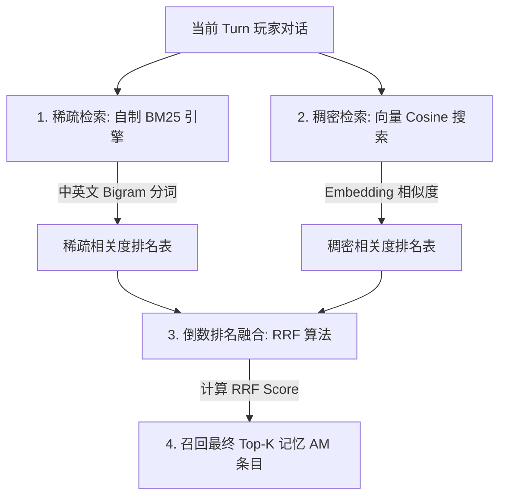

# shujuku 隐蔽高级子系统逆向分析报告 (1_5_shujuku深层高级子系统逆向分析.md)

> **逆向对象**: `D:\LLM\self_programming\shujuku`  
> **核心源码**: `src/service/vector/*` (混合检索)、`src/service/agent/agent-worldbook-takeover.ts` (世界书接管)、`src/service/template/chat-template-reconciler.ts` (大底调和)  
> **分析目的**: 解构 `shujuku` 底层最核心的三个“黑盘”高级子系统，完整还原其在酒馆大框架下进行高性能语义召回、Token 预算控制和 Schema 动态平滑迁移的物理代码 facts。

---

## 一、 BM25 与向量混合检索重排系统（Hybrid Search & RRF Engine）

为了在几百条历史 AM 纪要（`chronicle` 表）中精准召回与当前 Turn 对话最相关的记忆，`shujuku` 的 `src/service/vector/` 目录下物理实现了一整套无须依赖外部数据库的**混合搜索与重排引擎**。

### 1.1 自制中文双字分词 BM25 检索（`summary-vector-hybrid-retrieval.ts`）
由于酒馆运行于浏览器前端限制，`shujuku` 无法使用复杂的外部搜索引擎。为此，它在前端纯手写了一套 **CJK（中日韩）双字滑动分词（Bigram Tokenizer）** 的 BM25 稀疏检索器：
*   **双字分词**：`pushCjkTokens_ACU` / `tokenizeBm25Text_ACU` 通过滑动视窗，将中文文本（如“阿米娅的无人机”）拆解为 bi-gram 词元组（`["阿米", "米娅", "娅的", "无人", "人机"]`），完美绕过了浏览器环境无分词库的痛点。
*   **相关性评分**：`scoreBm25Document_ACU` 对语料库（`Bm25Corpus_ACU`）执行经典的 TF-IDF 变种算法评分，快速筛选出含相同实体、动作的纪要行。

### 1.2 倒数排名融合算法 (`reciprocalRankFusion_ACU` / RRF)
为了解决向量相似度（语义相近但缺少实体匹配）与 BM25（字面匹配但缺少语义概括）各自的局限性，`shujuku` 引入了搜索引擎界标准的 **RRF 重排算法**。
*   **物理公式**：
    对任意一个记忆条目 $d$，其综合 RRF 得分计算为：
    $$RRF\_Score(d \in D) = \sum_{m \in M} \frac{1}{k + r_m(d)}$$
    其中 $M$ 为检索模型集合（即 [BM25, VectorCosine]），$r_m(d)$ 是条目 $d$ 在模型 $m$ 中的排位（Rank），$k$ 是平滑常数（源码中 `k` 取固定值 `60`）。
*   **效果**：通过倒数加权，兼具“实体字面匹配”与“深层语义相近”的记忆条目会被强制推到首位，作为高保真上下文在“天之音”前置调用中召回。

---

## 二、 世界书绿灯接管与 Token 预算控制系统（Greenlight Takeover）

### 2.1 绿灯接管的起因
酒馆的世界书机制包含“蓝灯（常开）”和“绿灯（条件触发，正则匹配到关键词时注入）”。
*   当表格数据非常多，或剧情分支节点（Node）极为庞大时，若直接挂载为原生绿灯，会因为多词同时触发而导致主 System Prompt 瞬间被**撑爆撑死**。
*   `shujuku` 必须强行拦截、过滤、接管酒馆的绿灯渲染管线。

### 2.2 物理接管闭环（`agent-worldbook-takeover.ts` / `injection-engine.ts`）
1.  **现场快照备份**：在主模型生成前，`resolvePreTakeoverWorldbookSnapshot_ACU` 读取并缓存酒馆当前所有世界书条目的激活状态。
2.  **强制抑制（Takeover）**：
    *   通过 `disableTakeoverCandidates_ACU` 将所有受管辖的条件绿灯条目在酒馆底盘中物理设置为 **DISABLE**（彻底封锁酒馆的原生自动匹配，释放 Token 消耗）。
3.  **动态绿灯激活与提权**：
    *   根据当前活跃的剧情进度节点（Node）或表格作用域，只将与当前上下文强相关的条目进行**强制提权**（从条件绿灯修改为蓝灯常开，强行并入提示词）。
4.  **Token 预算动态控制（Token Budgeting Gate）**：
    在提权过程中，系统内置了严格的 Token 开销边界：
    *   `greenlightMinTkBudget`: $\text{20,000}$ Tokens
    *   `greenlightMaxTkBudget`: $\text{80,000}$ Tokens
    *   一旦检测到当前激活的表格和剧情文本总 Token 触及上限，触发 `injection-engine-order.ts`，按照优先级（Priority Order）由低到高物理截断、合并、或关闭非核心世界书条目，保护上下文窗口绝不溢出。
5.  **一键恢复现场（Restore）**：
    在主发包完成或发生网络报错的一瞬间，`restoreWorldbookGreenlights_ACU` 读取原备份快照，将所有条目的状态 100% 物理还原为玩家原先的设置，不留任何脏数据垃圾。

---

## 三、 列模式自动调和与作用域投影系统（Schema Reconciler & Chat Scope）

### 3.1 大底模板平滑调和引擎（`chat-template-reconciler.ts`）
在 RPG 运行中，制作者会频繁更新发布新版本的角色卡属性大底模板（Baseline Table Template）。
*   **痛点**：若用户当前的聊天文件（`.jsonl`）里已经记录了旧版属性表（缺少某些新字段、或某些列名被改动），直接载入会导致 SQLite 数据库结构损毁或数据丢失。
*   **调和逻辑 (`reconcileChatTemplate_ACU`)**：
    1.  当水合启动时，调和器对比旧有 Chat 存档结构与最新大底模板。
    2.  若检测到列新增，自动填充默认值，生成 FALLBACK DDL。
    3.  若检测到物理列更名，触发 **`renamePhysicalColumn_ACU()`**，在内存 SQLite 中物理执行 `ALTER TABLE RENAME COLUMN` 语句进行平滑映射转移，最大化保护玩家既有存档数据不受损。

### 3.2 聊天视窗局部投影（`chat-scope-range.ts`）
即使整个 SQLite 中包含 20 张关联表，在具体的剧情节点中，AI 也不需要知道所有的表。
*   `projectTableDataForTemplateScope_ACU()` 提供**投影过滤器**：
    根据当前活跃的任务阶段（`PlotStage`）或角色当前锁定的关卡 ID，计算当前有效的作用域范围 `TemplateScope`。
*   通过 `filterSheetKeysByTemplateScope_ACU()` 强行对 SQLite 执行局部视图投影，**仅将“当前必须使用的表格”数据格式化拼装进 System Prompt**，其余非活跃表（如尚未解锁的成就表、非当前场景的 NPC 表）保持隐身，实现极致的上下文省流。
