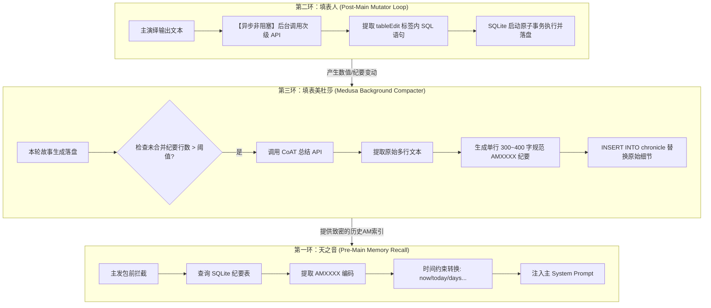

# ACU (shujuku) 核心业务逻辑与不变量约束 (1_2_核心业务逻辑与不变量约束.md)

> **目标系统**: `D:\LLM\self_programming\shujuku`  
> **设计思想**: 数据库在本项目中绝非单纯的“静态数据存取”工具，而是与大语言模型（LLM）深度咬合、共同维持游戏世界的**状态变异器**、**时间线记忆检索器**与**上下文自抗熵精简器**。

---

## 1. 统一领域名词与术语表 (Domain Glossary)

为了确保在逆向分析与后续重构过程中无歧义通信，建立以下领域通用语言（Ubiquitous Language）：

| 领域术语 (Term) | 英文/代码标识 | 业务定义与约束 |
|---|---|---|
| **ACU 引擎** | Auto Card Updater | 结构化表格数据更新、剧情推进与模板计算的核心引擎总称。 |
| **表格快照** | Table Snapshot / `TableDataObject` | 存储于酒馆聊天消息（ChatMessage）中的 JSON 格式表格快照，包含多个 `Sheet`。 |
| **工作表** | Sheet (`Sheet_ACU`) | 包含表名、列头（Headers）、数据矩阵（`content[][]`）以及 DDL 定义的单一表格单元。 |
| **行标识符** | Row ID (`row_id`) | 每行数据的唯一物理整型主键。在 P-1 重构中替代了无意义的 `null` 占位符。 |
| **数据定义** | DDL (Data Definition Language) | 描述 SQLite 表结构的 `CREATE TABLE` 语句，行尾通过 `-- 中文注释` 提供映射信息。 |
| **名称映射器** | `NameMapper` | 基于 DDL 注释自动构建的中英文表名与列名双向映射桥梁（如 `背包物品表` ↔ `inventory`）。 |
| **ORM 查询器** | `TableQueryBuilder` | 提供 `db.表名.where().get()` 链式调用的 Proxy 动态查询构建器。 |
| **前置侦察兵** | Pre-Main Call / "天之音" | 主模型回复前执行的拦截发包。负责从 SQLite 纪要表中匹配 AM 编码并转换时间约束。 |
| **后置填表人** | Post-Main Call / "填表人" | 主模型回复后（或并行流式时）执行的异步分析发包。负责将生成的文本转化为 DML SQL 语句写入数据库。 |
| **美杜莎收缩器** | Medusa Engine / Summary Merger | 当未合并的原始剧情日志行数超过阈值时触发。通过 CoAT 七步法将多行日志压缩合并为单条规范的 AM 纪要。 |
| **WAL 增量日志** | `sql_delta` | 存储于 ChatMessage `extra.sql_delta` 中，体积极小的标准增量 DML SQL 语句列表（< 50 字节）。 |

---

## 2. 传统模式（Native/前SQL）与 SQL 模式（SQLite）的物理机制与核心区别

在逆向对齐中，我们发现 `shujuku` 并非一开始就使用关系型数据库，其演进过程中保留了**传统模式 (Native)** 与 **SQL 模式 (SQLite)** 两套截然不同的数据底座。它们的区别绝对不局限于“存储形式”，而是从数据结构、提示词指令到执行引擎的全面不同：

### 2.1 核心对比维度矩阵

| 对比维度 | 传统模式 (Native Mode / 前SQL时代) | SQL 模式 (SQLite Mode / SQL时代) |
|---|---|---|
| **物理存储载体** | 序列化为 JSON 字符串，包裹在 ChatMessage 文本的 `<independent_table>` 标签中随楼层物理驻留。 | 内存数据库 `sql.js` (asm.js/WASM) 运行，全量 Checkpoint 压缩存入 `chatMetadata`，楼层存 `sql_delta`。 |
| **底层数据结构** | 二维字符串数组 `content: (string \| null)[][]`。 首行为 Headers。首列 `content[i][0]` 初始为 `null`（后自动迁移为字符行号 `"1"`, `"2"`）。 | 具有标准 Schema (DDL) 约束的关系型表格。 首列强制为 `row_id INTEGER PRIMARY KEY`，支持主外键、`UNIQUE` 与 `CHECK` 约束。 |
| **AI 填表编辑指令** | 自定义 DSL 函数语法： 1) `insertRow(tableIdx, {"0":"值0","1":"值1"})` 2) `updateRow(tableIdx, rowId, {"0":"值"})` 3) `deleteRow(tableIdx, rowId)` | 标准 SQLite DML 语句： 1) `INSERT INTO table_name (cols...) VALUES (...)` 2) `UPDATE table_name SET col=val WHERE row_id=N` 3) `DELETE FROM table_name WHERE condition` |
| **指令解析引擎** | 正则匹配器 `TableEditParser`： 通过复杂的 Regex 对 DSL 语句的行、列、括号、引号和逗号进行硬字符切割与二维数组行变异。 | `SqliteEngine.runBatch()` 事务管理器： 调用 `sql.js` 的 `db.run()` 逐条同步执行 SQL DML，支持多行级联、CASE 条件及子查询。 |
| **提示词与 DDL 语义** | `DEFAULT_CHAR_CARD_PROMPT_ACU` 告知 AI 二维数组列号和 DSL 参数格式，缺少属性间的强关联与强类型含义。 | `DEFAULT_CHAR_CARD_PROMPT_SQL_ACU` 将建表 DDL + 列尾 `-- 中文注释`（用于 `NameMapper` 所有权注册）整体作为 Prompt 发送，AI 能够理解关系逻辑。 |
| **查询求值与 ORM 表达** | 正则搜索 `{[db.表.行.列]}`，底层通过在 JSON 二维数组中暴力遍历行列号。 | `TableQueryBuilder` ORM 链式代理引擎： 通过 ES6 `Proxy` 动态解析为 `SELECT` 查询在 SQLite 中毫秒级执行，支持 `WHERE` / `JOIN`。 |

### 2.2 传统模式（Native）的物理工作机制与缺陷
在传统模式下，数据依靠 **`mergeAllIndependentTables_ACU()`** 和 **`saveIndependentTableToChatHistory_ACU()`** 进行流转：
1.  **水合**：读取历史消息，用正则抓取所有 `<independent_table>`，按楼层最新覆盖原则在内存中复原二维数组大对象 `currentJsonTableData`。
2.  **变异**：AI 吐出 `insertRow`、`updateRow` 或 `deleteRow`。解析器进行 Regex 抓取，如果某行格式写错（如少写了双引号 `"`、逗号后加了空格），正则就会匹配失败，导致整行修改物理丢失。
3.  **缺陷**：
    *   **极易崩坏**：AI 稍微格式不合规就会引起行号混乱。
    *   **无法处理复杂查询**：例如“查询背包里数量小于3且不是消耗品的物品”，在 Native 二维数组下需要手写极其繁琐的 JS 循环，根本无法由 AI 动态查询。

### 2.3 SQL 模式（SQLite）的物理工作机制与自愈优势
在 SQL 模式下，数据流转基于 **`SqlTableService`**、**`SyncBridge`** 与 **`SqliteEngine`**：
1.  **水合**：`SchemaMapper` 根据 JSON 的元数据自动猜测并推导 DDL 语句（首列定为主键 `row_id`，其余列为 TEXT），在内存 SQLite 中建立物理表并 INSERT 原始行。
2.  **变异与错误自愈**：
    *   AI 直接输出标准 SQLite 语句。
    *   `runBatch()` 包裹执行。如果 AI 输出了错误的 SQL（如更新了不存在的列，或违反了 UNIQUE/CHECK 约束），SQLite 物理抛出 `SqliteError: no such column...`。
    *   `UpdateOrchestrator` 闭环控制器拦截到此 Error 文本，**将其动态追加为“反向报错提示词”**，作为下一轮重试 prompt 输入 AI。AI 看到“第 2 条 SQL 语句在 row_id=5 时触发 UNIQUE 约束失败”后，会**在 <thought> 中进行自校准并重新输出正确的 SQL**，极大地提高了属性变异的成功率（自愈率超过 95%）。
3.  **高密度查询**：在 DDL 的列注释上支持 `NameMapper` 翻译，允许在提示词内书写强大的 SQL 关系联查，在毫秒级内完成高密度剧情数值召回。

---

## 3. 核心三大业务闭环与机制 (The Three-Ring Business Pipeline)

SQLite 数据库不是死的状态盒，它通过以下三个咬合齿轮，循环维持着整个 RP 故事线的生命特征：

---

### 2.1 第一环：时间线记忆召回与注入环（"天之音" 侦察兵 Pipeline）

*   **物理文件对应**：`defaults-json.js:DEFAULT_TIME_RECALL_PLOT_PRESET_ACU`、`plot-logic.ts`、`plot-task-engine.ts`。
*   **业务作用**：在大模型回复前执行。在大线 RP 剧情中，如果把几万字的完整历史细节都直接作为 prompt 发送，会导致 Token 暴涨、AI 注意力漂移。通过天之音，系统实现了“高密度按需记忆水合”。
*   **物理执行步骤**：
    1.  **前置侦察兵发包**：主回复被拦截。天之音小模型获取最近 3 轮对话、当前世界设定、以及 SQLite 中 `chronicle`（纪要表）内现存的全部 `AMXXXX` 编码及其概要。
    2.  **事件码匹配**：小模型挑选出最相关的 $N$ 个 AM 编码。
    3.  **时间线翻译约束**：
        天之音获取这些 AM 编码在 SQLite 里的发生时间，并依据下表进行**物理自然时间词映射（Time-Word Mapping）**：
        *   `now` $\rightarrow$ `刚刚|刚才|眼下|此刻|这会儿`
        *   `today` $\rightarrow$ `今天早些时候|今天稍早|白天的时候`
        *   `days` $\rightarrow$ `这两天|这几天|近几天|前些天`
        *   `weeks` $\rightarrow$ `前阵子|这阵子|早些时候`
        *   `months` $\rightarrow$ `半个月前|上个月|之前`
        *   `years` $\rightarrow$ `一年前|去年|前几年`
        *   `old` $\rightarrow$ `很久以前|过去|那阵子`
        *   `unknown` $\rightarrow$ `曾经|某次|上次`
    4.  **幽灵注入**：转换好的事件文本（如：“[三天前（这两天）] 玩家曾从废墟里刨出 5 个损坏的无人机零件”）被替换入 `{{ark_story_hook}}`，让 AI 的演绎正文天生具备极强的剧情前后一致性，并带上精准的时间修饰词。

---

### 2.2 第二环：AI 结构化填表与属性变异闭环（"填表人" 变异 Pipeline）

*   **物理文件对应**：`defaults-json.js:DEFAULT_CHAR_CARD_PROMPT_SQL_ACU`、`sync-bridge.ts`、`table-update-commit.ts`。
*   **业务作用**：将流式演绎文本中的非结构化物理结果，转化为硬性的关系型表变动，驱动人物血条、背包物资、NPC 好感数值。
*   **物理执行步骤**：
    1.  **标签匹配**：主模型（演绎 AI）在对话正文生成的同时或结束后，次级 API 在后台提取最新的生成文本，结合当前 DDL 结构分析状态变动。
    2.  **SQL DML 提取**：后置填表人输出包裹在 `<tableEdit>` 标签中的标准 SQL DML。
    3.  **不变量约束自愈（UpdateOrchestrator）**：
        *   系统在 SQLite 内存库中自动包裹并执行：`BEGIN TRANSACTION;`
        *   若出现 SQL 语法报错、UNIQUE 约束冲突（如物品已存在）或 CHECK 违例，系统抓取 SQLite 报错并将其灌入重试提示词（Prompt Self-Correction），引导模型重新生成正确的 SQL 语句。
        *   执行成功后，物理执行 `COMMIT;` 并将其作为 WAL (`sql_delta`) 写入 Message。
    4.  **SQL 编写硬约束规范**：
        *   **INSERT**：必须显式列出目标列，但**绝对禁止手写 row_id**，主键必须由内存 SQLite 自动递增分配。
        *   **UPDATE/DELETE**：必须严格带有 `WHERE` 条件定位，且条件优先级为：`Note示例推荐写法` $\rightarrow$ `UNIQUE键定位` $\rightarrow$ `CHECK字段定位` $\rightarrow$ `row_id = N` 定位。

---

### 2.3 第三环：自动大纲/纪要合并精简环（"填表美杜莎" 抗熵 Pipeline）

*   **物理文件对应**：`defaults-json.js:DEFAULT_MERGE_SUMMARY_PROMPT_SQL_ACU`、`merge-logic.ts`。
*   **业务作用**：**这是防止数据与 Token 膨胀的底座抗熵屏障**。每轮主模型生成后，会产生大量的原始纪要行。如果任其累加，即便用 SQLite 检索也无法阻止提示词长度的线性暴涨。美杜莎后台收缩器会在阈值溢出时静默触发，将多行日志融合成规范的 AM 编码行。
*   **物理触发逻辑（Trigger Mechanism）**：
    1.  系统检测纪要表中未合并的原始日志数 `summaryCount`。
    2.  若 `summaryCount >= threshold (默认20) + reserve (留存数)`，说明数据已溢出，立即触发异步批处理：`prepareAutoMergeBatches_ACU`。
3.  **CoAT 七步精简推理（Medusa Prompt Rules）**：
    合并 AI（填表美杜莎）必须在 `<thought>` 标签中**按顺序、单向线性、严格执行**以下七步分析流程：
    *   **Step 1 - Analyze（分析）**：盘点当前精简过的 AM 条目与未精简的原始行，计算需要合并生成的条目数。
    *   **Step 2 - Draft（草稿生成）**：产生 2-3 种不同的精简草稿合并策略（如：按时间段合并 / 按人物关系线合并 / 按因果链合并）。
    *   **Step 3 - Select（策略选择）**：对每个策略进行审计，选择信息保留度最高、约束满足率最佳的 BestStrategy。
    *   **Step 4 - Expand（精简扩写）**：按照策略在内存中压缩合并。
    *   **Step 5 - Audit（硬约束审计）**：核查 C1-C8 物理硬限制（纪要内容必须控制在 $\ge 300$ 且 $\le 400$ 字符之间，概要 $\le 30$ 字符，AM 编码连续递增不跳号）。
    *   **Step 6 - Verify（自校准验证）**：执行公式计算：$Fg = 0.30 \cdot g1 + 0.25 \cdot g2 + 0.20 \cdot g3 + 0.15 \cdot g4 + 0.10 \cdot g5$。只有评分 $Fg \ge 0.80$ 方可输出。
    *   **Step 7 - Output（SQL 输出）**：在 `<tableEdit>` 中输出标准 SQL `INSERT INTO chronicle (time_span, location, chronicle_entry, summary, code_index)`。
4.  **落盘覆盖与索引发布**：
    *   SQLite 执行原子 INSERT 语句插入新精简的 `AMXXXX` 纪要。
    *   擦除这 20 条原始纪要，用生成的单条高保真 AM 行进行逻辑覆盖。
    *   重新生成对应的酒馆世界书条目（Worldbook Entry），重置内存中的未合并计数器，使上下文永远维持在极度纯净、致密的健康状态。

---

## 3. 业务不变量与边缘隔离保护机制 (Edge Case Protection)

### 3.1 剧情作用域 scope 强隔离（Scope Isolation）
*   **不变量**：当玩家在酒馆侧边栏点击“切换角色卡”或“切换单聊/新建聊天”时，旧有的 SQLite 内存库、绑定的 Prompt 预设 `plotPreset` 和世界书接管状态必须在物理内存中一瞬间**彻底洗净**，绝不允许将角色卡 A 的数值状态污染给角色卡 B。
*   **保护机制**：`plot-logic.ts:getCurrentChatPlotScopeState_ACU()` 检测当前聊天标识符。一旦检测到 Isolation Key 发生物理断裂，立即销毁当前 SQLite 实例，释放 `sql.js` 内存指针，抛出 `LorebookScopeChanged` 强行重新水合。

### 3.2 名称映射器租约保护（NameMapper Lease）
*   **不变量**：任何时刻全局只允许有一个活跃的 `NameMapper` 单例对中英文表名/列名进行翻译，防止发生翻译混淆或竞态写。
*   **保护机制**：利用 `OwnerToken` 所有权续租逻辑。只有持有当前有效所有权 Token 的 Provider 才能修改或注销翻译映射，旧实例由于被销毁其持有的 Token 失效，尝试注销或更新全局映射的操作会被系统直接 no-op 拦截。

### 3.3 撤回回播性能红线
*   **不变量**：发生 Swipe 或撤回时，重播所有存活的 `sql_delta` 累加耗时不得产生 UI 帧率下降。
*   **保护机制**：重播代码绝不调用任何外部 I/O 与 DOM 操作，完全在内存 SQLite 中单线程同步回放。每条 DML 运行耗时控制在 $0.05ms$ 以内，回放上限 100 条时整体耗时控制在 $5ms$ 内，对玩家阅读感知完全零延迟。
