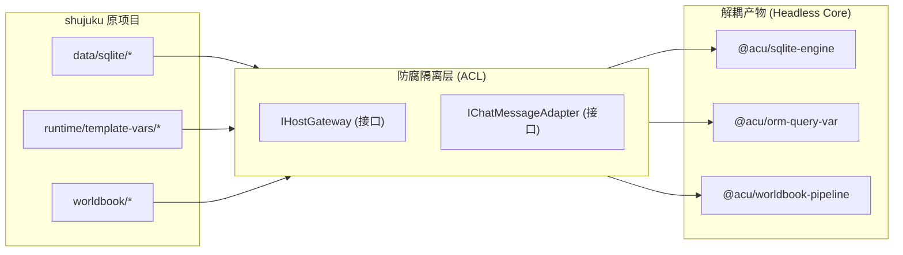

# ACU (shujuku) 逆向工程与解耦迁移方案 (REVERSE_ENGINEERING_PLAN.md)

> **目标系统**: `D:\LLM\self_programming\shujuku`  
> **分析工具**: Codebase Memory MCP (`codebase-memory-mcp`)  
> **方案用途**: 指导如何将 `shujuku` 的核心关系型数据库引擎（SQLite Runtime）、ORM 模板求值引擎与世界书管线进行无痛逆向、解耦拆分并移植至当前项目或无头（Headless）服务中。

---

## 1. 逆向工程目标与范围 (Objectives & Scope)

### 1.1 总体目标
1. **全面解耦宿主依赖**: 将 `shujuku` 过于紧密耦合在 SillyTavern 宿主 DOM、jQuery 及 `window.parent` 原生 API 中的核心算法剥离，抽取为纯粹的 TypeScript 无头（Headless）核心引擎。
2. **提取关系型数据库子系统**: 抽取包含 `sql.js` 内存数据库、`SchemaMapper` DDL 映射器、`SyncBridge` 同步桥与 `SqlTableService` 事务处理在内的独立模块。
3. **提取 ORM 动态模板子系统**: 抽取包含 `TableQueryBuilder` Proxy 链式查询与 `NameMapper` 中英文别名映射的纯逻辑计算库。
4. **制定模块化迁移路线图**: 为将 ACU 的强大表格能力融入当前 `ST_Ark_StatusBar`（明日方舟状态栏 RPG 引擎）提供清晰的阶段性拆解与测试验证方案。

### 1.2 逆向范围划分

```text
┌─────────────────────────────────────────────────────────────────┐
│                      要提取的核心引擎 (Extractable Core)         │
├─────────────────────────────────────────────────────────────────┤
│ 1. SQLite 内存数据库引擎 (SqliteEngine + SchemaMapper + SyncBridge)│
│ 2. ORM & 模板变量求值器 (TableQueryBuilder + NameMapper)         │
│ 3. 表格更新调度与 SQL 自愈器 (UpdateOrchestrator + PromptBuilder) │
│ 4. 剧情任务与阶段状态机 (PlotTaskEngine)                          │
└─────────────────────────────────────────────────────────────────┘
                                ▲ (解耦隔离)
┌─────────────────────────────────────────────────────────────────┐
│                      需要重构/抛弃的宿主耦合层 (Host Boundary)    │
├─────────────────────────────────────────────────────────────────┤
│ 1. 旧版 jQuery 主弹窗 (main-popup.ts - 5700+ 行 Monolith)        │
│ 2. DOM 强绑定的 UI Refs (ui-refs.ts)                            │
│ 3. 强依赖 window.parent.SillyTavern 的直接 API 调用             │
└─────────────────────────────────────────────────────────────────┘
```

---

## 2. 逆向工程实施步骤与方法 (Methodology & Phases)

### 阶段一：静态图谱勘探与契约提取 (Phased Reconnaissance)
1. **图谱依赖扫描**: 利用 `codebase-memory-mcp` 的 `get_architecture` 与 `query_graph` 提取完整的符号调用网（Call Graph）。
2. **抽取隔离接口 (`IHostGateway`)**: 针对 `AiGateway`, `ChatGateway`, `WorldbookGateway`, `HostGateway` 抽象出 100% 纯 TS 接口，阻断对酒馆全局变量的非法穿透。

### 阶段二：无头引擎解耦与单元提纯 (Headless Decoupling)
1. **创建纯净模块目录**: 在 `src/sandbox_shujuku/core/` 中建立零 DOM 依赖的算法副本。
2. **消除 `window`/`document` 全局引用**: 将原本代码中的 `toastr.success` 改为事件总线派发 (`CustomEvent`)，将 jQuery 选择器操作改为响应式状态通知。
3. **注入 `sql.js` 异步加载器**: 将 `sql.js` 的 asm.js/WASM 加载逻辑包装为纯异步工厂（Factory）。

### 阶段三：PoC 概念验证与隔离测试 (PoC Harness Verification)
在 `src/poc/` 目录下编写无宿主环境的验证脚本（基于 Vitest / Node.js），确保提取后的引擎能脱离酒馆独立运行。

---

## 3. 核心解耦模块拆分路线图 (Decoupling Roadmap)



### 3.1 模块 A: SQLite 运行时数据库引擎 (`@acu/sqlite-engine`)
* **源文件**: `src/data/sqlite/sqlite-engine.ts`, `schema-mapper.ts`, `sync-bridge.ts`, `src/service/table/sql-table-service.ts`
* **目标契约**:
  ```typescript
  export interface IHeadlessSqliteEngine {
    init(): Promise<void>;
    loadSnapshot(tables: Sheet_ACU[]): void;
    executeSqlBatch(sqls: string[]): { changes: number; error?: string };
    exportSnapshot(): Sheet_ACU[];
    dispose(): void;
  }
  ```
* **解耦动作**: 移除对 `saveIndependentTableToChatHistory_ACU()` 的内部调用，改为暴露 `exportSnapshot()` 供上层通过事件或 Promise 自由落盘。

### 3.2 模块 B: ORM 动态模板求值器 (`@acu/orm-query-var`)
* **源文件**: `src/service/runtime/template-vars/sql-query-var.ts`, `name-mapper.ts`
* **目标契约**:
  ```typescript
  export interface IHeadlessOrmEvaluator {
    bindSchema(ddlMap: Record<string, string>): void;
    evaluateExpression(expr: string): any;
    replaceTemplateVariables(promptText: string): string;
  }
  ```
* **解耦动作**: 剥离 `window.TavernHelper` 变量替换辅助，完全由 `Proxy` + 本地 `SqliteEngine` 求解。

---

## 4. 技术风险评估与规避矩阵 (Risk & Mitigation Matrix)

| 风险点 | 风险等级 | 潜在影响 | 规避与缓解策略 (Mitigation) |
|---|---|---|---|
| **1. `sql.js` 环境兼容性** | **高** | asm.js / WASM 在部分浏览器或限制性 iframe 中可能加载失败或占用过高内存。 | 实现 `ITableStorageProvider` 策略回退机制。当 `sql.js` 初始化抛错时，自动降级为原生 JSON 数组模式。 |
| **2. 隐式 DOM 引用死锁** | **中** | 旧代码中散落有 `$("#extensions_settings")` 等 jQuery 强依赖，导致脱离酒馆时崩溃。 | 严格执行 `npx tsc` 与无头单测，所有 DOM 操作必须隔离在 `presentation` 层。 |
| **3. SQL 语法注入与非法 DDL** | **中** | LLM 生成恶意或畸形 SQL，破坏数据库表结构。 | 1) 表名/列名正则白名单限制；<br>2) 所有 DML 操作包裹在 `BEGIN...ROLLBACK` 事务中；<br>3) 屏蔽 `DROP DATABASE` / `PRAGMA` 等危险指令。 |
| **4. NameMapper 竞态越权** | **低** | 快速切换聊天时旧数据库实例清空了新实例的名称映射。 | 引入 `OwnerToken` 租约所有权，只有持有效 Token 的活跃实例方可注销/更新全局 NameMapper。 |

---

## 5. PoC (概念验证) 测试计划 (PoC Verification Plan)

为了验证逆向工程的有效性，在 `src/sandbox_shujuku/__tests__/` 中建立三套验证脚本：

### PoC-1: 独立 SQLite 内存数据库水合与事务测试
* **测试目标**: 在 100% 没有任何 SillyTavern / Browser DOM 环境的 Node.js/Vitest 下，验证 `SqliteEngine` + `SchemaMapper` 能否从 JSON 数组成功构建 DDL、插入数据并执行事务回滚。
* **验证断言**:
  - 输入初始 JSON 数组 -> 自动解析为 `CREATE TABLE` 并灌入数据。
  - 执行故意报错的 SQL 批处理 -> 验证数据库触发 `ROLLBACK` 且原始数据无损。

### PoC-2: ORM `TableQueryBuilder` 与中英文 `NameMapper` 链式查询测试
* **测试目标**: 验证 `db.背包物品表.where("物品名称", "金币").get("数量")` 能否正确翻译为 `SELECT quantity FROM inventory WHERE item_name = '金币'` 并返回标量。
* **验证断言**:
  - `NameMapper.translateSql` 能精准跳过 SQL 字符串内的中文，仅替换表名与列名。
  - `TableQueryBuilder` 能正确返回强类型标量、列表和 Count 结果。

### PoC-3: SQL 错误 Prompt 自愈闭环测试
* **测试目标**: 模拟 LLM 输出非法 SQL（如插入不存在的列），验证 `UpdateOrchestrator` 能否捕获异常并生成标准自愈 Prompt。
* **验证断言**:
  - 输出格式包含 `"第 N 条语句失败: [错误详情]"`。
