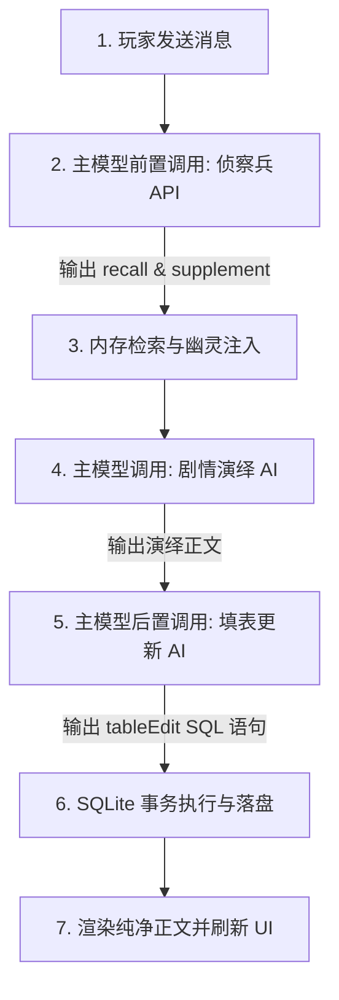
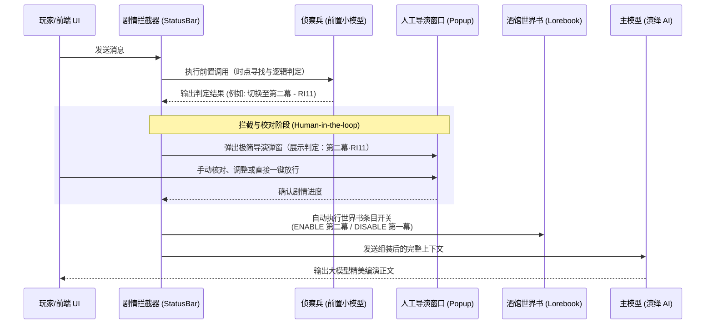
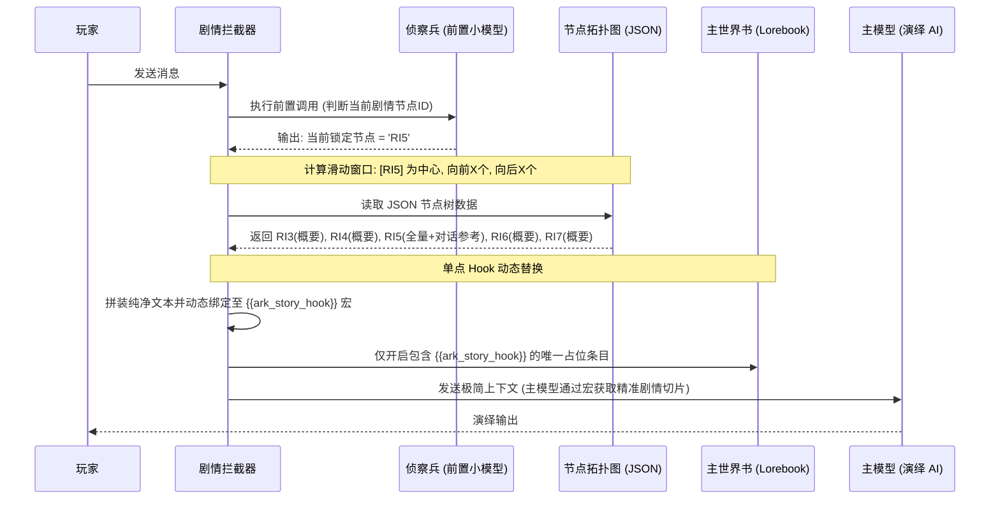

# 明日方舟剧情自动化引擎：双轨调用与加载模式技术规格书 (STORY_ENGINE_COMPREHENSIVE_MODES.md)

> **目标版本**: 剧情自动化引擎 V2 (Standalone Core)  
> **设计思想**: 融合数据库前置/后置双重调用闭环，提供“幕级条目自动化开关（模式一）”与“滑动节点视窗 Hook 注入（模式二）”两套可无缝切换的运行时加载模式。

---

## 一、 数据库内置双重调用机制 (Double-Call Pipeline)

为了实现高内聚的剧情与数据控制，引擎在每轮交互中，在主模型运行的前后分别进行一次专门的 API 旁路调用：



### 1.1 主模型前置调用 (Pre-Main Call)：记忆与背景智能裁剪
* **使命**：将主模型的上下文维持在极佳的“高注意力”状态，杜绝无效 Token 堆砌。
* **输入**：近三轮对话 + 当前剧情大纲表（含有各历史事件的 `AMxxxx` 编码及文本）+ 背景人设大设定。
* **运作**：前置小模型（如 Gemini Flash）扮演“档案管理员”，从上百条历史大纲中筛选出最相关的 $N$ 条 `AMxxxx` 事件编码，并从大设定中过滤出 6 到 8 条最相关的背景规则。
* **注入**：后端网关将这些被召回的 `AM` 对应的详细事件段落拼装至主模型的系统 Prompt 槽，完成“按需记忆组装”。

### 1.2 主模型后置调用 (Post-Main Call)：数据变异与不变量落盘
* **使命**：将对话中的情感和物理结果转化为硬性的关系型数据，驱动游戏化属性。
* **输入**：最新一轮生成的对话文本 + 当前 SQLite 数据库结构 DDL 与 Note 约束。
* **运作**：后置小模型扮演“账目核对员”，分析最新剧情带来的状态变化。
* **执行**：输出 `<tableEdit>` SQL 标签块。SQLite 内存库启动原子事务（`BEGIN TRANSACTION`），执行这些 SQL（如 `UPDATE sys_variables SET var_value = var_value - 10 WHERE var_key = 'player_hp'`），并在执行无误后合并快照保存。

---

## 二、 模式一：幕级条目自动化开关与人工审查拦截 (Act-Level Managed View)

这是最符合传统编演、保障极致演出因果连续性（Context）的粗粒度加载模式。



### 2.1 核心机制
* **大文本驻留**：将整整一幕（Act，如第一幕文本）作为世界书的单一物理开关条目（Worldbook Entry）。只要该幕处于激活状态，整幕剧本的前因后果、环境渲染、主线人设在大脑中保持全量常驻。
* **自动开关控制**：由前置调用（侦察兵）结合 `defaults-json.js` 中的判定提示词与 `最新思维链.txt` 规则，确定当前应激活哪一幕。
* **人工导演窗口 (Human Interceptor)**：在执行世界书条目（幕）变动时，系统暂停后续的主模型发包，向玩家展示当前的剧情判定（例如：“AI 检测到您已完成了第一幕突围，即将切换到第二幕：天灾将至”）。玩家可以手动纠偏、微调当前进度，彻底杜绝 AI 的偶发性错判，保障游玩轨道绝对受控。

---

## 三、 模式二：基于 AST 滑动视窗的单点 Hook 注入模式 (Sliding Node-Window Hook)

这是面向未来、Token 消耗极低、最智能的极致省流细粒度加载模式。它将“一幕”在内存中切割为“节点”，并通过酒馆的单点宏完成动态手术式注入。



### 3.1 核心机制
* **预编译节点网络**：本地调用 Agent 对社区的大文本世界书进行预先扫描，利用正则表达式拆分 `# 剧情节点RI1：`。将每个节点提炼为包含 `summary`（梗概）、`full_script`（全量剧本）、`dialogue_references`（对话参考）、`next_nodes`（后接节点分支）的标准 JSON 拓扑树，保存在插件本地，彻底脱离对酒馆笨重世界书的管理。
* **滑动节点视窗 (Sliding Node Window)**：
  前置侦察兵判定当前处于节点 $N$（如 `RI5`）。系统在内存中以 $N$ 为中心，无视酒馆的原有条件限制，强行计算出相邻的滑动视窗：
  * **历史视窗（向前 $X$ 个节点）**：如 `RI3`、`RI4`。**仅获取其 Summary 概要**，用来维持大模型的历史因果上下文，防逻辑跳跃。
  * **当下视窗（当前节点 $N$）**：`RI5`。**获取全量文本与重要对话参考**，为当前演绎提供高密度的词汇和语气校准。
  * **未来视窗（向后 $X$ 个节点）**：如 `RI6`、`RI7`。**仅获取其 Summary 概要**，作为主线逻辑收敛的潜在引导，提示 AI 在必要时埋下剧情伏笔。
* **单点 Hook 宏注入**：
  在酒馆的主世界书中，**永远只保留唯一一个**起名为剧情 Hook 的条目（如 `{{ark_story_hook}}`）。插件在发包前，将拼装好的滑动视窗文本：
  `[RI3 & RI4 概要] -> [RI5 完整剧本与对话参考] -> [RI6 & RI7 概要]`
  直接替换进这个宏中。主模型通过这个单点 Hook 瞬间读取到了极致精炼、毫无杂质的“当下场景切片”，Token 消耗暴降，生成质量极高。

---

## 四、 剧情运行监控面板技术规格 (Story Runtime Visualizer)

为了让剧情运行状态高度直观，我们可以为两套模式设计一套极具游戏化风格的**剧情运行监控面板 (Story Runtime Visualizer)**：

```text
========================================================================
                      剧情自动化引擎 - 节点运行状态池 (3 节点激活)
========================================================================
 [引擎状态: 运行中]                                  [滑动视口窗口数: 3/5]
 [当前活跃幕: 第一幕 (黑暗时代·上)]                   

 🟢 活跃执行 (ACTIVE - 绿标)
   - #05 剧情节点 [RI5] (当前正在突围，执行全量剧本与对话注入)

 💛 备用/历史预加载 (STANDBY - 黄标)
   - #03 剧情节点 [RI3] (历史概要预加载，维持因果线)
   - #04 剧情节点 [RI4] (历史概要预加载，维持因果线)
   - #06 剧情节点 [RI6] (未来节点大纲载入，引导故事收敛)

 🔴 抑制/非活跃 (DISABLED - 灰标)
   - #01 剧情节点 [RI1] (已完全通过，释放内存/Token)
   - #02 剧情节点 [RI2] (已完全通过，释放内存/Token)
   - #07 剧情节点 [RI7] (超出向前/向后滑动窗口范围，保持静默)
========================================================================
```

1.  **模式一中**：标绿代表“当前人工确认并开启的 Act 幕条目”；标黄代表“准备进行预加载或提示切换的备用 Act 幕条目”；标红代表“已关闭/历史 Act 幕条目”。
2.  **模式二中**：标绿直接代表“当前锁定并全量注入的 Node”；标黄代表“处于向前/向后 $X$ 范围内的滑动视窗 Node（只注入 Summary）”；标红代表“非活跃/完全处于滑动视窗外的 Node”，从而在 UI 上实现高度可视、一目了然的控制体验。
