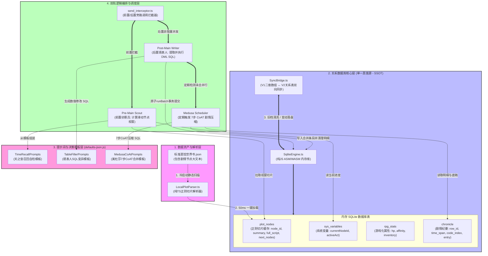

# shujuku 原生业务流与剧情自动化引擎对照规格书 (2_3_shujuku原生业务流与剧情自动化引擎对照规格书.md)

> **文档定位**: 明确划清 `shujuku` 逆向工程事实与本项目自主扩展的剧情自动化引擎边界，确立全生命周期发送/变异/恢复流程中的双侧逻辑并行对照关系。
> **内置提示词渊源**: `shujuku` 数据库原生内置提示词位于 `D:\LLM\self_programming\shujuku\src\shared\defaults-json.js`，包含 `DEFAULT_CHAR_CARD_PROMPT_SQL_ACU`（填表人）、`DEFAULT_TIME_RECALL_PLOT_PRESET_ACU`（天之音）与 `DEFAULT_MERGE_SUMMARY_PROMPT_SQL_ACU`（美杜莎 CoAT）等。

---

## 一、 核心概念边界划分声明 (Boundary Clarification)

为了杜绝后续开发中对“哪些是逆向事实，哪些是扩展功能”产生混淆，做出如下物理边界定义：

### 1. 逆向工程事实 (Reverse Engineering Facts)
指 `shujuku` 仓库源码中**原本就已经实现并物理存在的代码、算法与默认提示词**：
- **`sql.js` 内存数据库与 DDL/DML 执行器** (`data/sqlite/`)；
- **前置发包 (Pre-Main / 天之音)**：从 SQLite `chronicle` 纪要表中检索 `AMxxxx` 编码，计算物理时差并翻译为自然时间词 (`now`/`today`/`days`/`weeks`/`months`)；
- **后置发包 (Post-Main / 填表人)**：提取正文中的 `<tableEdit>` SQL，通过 `UpdateOrchestrator` 追加报错提示词进行自愈重试；
- **美杜莎 CoAT 7 步合并器**：未精简纪要 $\ge 20$ 行时，按 7 步推理压缩为单条规范 `AMxxxx` 纪要；
- **`stable-row-id-allocator` 主键锁**：全生命周期 `reserved` Set 锁定曾用 `row_id`。

### 2. 本项目特有剧情自动化功能 (Unique Extended Features)
指我们在 `shujuku` 数据库底层设施之上，为了实现自动化剧情 RPG 体验而**独有设计的上层编排与控盘系统**：
- **模式一：幕级条目自动化开关 (Act-Level Auto-Toggle)**：自动对酒馆原生世界书中的“第一幕”、“第二幕”执行 `ENABLE`/`DISABLE` API 调用，替玩家自动完成菜单切换；
- **模式二：滑动节点视窗 Hook 切片 (Sliding Node-Window Hook)**：冷启动时将扁平 JSON 大剧本正则解构为 `plot_nodes` 数据库索引网络，按视窗 $N-1(\text{概要}) + N(\text{全量剧本+对话参考}) + N+1(\text{概要})$ 动态替换注入唯一宏 `{{ark_story_hook}}`；
- **双模式共通：可选的人工审查拦截 (Optional Edit Window / Human Interceptor)**：在前置旁路 API 运行后、放行给主模型前，在屏幕中央弹出审查窗，供玩家监视当前剧情进度节点（NodeID）、预览导演建议，并允许手动修正或放行；
- **剧情坐标与 RPG 状态统一 WAL 变异**：将剧情进度坐标 `currentNodeId` 与角色血条、背包物品统一在 SQLite 中进行增量 DML 变异与 5ms 顺延重播。

---

## 二、 发送与变异全生命周期对照表 (Full-Lifecycle Comparison)

| 触发时间节点 | 左侧：`shujuku` 数据库原生完整业务流 (逆向事实) | 右侧：对应节点下，我们独有的剧情自动化引擎逻辑 (扩展功能) |
|---|---|---|
| **1. 玩家点击【发送】<br>(遮罩拦截与水合)** | - **发送拦截**：捕获发送事件，阻断主模型直接发包。<br>- **水合检查**：若内存中无 `sql.js` 实例，从聊天的全局 `SillyTavern.chatMetadata.sqlite_base_snapshot` 装载 Base 数据库。<br>- **启动前置调用 (Pre-Main Call / 天之音)**：将最近 3 轮对话、背景设定及 SQLite 中 `chronicle` 表现存的全部 `AMxxxx` 编码提交给次级小模型。 | - **剧情坐标读取与双模式判定**：<br>前置旁路 API 拦截发包时，读取 SQLite 中 `sys_variables` 的 `currentNodeId`。<br>- **模式一 (幕级开关)**：检测当前聊天对应的酒馆世界书幕级条目激活状态。<br>- **模式二 (滑动视窗)**：次级 API 从 SQLite `plot_nodes` 节点网络（仅含 NodeID + Summary 简介）中，匹配判定当前游玩处于哪个 `node_id`（如 `RI5`），并生成导演建议。 |
| **2. 前置 API 执行中<br>(次级小模型计算)** | - **天之音 Prompt 任务 (`DEFAULT_PLOT_PROMPT_GROUP_ACU`)**：<br>1) 输出 `<all_am>` 列出所有现存 AM 编码；<br>2) 执行 `<self_check>` 校验；<br>3) 按【因果链/人物关系/共同经历】挑选最相关的 $N$ 条 AM 编码，在 `<recall>` 中输出。 | - **视窗装载或幕级判定**：<br>- **模式一**：判定当前对话是否已触发大章节跨越条件（如第一幕结束，即将进入第二幕）。<br>- **模式二**：以判定出的 `currentNodeId` 为中心，从 SQLite 提取相邻节点切片：$[N-1 \text{ 历史概要}] \rightarrow [N \text{ 当前全量剧本+对话参考}] \rightarrow [N+1 \text{ 未来概要}]$。<br>- **共通：可选的人工审查拦截窗口 (Edit Window)**：<br>在放行主模型前，在屏幕中央弹出**审查窗**（展示当前 NodeID 节点/幕级状态、偏离度与导演建议）。玩家可选择“直接放行”、“手动微调导演建议/目标节点”、“重新掷骰子”或“取消发送”，让玩家 100% 掌控剧情航向。 |
| **3. 前置 API 返回<br>(幽灵注入与切片)** | - **自然时间词映射**：代码计算选中的 `AM` 编码发生物理时差，翻译为 `now` (刚才)、`today` (今天稍早)、`days` (前些天)、`weeks` (前阵子)、`months` (上个月) 等自然时间词。<br>- **注入系统 Prompt**：将带自然时间词的 AM 概要替换注入系统 Prompt 槽，放行主模型。 | - **单点 Hook 替换与幕级开关执行**：<br>- **模式一**：根据确认的章节，自动调用酒馆原生 API 静默勾选开启“第二幕”世界书，勾选关闭“第一幕”世界书，替代玩家手动切菜单。<br>- **模式二**：将自然时间词 + 滑动视窗剧本切片 + 导演建议，统一物理替换绑定至酒馆唯一的 `{{ark_story_hook}}` 占位宏。<br>- 放行主模型发包。 |
| **4. 主模型演绎正文<br>(演绎与 DOM 过滤)** | - **正文渲染**：主模型拿到带有 AM 时间切片的 System Prompt，流式生成故事正文。<br>- **DOM 前端过滤**：渲染层用正则在 DOM 树中强行切除正文里的 `<thought>`、`<recall>` 等思考标签，保持界面纯净。 | - **剧本引导与回归**：<br>主模型读取“当前节点全量剧本（含重要对话参考）+ 导演建议”，遵守《最新思维链.txt》进行消化与改编。若玩家偏离，主模型在结尾顺手给出回归节点的引子。<br>- **DOM 前端剥离与 UI 常驻**：<br>用严厉正则彻底在对话 DOM 中剥离 `<st_ark_director>` 思考块，同时在状态栏/工作台中可视化常驻回显当前剧情节点坐标（如 `当前节点：RI5 (模式二)`）。 |
| **5. 主模型生成完毕<br>(后置变异与落盘)** | - **触发后置异步调用 (Post-Main Call / 填表人)**：主模型正文流式输出的同时，次级 API **在后台非阻塞并发运行**。<br>- **填表人 Prompt (`DEFAULT_CHAR_CARD_PROMPT_SQL_ACU`)**：<br>读取背景、正文数据与当前 DDL，分析故事带来的数值变动，在 `<content><tableEdit>` 中输出标准 SQL DML：`INSERT`/`UPDATE`/`DELETE`。<br>- **SQLite 事务与 WAL 落盘**：<br>SQLite 执行 `BEGIN TRANSACTION` 提交变异；报错则触发 `UpdateOrchestrator` 重试自愈；成功后将变动 SQL 存入 ChatMessage `extra.sql_delta`（<50 字节）。 | - **剧情坐标与 RPG 属性统一 SQL 变异**：<br>后置填表人在更新背包、好感度、血条的同时，**将确定跳转的新剧情坐标（如 `UPDATE sys_variables SET var_value = 'RI6' WHERE var_key = 'currentNodeId';`）一同作为标准 SQL 提交写入 SQLite**！<br>- **状态栏 UI 同步刷新**：<br>实时更新状态栏 UI 上的剧情坐标节点。 |
| **6. 后台定期维护<br>(抗熵精简阶段)** | - **美杜莎 CoAT 7 步合并 (`DEFAULT_MERGE_SUMMARY_PROMPT_SQL_ACU`)**：<br>检查 SQLite `chronicle` 表未合并行数，若 $\ge 20$ 行，后台触发美杜莎，按 7 步推理将 20 条零散明细合并为 1 条 300~400 字规范 `AM` 纪要，写入 SQLite 并擦除旧明细。 | - **全量 Checkpoint 更新与离线瘦身**：<br>当美杜莎合并完成或达到楼层周期（如 10 楼），代码在 `SillyTavern.chatMetadata` 中更新全量数据库 Checkpoint 快照（`sqlite_base_snapshot`），楼层只留 <50 字节 `sql_delta`。 |
| **7. 用户撤回或 Swipe<br>(恢复阶段)** | - **5ms 顺延重播**：玩家点击撤回或 Swipe，内存 SQLite 用 `chatMetadata` 的 Base 快照重装现场，顺延遍历运行剩余存活楼层的 `extra.sql_delta` 语句，5 毫秒内恢复变异。 | - **剧情坐标与数值 100% 同步撤回**：<br>伴随着 `sql_delta` 的重播，`currentNodeId` 剧情坐标与背包、血条数值一同在 **5 毫秒内同步回滚**到该楼层的真实位置，状态栏 UI 实时将剧情节点切回撤回后的对应节点，绝不发生剧情坐标与数据错乱。 |

---

## 三、 双加载模式与可选人工审查机制详解 (Detailed Specifications)

### 3.1 模式一：幕级条目自动化开关 (Act-Level Auto-Toggle)
1. **适用的剧情资产**：适用于未进行 AST 正则切片的传统大文本世界书（如包含 `第一幕`、`第二幕` 等条目的完整世界书）。
2. **自动化工作流**：
   - 当后置填表人或前置侦察兵判定玩家剧情进度已跨越至下一幕（如 `第二幕`）时；
   - 剧情引擎捕获该状态变异，自动调用酒馆原生 API：
     - `setWorldbookEntryState(firstActUid, false)`（禁用旧幕）
     - `setWorldbookEntryState(secondActUid, true)`（启用新幕）
   - 替玩家省去手动切菜单、勾选/取消勾选世界书条目的繁琐过程。

### 3.2 模式二：滑动节点视窗 Hook 切片 (Sliding Node-Window Hook)
1. **适用的剧情资产**：冷启动时，插件读取扁平 JSON 文件，由正则解构并在 SQLite 中预编译建立 `plot_nodes` 表。
2. **自动化工作流**：
   - 屏蔽酒馆笨重原生的世界书条目，仅保留唯一的 `{{ark_story_hook}}` 占位宏；
   - 根据前置侦察兵判定的 `currentNodeId`（如 `RI5`），以 SQL 查询调出：
     - **历史视窗 ($N-1$)**：仅取 Summary 概要；
     - **当前视窗 ($N$)**：调出 FullScript 全量剧本与重要对话参考；
     - **未来视窗 ($N+1$)**：仅取 Summary 概要。
   - 拼装拼接后动态替换注入 `{{ark_story_hook}}`，实现 Token 消耗由 50,000 暴降至 800 的极致省流。

### 3.3 共通机制：可选的人工审查拦截窗口 (Edit Window)
1. **门控开关**：在插件配置中提供开关选项：`“开启剧情前置审查窗 (Human-in-the-Loop)”`。
2. **交互流程**：
   - 当开启此功能时，在前置旁路 API 运行完毕后，系统**挂起主发包流程**，在屏幕中央弹出审查模态窗；
   - **展示内容**：回显次级 API 判定的目标节点（`currentNodeId`）、偏离度评估以及拟投喂给主模型的“导演建议”；
   - **用户可执行操作**：
     - **【直接放行】**：无脑同意，进入主模型发包；
     - **【编辑修改】**：手动修改导演建议或强行校正目标 NodeID，随后放行；
     - **【重新分析】**：重新触发次级旁路 API 分析；
     - **【取消发送】**：中断本次发包。
3. **彻底监控剧情**：确保不论使用模式一还是模式二，用户均能 100% 监视并掌控剧情的实际流转，杜绝 AI 乱跑乱跳。

---

## 四、 核心系统框架与运行时业务流图 (System Architecture & Business Workflow Diagrams)

以下定义本沙盒系统的核心物理架构与运行时数据流咬合关系。方案设计已完全与主项目及外部依赖实现解耦。

### 4.1 项目完整架构图 (Standalone Sandbox Architecture)
本图描绘了沙盒系统的核心静态结构、各计算子模块的分工，以及它们在数据层（SQLite 统一单源存储）上的咬合关系。



---

### 4.2 运行时业务流程图 (Runtime Business Workflow)
本图描述了在一轮完整的 AI 交互中，系统从前置拦截、人机导演确认、主模型流式渲染，到后台非阻塞异步填表、错误自愈重试的完整业务执行时序。

```mermaid
sequenceDiagram
    autonumber
    actor Player as 玩家 (UI)
    participant Interceptor as 双轨拦截器
    participant SQLite as SQLite 内存库
    participant PreAPI as 前置侦察兵 (次级API)
    participant Director as 人工导演窗口 (Popup)
    participant MainLLM as 主模型 (演绎AI)
    participant PostAPI as 后置填表人 (后台异步API)

    %% ---- 1. 前置拦截与判定阶段 ----
    Player->>Interceptor: 玩家发送消息
    activate Interceptor
    Interceptor->>SQLite: 查询 sys_variables 获取当前 currentNodeId
    SQLite-->>Interceptor: 返回 'RI5'
    Interceptor->>PreAPI: 请求前置剧情判定 (带入天之音模板 + 历史AM上下文)
    activate PreAPI
    Note over PreAPI: 严格执行天之音规则:<br/>1. <all_am> 全量抄录防遗漏<br/>2. <self_check> 数量验证防失忆
    PreAPI-->>Interceptor: 返回 [目标节点ID: 'RI5' + 导演建议]
    deactivate PreAPI

    %% ---- 2. 导演介入与切片注入 ----
    rect rgb(35, 40, 65)
        Note over Interceptor, Director: 门控开启：人工导演介入 (Human-in-the-Loop)
        Interceptor->>Director: 挂起主发包，弹出导演核对弹窗
        Player->>Director: 手动确认、微调导演建议，或一键放行
        Director-->>Interceptor: 导演思路和进度放行
    end

    Interceptor->>SQLite: 按模式二查询 plot_nodes (RI4概要 + RI5全量 + RI6概要)
    SQLite-->>Interceptor: 返回滑动视窗剧本切片
    Interceptor->>Interceptor: 将 [视窗切片 + 导演建议] 绑定至宏 {{ark_story_hook}}

    %% ---- 3. 主模型流式生成与后置异步并发 ----
    Interceptor->>MainLLM: 物理替换宏，放行主模型发包
    deactivate Interceptor
    activate MainLLM
    
    par 主模型流式正文演绎与后置非阻塞分析同步进行
        MainLLM-->>Player: 流式渲染演绎正文 (正则过滤思维链标签)
    and 后置异步并发开始
        MainLLM-->>PostAPI: [非阻塞] 发送最新正文、背景人设与当前 DDL
        deactivate MainLLM
        activate PostAPI
        Note over PostAPI: 运行 SQL_TABLE_FILLER_PROMPT<br/>分析角色属性与好感度变动
        PostAPI-->>Interceptor: 返回 <tableEdit> 标准 SQL 变异指令集
        deactivate PostAPI
        activate Interceptor
        
        %% ---- 4. 事务提交与错误自愈循环 ----
        rect rgb(60, 35, 35)
            Note over Interceptor, SQLite: 事务执行与 UpdateOrchestrator 错误重试闭环
            Interceptor->>SQLite: SQL 批处理原子事务提交 (SqliteEngine.runBatch)
            alt SQL 执行报错 (如 UNIQUE 键冲突)
                SQLite-->>Interceptor: 抛出: "第 N 条语句失败: ..." 异常
                Interceptor->>PostAPI: 捕获异常，将 SQL + 错误日志拼接自愈 Prompt 重试发包
                activate PostAPI
                PostAPI-->>Interceptor: 返回修正后的 SQL 指令
                deactivate PostAPI
                Interceptor->>SQLite: 重新执行事务
            end
        end
        
        SQLite-->>Interceptor: 事务提交成功，变更行数 X
        Interceptor->>Interceptor: 提取变更语句，写入 ChatMessage.extra.sql_delta (<50 字节)
        Interceptor->>Player: 刷新 UI 状态栏 (剧情进度与 RPG 数值同步变异)
        deactivate Interceptor
    end

