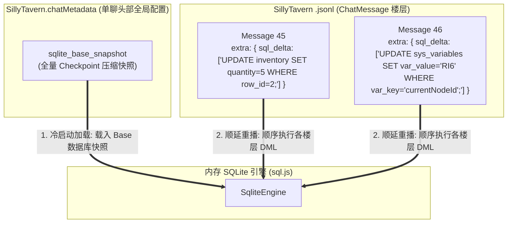
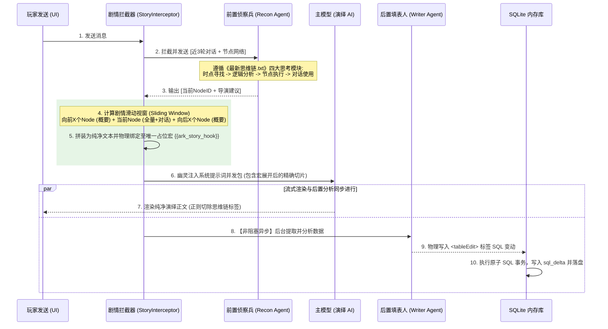

# 明日方舟剧情自动化引擎与数据库/旁路 API 整合总体规划 (3_1_剧情与数据库旁路API整合总体规划.md)

> **核心目标**: 融合独立 API 旁路发包服务、`shujuku` 数据库逆向成果以及社区 `7.20最新整合剧情世界书` 资产，构建全闭环、一键式的明日方舟剧情 RPG 引擎。

---

## 一、 MVU 变量管理器 vs 数据库（SQLite/Native）技术选型深度对比与融合方案

### 1.1 核心维度的技术对比

| 评估维度 | 原 MVU 方案 (`mvu_core` / `PHASE3`) | 数据库-Native 模式 (`shujuku`) | 数据库-SQLite 模式 (`shujuku`) |
|---|---|---|---|
| **数据结构与语义** | 单一树状 JSON + Zod Schema 钳制 | 2D 字符串数组矩阵 (`content[][]`) | 标准关系型表 (DDL、主外键、`row_id`) |
| **存储载体与撤回** | 挂载于 ChatMessage `metadata` 或 message 变量，**天然支持楼层级回档/撤回** | 编码于 Message 文本里的 `<independent_table>` 标签块，回放回溯机制复杂 | 内存 DB + `SyncBridge` 导出 JSON 写入 Message，依托全量 Snapshot 回水 |
| **变异与更新机制** | JSON Patch / Delta (`replace`, `insert`, `delta`)，由 `jsonrepair` + Zod 修复 | 自定义 DSL (`insertRow`, `updateRow`, `deleteRow`) | 标准 SQL (`INSERT/UPDATE/DELETE`) + `UpdateOrchestrator` 错误重试闭环 |
| **查询与 Prompt 注入** | 手动路径读取 (如 `_.get`)，灵活度较低 | 按行列索引读取，仅支持简单条件 | **ORM 链式代理 (`db.表名.where().get()`)** + 标准 SQL JOIN，表达力极强 |
| **数据密度与性能** | 长时间运行后变量树线性膨胀，序列化开销大 | 适中，但二维数组缺少类型约束 | **高密度存储**，数百行/几十张表仅占用几 MB 内存，`sql.js` 毫秒级检索 |

### 1.2 架构选择结论：统一关系存储与极轻化增量 WAL 日志架构 (Unified SQLite & WAL Delta Engine)

**结论**：我们**拒绝了冷热双轨分级存储设计**（即一部分用 MVU 状态树，一部分用 SQLite 的杂交方案），因为这会引入高昂的双端同步开销、状态时序死锁和撤回不一致风险。

相反，我们决定采用**统一内存关系数据库作为单一数据源（Single Source of Truth / SSOT）**。所有游戏数值状态（包括背包物品、NPC 好感、全局纪要，甚至极轻量的当前剧情坐标 `currentNodeId`）**完全统一在 SQLite 内存数据库内存储与查询**。

通过与酒馆聊天存储机制的底层咬合，实现这套极致轻量的 WAL (Write-Ahead Log) 存储设计：



1.  **唯一全量 Checkpoint**：完整的 SQLite 数据库快照（Zstd 压缩或 Hex Blob）**仅保存一份**在聊天的全局 `SillyTavern.chatMetadata.sqlite_base_snapshot` 中。随着对话楼层增加，它会被定期或在关键事件后直接覆盖更新，**不会随消息条数翻倍**。
2.  **楼层增量 WAL 日志 (`sql_delta`)**：普通对话楼层的 `ChatMessage.extra.sql_delta` **只存储本轮生成的增量 DML SQL 语句列表**（通常小于 50 字节）。从而彻底解决了 `.jsonl` 聊天文件体积暴涨和 IO 导致的生成卡顿问题。
3.  **撤回（Undo）与分叉（Swipe）数据一致性**：
    *   拦截撤回事件，在删除消息前，立即将内存中执行完毕的最新全量快照物理写回到当前剩余的最新楼层，建立新 Checkpoint，舍弃后面的 `sql_delta` 语句，直接避免了复杂的回滚回溯重播计算。
    *   分叉（Swipe）时由于仅拷贝了历史消息和 Metadata，系统会自动继承对应的快照和 WAL deltas，在内存中重新水合，保证状态绝对一致。

---

## 二、 数据库前 SQL 时代与 SQL 时代的数据格式及 API 映射

为了实现免用户打开聊天的插件化/一键化数据转换与后端导入，通过对 `shujuku` 中前 SQL 时代（Native 模式）与 SQL 时代（SQLite 模式）的分析，得出以下完整数据结构与 API 对应关系：

### 2.1 数据格式 (Data Types) 对比

#### 1. 前 SQL 时代 (Native 模式) 格式
*   **数据结构**: `TableDataObject_ACU` 包含 `Sheet_ACU[]`。
*   **Sheet 矩阵**: `content: (string | null)[][]`
    *   行 0 为表头（Headers），历史数据中 `content[0][0]` 为 `null` 占位符。
    *   行 1+ 为数据，首列为 `null` 或行号。
*   **存储载体**: 序列化为 JSON 后包裹在 ChatMessage 文本的 `<independent_table>` 标签中。

#### 2. SQL 时代 (SQLite 模式) 格式
*   **数据结构**: 由 DDL（`CREATE TABLE ...`）强类型约束的物理数据库，首列强制为 `row_id INTEGER PRIMARY KEY`（P-1 重构已将前 SQL 时代的 `null` 批量迁移为 `row_id`）。
*   **元数据表**: 内存库中额外维护 `_acu_sheet_meta` 系统表（存放 `note`, `updateConfig`, `exportConfig`），对外和 AI 不可见。

### 2.2 对外 API 映射与离线转换插件接口

针对免打开聊天的后端转换，映射关系如下表所示：

| 功能操作 | 前 SQL 时代 (Native API) | 现在 SQL 时代 (SQLite API) | 后端转换插件解耦 API 接口 |
|---|---|---|---|
| **数据回放/水合** | `mergeAllIndependentTables_ACU()` | `SqlTableService.loadFromChat()` / `SyncBridge.loadFromTableData()` | `AcuImporter.hydrateFromChatJsonl(chatJsonl)` |
| **编辑指令应用** | `parseAndApplyTableEdits_ACU()` | `SqlTableService.applyEdits()` / `SqliteEngine.runBatch()` | `AcuImporter.applySqlOrDsl(input)` |
| **数据导出/落盘** | `saveIndependentTableToChatHistory_ACU()` | `SyncBridge.exportToTableData()` | `AcuImporter.exportToJsonSnapshot()` / `exportToSqliteDump()` |
| **DDL 提取/生成** | 无（按位置映射） | `SchemaMapper.generateDDL()` / `generateFallbackDDL()` | `AcuImporter.extractDdlSchema()` |

---

## 三、 整合剧情世界书（`7.20整合包`）结构分析与剧情模块业务循环框架

### 3.1 世界书共同结构与思维链 (CoT) 拆解

通过对 `references\7.20最新整合剧情世界书` 的分析，探明其核心资产由三大件构成：

1.  **剧情发生逻辑条目 (Timeline Entry)**: `constant: true` 蓝灯常开，定义幕（Act）与节点（Node，如 RI1, RI2, ST1）的时间顺序与相隔时距。
2.  **剧情节点剧本条目 (Node Script Entries)**: 包含**梗概 (Summary)**、**前置发生条件**、**本节点重要对话参考 (Dialogue References)** 和 **后接节点 (Next Nodes)**。
3.  **思维链 (`最新思维链.txt`) & 正则包**:
    *   **四大思考模块**: `剧情时点寻找` (1-5) -> `剧情逻辑分析` (1-5) -> `节点执行` (1-5) -> `对话示例使用` (1-9)。
    *   **双正则防护**: `regex-我在哪？`（提取并在 UI 驻留显示当前坐标 `<weizhi>`）；`regex-不看思路`（在聊天 DOM 强行隐藏 `<st_ark_director>` 思维链标签）。

### 3.2 剧情模块业务循环框架与双重调用机制 (Double-Call Pipeline)

为了实现高内聚的剧情与数据控制，引擎在每轮交互中，在主模型运行的前后分别进行一次专门的 API 旁路调用（前置侦察兵 + 后置填表人），构筑双轨拦截。

同时，**后置填表采用非阻塞异步调用**，在主模型流式渲染输出的同时，在后台静默分析数据变动并异步执行 SQL 变动写入，确保玩家的阅读流程无卡顿：



1.  **前置侦察兵 (Pre-Main Call / 阻塞发包)**：
    在主回复发包前阻塞运行。基于《最新思维链.txt》分析剧情时点，自动匹配最相关的剧情节点 $N$。在内存中以 $N$ 为中心计算出**滑动视窗（Sliding Node Window）**：对历史和未来边缘节点只载入 Summary 梗概（用于在节省 Token 的同时维持剧情前因后果防止 AI 忘词），对当前活跃节点 $N$ 载入全量剧本与 Dialogue References 对话参考（用于语气口癖和语言特征校准），随后替换至酒馆唯一的 `{{ark_story_hook}}` 占位宏。
2.  **主模型流式演绎 (Main Call / 流式输出)**：
    主模型通过 `{{ark_story_hook}}` 获得极高密度的场景切片和语气校准。流式输出剧情回复，并通过正则匹配强行将后台思考标记（如 `<st_ark_director>`）在玩家可见的 DOM 树中剔除，保持纯净文本。
3.  **后置填表人 (Post-Main Call / 异步非阻塞)**：
    在主回复开始流式渲染并被玩家阅读的同时，次级 API **在后台异步并发运行**。接收最新生成的对话文本，提取其中蕴含的数值与关系变动，并生成标准 DML SQL 包裹在 `<tableEdit>` 中。由于是异步旁路运行，玩家的阅读过程没有任何等待感。

---

## 四、 在 `src\ARK_STATUSBAR` 中集成逆向无头酒馆业务逻辑（Bypass API 引擎）

### 4.1 旁路 API 逻辑 (Bypass Pipeline) 的必要性

为了使剧情引擎与状态栏在**任意版本酒馆（SillyTavern）、不同分支或完全独立的 App** 中均能 100% 稳定运行，必须彻底摆脱对宿主 UI / DOM 及特定 `TavernHelper` 版本的硬性依赖。

我们在 `src/sandbox_headless_core/MVP_TEST_REPORT.md` 中已经成功验证了基于 `@earendil-works/pi-ai` 与纯 TypeScript 驱动的无头全套管线（`CharacterParser`, `PresetAssembler`, `ContextBuilder`, `AgentEngine`）。

### 4.2 接入架构设计 (`src/ARK_STATUSBAR/services/bypass/`)

在 `src/ARK_STATUSBAR/` 中下设 `services/bypass/` 目录，通过策略模式（Strategy Pattern）建立双引擎驱动：

```text
src/ARK_STATUSBAR/
├── services/
│   ├── bypass/                           # 【无头旁路 API 核心】
│   │   ├── core/
│   │   │   ├── character_parser.ts       # 二进制 PNG 脱壳器
│   │   │   ├── preset_assembler.ts       # 预设组装管线 (支持 system_prompt 排序)
│   │   │   ├── context_builder.ts        # 消息上下文拼装器 (保留 <think>)
│   │   │   └── agent_engine.ts           # pi-ai 流式发包代理
│   │   ├── story_interceptor.ts          # 剧情双轨拦截器
│   │   └── host_gateway.ts               # 宿主网关抽象层 (Seam)
│   └── statusbar_manager.ts              # 统一门面 (Facade)
```

#### 宿主网关抽象层 (`IHostGateway`) 规约
```typescript
export interface IHostGateway {
  readonly mode: 'tavern_native' | 'headless_bypass';
  
  // 发送消息拦截与获取
  fetchHistory(limit: number): Promise<ChatMessage[]>;
  sendBypassRequest(payload: BypassRequestPayload): Promise<AsyncIterable<string>>;
  
  // 变量与世界书操作
  getVariable(key: string): any;
  setVariable(key: string, value: any): void;
  setWorldbookEntryState(uid: string, enabled: boolean): void;
}
```

1.  **环境自动感知**:
    *   若检测到原生酒馆环境且 API 健全，`HostGateway` 挂载 `TavernNativeAdapter`，直接复用酒馆发包管道。
    *   若检测到宿主 API 缺失、版本过旧或处于独立 App 环境，系统**自动切入 `HeadlessBypassAdapter`**，激活本地的 `AgentEngine` + `pi-ai` 代理管线，强行完成次级模型与主线模型的无痕发包！
2.  **彻底隔离酒馆环境风险**: 无论 SillyTavern 未来如何重构其前端 UI，`src/ARK_STATUSBAR` 的旁路逻辑均能自给自足地完成预设组装、思维链剥离、世界书激活与状态落盘。
