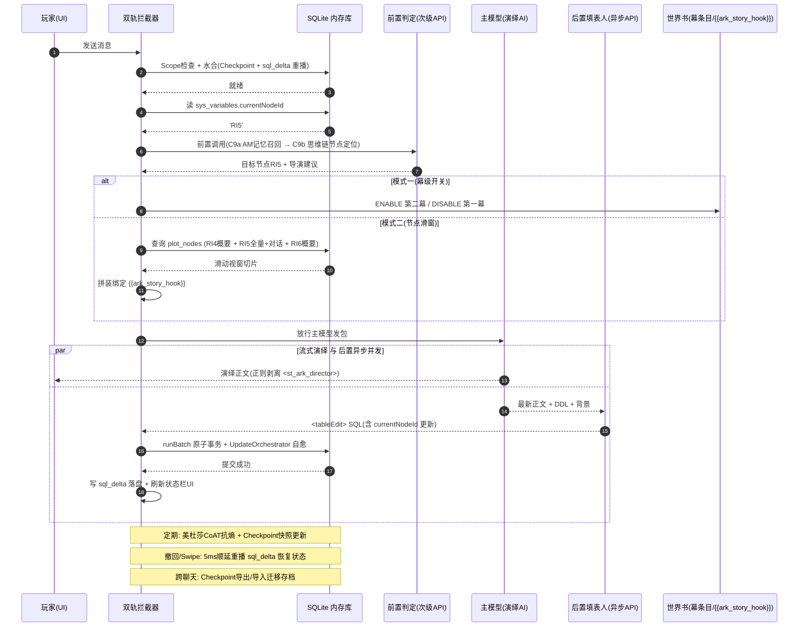

# shujuku 逆向取舍边界与剧情模块完整性定稿 (3_2_shujuku逆向取舍边界与剧情模块完整性定稿.md)

> **文档定位**: 本项目对 `shujuku`（ACU 数据库扩展）的**逆向取舍边界终稿**。为让剧情模块具备"完整、可运行的使用体验"，逐子系统敲定【保留 / 丢弃 / 待定】与理由，并端到端说明闭环如何成立。
> **决策背景**: 历经多轮群聊一手材料收敛。用户（TonyDG）明确立场：**数据库内置进 ARK_STATUSBAR 单插件**（非双插件）、**双轨加载模式（幕级开关为主 + 节点滑窗为备选）都保留**、**总结+召回为必需**、**运行时保留 SQL 但持久层兼容 JSON 且不改变旧档数据类型**。
> **纪律**: 本定稿仅基于 `@types` 与 `1_*` 逆向文档事实，不臆造 shujuku 不存在的能力；仅涉及沙盒 `src/sandbox_shujuku/`，严禁改动主项目。

---

## 一、评审标尺：什么是"完整、可运行体验"

本定稿所有取舍均对照以下五条标尺打分，避免"功能清单越列越长、越判断越失灵"：

1. **闭环完整**：召回 → 判定 → 注入 → 演绎 → 变异 → 落盘 → 撤回重播 → 跨聊天迁移，全链路每个环节有可运行实现，无断链。
2. **零宿主黑盒依赖**：可在任意酒馆版本 / 独立 App 稳定运行（遵循 `3_1` 的 Bypass 无头解耦）。
3. **数据不腐化**：长线 RP 下 Token 不线性暴涨（抗熵）、撤回/分叉状态强一致、不丢档、不改旧档数据类型。
4. **玩家受控**：AI 不瞎跑剧情，玩家能监视/纠偏（可交互界面兜底）。
5. **边际成本合理**：不引入超出剧情模块需要的复杂度（避免把 shujuku 整套 Multi-Agent 复杂度搬来做包袱）。

---

## 二、shujuku 全子系统清单（逆向事实盘点）

| # | 子系统 | 出处 | 一句话职责 |
|---|---|---|---|
| C1 | SqliteEngine (sql.js) | 1_2/1_3 | 内存关系库，事务 runBatch、DDL/DML 执行器 |
| C2 | SchemaMapper | 1_2/1_3 | Sheet↔DDL 双向转换、fallback DDL 猜测 |
| C3 | SyncBridge | 1_2/1_3 | DB↔ChatMessage JSON 绑定，V1 content[][]↔V2 row_id 双向迁移 |
| C4 | ITableStorageProvider 接缝 | 1_1 | Native/SQLite 双模式透明切换 |
| C5 | Native DSL 模式 | 1_2 | insertRow/updateRow/deleteRow 二维数组 DSL |
| C6 | NameMapper + 租约 | 1_2 | DDL 注释建中英表/列名映射 + OwnerToken 续租 |
| C7 | TableQueryBuilder ORM 代理 | 1_1/1_2 | `db.表名.where().get()` 链式查询 |
| C8 | stable-row-id 主键锁 | 1_2_3 | reserved Set 锁定曾用 row_id 防回放错乱 |
| C9 | 天之音 (Pre-Main 召回) | 1_2_1 | AM 编码召回 + 时间词映射 + 幽灵注入 |
| C10 | 填表人 (Post-Main 变异) + UpdateOrchestrator | 1_2_1 | `<tableEdit>` SQL 提取 + 报错自愈重试 |
| C11 | 美杜莎 CoAT 7 步合并 | 1_2_1 | 未精简纪要≥20 行时压缩为规范 AM 纪要 |
| C12 | Vector 混合检索 (BM25+RRF) | 1_2_2 | 自研 bigram BM25 + 向量余弦 + RRF 重排召回 |
| C13 | 世界书绿灯接管 (Greenlight Takeover) | 1_2_2 | 快照备份→DISABLE→提权→Token 预算→恢复 |
| C14 | Schema Reconciler (renamePhysicalColumn) | 1_2_2 | 大底模板列增/更名平滑调和 |
| C15 | Chat Scope 作用域隔离 | 1_2 | 切聊天/角色卡时清洗内存库 + 局部投影 |
| C16 | UpdateScheduler & UpdateGroup | 1_2_3 | 多频度阶梯自动填表 + 同 Signature 并发分组打包 |
| C17 | Agent Decision Engine | 1_2_3 | 拓扑排序 + 死锁检测 + 世界书分片并发决策 |
| C18 | WAL/sql_delta + Checkpoint | 1_2/3_1 | 全量快照 + 楼层增量 + 5ms 顺延重播 |
| C19 | 跨聊天快照迁移 (Checkpoint 备份/恢复) | 1_0 | 存档导出/导入跨环境迁移 |
| C20 | 严格 JSON 填表协议分支 | 1_2_1 | 小模型无标签时改输出标准 JSON 包裹 SQL |
| C21 | 人工审查拦截窗 (Edit Window) | 2_2/2_3 | 前置判定后弹出导演核对窗口 |
| P1 | 11 个 UI 页面 | 1_0 | 仪表盘/填表工作台/规则/剧情/Agent/API/续写/导入/数据/高级/开发 |
| D1 | Rollup 占位符 + base64 内联 wasm | 1_3 | 构建期黑客手段（659KB wasm 内联） |
| D2 | toastr / extensionSettings 耦合 | 1_3 | 宿主 DOM/设置黑盒强依赖 |

---

## 三、逐子系统取舍矩阵（终稿）

判定统一采用三判据：**①数据契约**（切过来读不出/读错/丢档→必迁）、**②行为契约**（切过来原本自动发生的事不发生了→必迁）、**③可替代判据**（能否用更简单机制达到同等体验→能则降级）。

### A 区：保留（数据契约 / 高杠杆底座）

| 项 | 判定 | 理由（对完整可运行体验的贡献） | 依赖/代价 |
|---|---|---|---|
| **C1 SqliteEngine** | ✅ 保留 | 数据 SSOT 底座，WAL/撤回/变异建立其上；`core/db/SqliteEngine.ts` 已无头移植 | asm.js 纯 JS，零 wasm 依赖 |
| **C18 WAL/Checkpoint/5ms 重播** | ✅ 保留 | **撤回/分叉强一致 + .jsonl 不膨胀**，存档不腐化命门 | 需 chatMetadata 快照 + 楼层 sql_delta |
| **C10 填表人 + UpdateOrchestrator** | ✅ 保留 | 数据变异闭环入口，自愈率>95%，数值/剧情坐标靠它落盘 | 需 C1/C8 |
| **C9a 天之音 AM 记忆召回（原功能）** | ✅ 保留（原样兼容） | 数据库**最核心功能**：前置拦截时从 chronicle 召回相关 AM 纪要编码 + 时间词映射 + 幽灵注入；**完整保留原行为，绝不替换** | 需 C1 |
| **C9b 剧情节点定位（加法）** | ✅ 保留（新增扩展） | 在 C9a 前置拦截基础上**叠加**：读 plot_nodes 定位 currentNodeId 并决定开哪幕；**不是替换 AM 召回** | 需 C1/C7 |
| **C11 美杜莎 CoAT** | ✅ 保留 | 长线抗熵，阻止纪要/Token 线性膨胀（用户点名"总结必需"） | 需 C1 |
| **C8 stable-row_id 锁** | ✅ 保留 | 撤回/美杜莎删行后防主键复用导致回放错位 | 需 C1 |
| **C3 SyncBridge** | ✅ 保留（需修正） | 旧档 V1↔V2 无损兼容，社区老档不丢、不改类型 | 需 C1/C2；**TEXT 强转修正见§六.1** |
| **C15 Chat Scope 隔离** | ✅ 保留 | 切卡/切聊数据绝对清洗，防张冠李戴 | 需 C1 |
| **C19 跨聊天快照迁移** | ✅ 保留 | 存档迁移/备份，换环境不丢档 | 需 C18 |
| **C16 UpdateScheduler/UpdateGroup** | ✅ 保留（可降配置） | 自动静默填表 + 并发分组省 API，玩家无感体验 | 需 C10 |
| **C6 NameMapper + C7 ORM** | ✅ 保留 | 查询表达力强，提示词内可写 `db.表.where()` | 需 C1 |
| **C20 严格 JSON 填表协议** | ✅ 保留（可选分支） | 兼容不支持自由标签的次级小模型 | 需 C10 |

### B 区：丢弃（脏包袱 / 复杂度不成比例）

| 项 | 判定 | 丢弃理由 | 代价与替代 |
|---|---|---|---|
| **D1 Rollup 占位符 + base64 wasm** | ✅ 丢弃 | 纯构建期技术债，现代 Webpack 项目不需要 | 无代价，asm.js 已替代 |
| **D2 toastr / extensionSettings 耦合** | ✅ 丢弃 | 宿主黑盒硬依赖，违背无头解耦 | 无代价，net 层已剥离 |
| **C5 Native DSL 模式** | ✅ 丢弃 | 极易崩坏（正则硬切割、行号混乱、无法复杂查询），SQLite 全面胜出；统一 SQL 单轨 | 无代价 |
| **C12 Vector 混合检索** | ✅ 丢弃 | 剧情用大纲/剧情节点检索（模式二滑窗天然覆盖）即可，"想太精细没意义" | 用静态节点检索替代 |
| **C17 Agent Decision Engine** | ✅ 丢弃 | 拓扑排序/分片并发是大型 Multi-Agent 复杂度，单玩家剧情线过度设计 | 用"根据当前节点开关幕"的简单判定替代 |
| **C13 绿灯接管 Token 预算提权** | ✅ 丢弃（简化） | 只保留幕级 ENABLE/DISABLE，不搬完整 Token 接管管线 | 简化实现 |
| **C14 Schema Reconciler** | ✅ 丢弃 | 剧情模块不维护大底模板，极少触发 | 导入时一次迁移脚本兜底 |
| **P1 原生 11 个 UI 页面** | ✅ 丢弃 | 不逆向重做，自建剧情专用 UI 兜底对应功能与控制项（见§四.5） | 用自建 UI + 复用表格编辑器组件替代 |
| **智能续写 (Auto Continuation)** | ✅ 丢弃 | 挂机变现引擎，与剧情 RPG 体验无关 | 丢弃 |
| **外部导入 (External Import)** | ✅ 丢弃 | 与运行时体验无关 | 降级为可选工具脚本 |

### C 区：定稿（已收敛，双轨均保留，MVP 范围与必需步骤已定）

| 项 | 定稿结论 | 说明 |
|---|---|---|
| **加载模式一（幕级开关）** | ✅ 主方案，MVP 先做 | 最简 AI 判当前节点 → 开关幕条目；**最小实现只处理模式一** |
| **加载模式二（节点滑窗）** | ✅ 备选（保留，实现延后） | TonyDG 自提备选：脚本划分节点，按判定位置给上下 x 距离节点概要节约 token；**其余功能延后**，前期只做节点逻辑转写（见下行） |
| **节点逻辑转写（新增必需步骤）** | ✅ 必做（前期探索步骤） | 因剧情思维链判的是"节点"而非"幕"，且 AI 在需切幕时倾向不切幕、按节点逻辑编造下节点概要，故须开 agent 逐一获取各剧本节点逻辑位置，转写为独立的**"剧情节点逻辑条目"**（顺延/并行/交汇/时距/依赖），供前置 API 判定节点后脚本准确开闭幕/推宏 |
| **C21 人工审查拦截窗** | ✅ 定稿：MVP 触发剧情变动时弹窗 | 雏形阶段仅在**触发剧情变动时弹出简单弹窗**；并入主项目后按整体 UI 风格定管理剧情状态界面位置与弹窗样式 |
| **C4 存储策略接缝** | ✅ 定稿：读什么存什么 | **读取哪些数据就存哪种数据**（保持原格式与类型），保证切回 shujuku 插件无副作用；Native V1 读取与写入侧均兼容 |

---

## 四、加法位置：剧情自动化在数据库上如何"做加法"

**核心洞察：剧情自动化不新增"业务环"，它只是在既有"前置拦截 → 后置填表"这个双环里，替换召回的内容 + 追加几条 SQL。** 加法落在四个具体位置：

| 加法层 | 落在底座哪 | 具体加法 |
|---|---|---|
| **① 数据端** | 只**加表**，不动底座表逻辑 | 新增 `plot_nodes`（静态剧本切片/幕节点）+ `sys_variables`（currentNodeId / activeAct） |
| **② 前置判定** | 复用"天之音前置拦截"钩子 | **AM 记忆召回（C9a）原样保留**；在其上**叠加**"读 plot_nodes 定位 currentNodeId 并决定开哪幕"（C9b，思维链仍用于定位） |
| **③ 幕开关** | 接在②之后 | 对世界书幕条目做 ENABLE/DISABLE（或模式二单点 `{{ark_story_hook}}`） |
| **④ 落盘** | 复用"后置填表人" | 追加 `UPDATE sys_variables SET var_value=? WHERE var_key='currentNodeId'`，随数值一起 WAL 落盘 |

> 底座（WAL、事务自愈、导入导出、Scope、总结召回）全部原样复用。加法 = **两张新表 + 前置判定器改造 + 幕开关控制器 + 追加一条落盘 SQL + 一个剧情控制界面**。

> **剧本侧必要步骤（节点逻辑转写）**：除上述运行时加法外，MVP 前必须先开 agent 逐一读取各剧本的节点逻辑位置（顺延/并行/交汇/时距/依赖），**转写为世界书中一个独立的"剧情节点逻辑条目"**。该条目是 C9b 判定与幕开关的**静态依据**（与 `plot_nodes` 配套），弥补"思维链只判节点、不会可靠报告切幕"的缺口，让脚本能据此准确开闭幕条目 / 推送准确节点文本到宏位。

---

## 五、端到端闭环（召回 → 判定 → 注入 → 演绎 → 变异 → 落盘 → 撤回重播 → 跨聊天迁移）

**链路闭环校验**：
1. **召回/判定**：C9a AM 记忆召回原样运行（底座核心）；C9b 在其上叠加读 `plot_nodes` 定位当前节点（双轨主判）。✅
2. **注入**：模式一 ENABLE 幕条目 / 模式二替换 `{{ark_story_hook}}`。✅
3. **演绎**：主模型读取当前节点剧本 + 对话参考，DOM 剥离思考块。✅
4. **变异**：C10 后置填表人提取 SQL，C8 锁 row_id。✅
5. **落盘**：C18 sql_delta + Checkpoint。✅
6. **撤回重播**：C18 5ms 顺延重播，C1 状态回滚。✅
7. **跨聊天迁移**：C19 Checkpoint 导出/导入。✅
8. **抗熵**：C11 美杜莎压缩纪要。✅

---

## 六、关键实现收口（诚实标注的修正与红线）

### 6.1 SyncBridge 单元格类型修正（必须做）
当前 `core/db/SyncBridge.ts` 基线将所有业务列建为 `TEXT`、导出走 `String(cell)`，导致数字被转字符串，**违背"不改变旧档数据类型"**。需两处小改：
1. **SchemaMapper 按数据推断列类型**（INTEGER / REAL / TEXT），非一律 TEXT；
2. **导出保留单元格原始类型**：数字写回数字、`null` 写回 `null`、字符串才写回字符串，不做强转。

验收：V1 JSON 往返后，单元格类型与旧档完全一致；载体类型（V1 JSON）不被改写。

### 6.2 存储选型定稿
- **运行时 = SQL**（SQLite 内存库，单真值源，CRUD/查询走 SQL）；
- **持久层 = V1 JSON 契约**（兼容 json + 不改变旧档存储类型）；
- `sql_delta`/Checkpoint 仅作为**新开聊天的可选优化**，绝不触碰旧档的存储载体与类型。

### 6.3 红线
- 示意图与实现一律以 `@types` 与 `1_*` 逆向事实为准，不臆造 shujuku 不存在的能力。
- 双轨加载模式一/模式二**都不弃**，逐个摸索；**MVP 只做模式一（幕级开关）**，模式二其余功能延后。
- **节点逻辑转写是 MVP 前必需步骤**：须转写独立"剧情节点逻辑条目"作为 C9b 判定与幕开关的静态依据，禁止跳过（否则无法准确判幕切换）。
- 架构为**内置单插件**，底座层/加法层代码分层解耦，不拆双插件。
- 涉及宿主原生世界书 `setWorldbookEntryState` 等调用，以 `@types` 原生声明为准。

---

## 七、脏包袱清单（丢弃的代价与替代）

| 被丢弃项 | 代价 | 替代方案 |
|---|---|---|
| Native DSL 模式 | 无（统一 SQL 单轨） | SQLite 全覆盖 |
| 语义向量/BM25+RRF | 语义召回精度下降 | 大纲/剧情节点检索（模式二滑窗）兜底 |
| Agent 决策拓扑/分片 | 多任务并发调度能力 | 简单"根据节点开关幕"判定 |
| 绿灯 Token 预算接管 | 世界书 Token 精细预算控制 | 幕级 ENABLE/DISABLE + `{{ark_story_hook}}` 单点 |
| Schema 自动调和 | 模板列更名自动化 | 导入时一次性迁移脚本 |
| 11 个原生 UI 页 | 原生功能入口消失 | 自建剧情 UI 兜底对应功能与控件（表格编辑器组件先复用、后续风格化） |
| 智能续写 / 外部导入 | 挂机/批量导入能力 | 弃（与剧情体验无关） |

---

## 八、迁移底线三判据总表（用户转入私有引擎的体验契约）

**数据契约（必迁，一条不能少）**：SQLite 底座、8 张核心表、表格模板预设、填表规则、剧情推进预设 + API 预设库、各类提示词导入导出、旧档 V1↔V2 无损兼容。

**行为契约（必迁，切了体验倒退）**：自动填表调度（频度阶梯 + skipFloors + 手动 N 层）、填表执行 + 自愈、召回（天之音）、总结（美杜莎）、WAL/Checkpoint/撤回重播 + stable-row_id、跨聊天 Checkpoint 导出/导入、可视化表格编辑/手动改数据。

**可替代判据（降级迁移）**：语义向量→大纲检索；Agent 拓扑→简单节点开关；绿灯接管→幕级开关；Schema 调和→迁移脚本；严格 JSON 协议→可选分支。

**非契约（弃）**：智能续写、外部导入、11 个原生 UI 页、构建期技术债、宿主耦合。

---

## 九、遗留点定稿（用户已逐项拍板）

1. **C21 人工审查/交互界面形态**：✅ 定稿——雏形阶段仅在**触发剧情变动时弹出简单弹窗**即可；并入主项目后，再根据整体 UI 风格确定管理剧情状态界面的位置与弹窗样式。
2. **C4 存储策略接缝**：✅ 定稿——**读取哪些数据就存哪种数据**（读什么存什么，保持原格式与类型），确保切回 shujuku 数据库插件时无副作用；Native V1 读取与写入侧均保持兼容。
3. **模式一/模式二探索顺序与节点逻辑转写**：✅ 定稿——
   - **MVP 只做模式一（幕级开关）**；模式二（节点滑窗）其余功能延后实现。
   - **但节点逻辑转写是前期必需步骤**：因剧情思维链判的是"节点"而非"幕"，且 AI 在需要切幕时倾向不切幕、转而按节点逻辑编造下节点概况，导致用户需频繁查世界书判幕。
   - 因此无论哪种模式，为保证剧情切换准确，须**开 agent 逐一获取各剧本节点逻辑位置并转写为独立的"剧情节点逻辑条目"**（存储节点间顺延/并行/交汇/时距/依赖），供前置 API 判定节点位置后，脚本能准确开关对应幕条目 / 或推送准确节点文本到对应宏位。

---

*定稿完成。核心决策已由用户逐轮拍板，本文件为最终取舍边界，供后续剧情自动化引擎开发引用。*