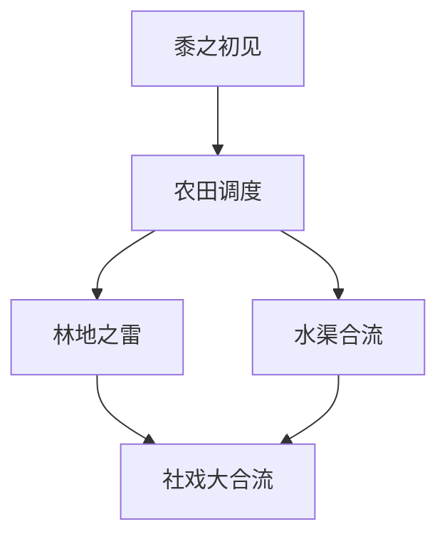

# 任务转交：剧情世界书解析器 (PlotParser) 与 Mermaid-DAG 标准落地

> **文档定位**：这是给下一任负责 `sandbox_shujuku` 剧情模块的 Agent 的**唯一有效任务交接书**。
> **纪律红线（先读这个）**：
> 1. 本任务的真实上下文**只在此处**。**严禁**去 `.kilocode/development_logs/feat_story-engine-v2/` 下翻 3 月份的旧讨论——那是早期剧情自动化的历史探讨，与本任务无关，会把思路带偏。
> 2. 一切设计必须从 `references/7.20最新整合剧情世界书/` 的**真实物理文本**出发。**禁止臆造任何自定义标签**（如 `[节点大纲]`、`[环境描写]`、`[分支选项]`），禁止让创作者为你的解析器重写剧本。
> 3. 上一任失败的根本原因有三：正则极度脆弱、凭空捏造模板、DAG 形式分裂（冷 JSON 无表达力 / 重黑盒切片两头不讨好）。本文档针对这三点给出**可落地的事实约束**。

---

## 〇、 委派节点与阶段定位（先读，决定你何时/如何被派发）

**本 handoff 是 `3_2_shujuku逆向取舍边界与剧情模块完整性定稿.md` 中「节点逻辑转写」的落地执行书**。`3_2` 已把「节点逻辑转写」定为 **MVP 前必需步骤**（见其 §三.C区、§四、§六.3、§九.3）。

- **本质**：这是一个**剧情资产侧（世界书侧）的前期探索/导入步骤**，与数据库底座逆向（`TASK_HANDOFF_数据库记忆召回与存储核心保留.md`，负责 chronicle/WAL/天之音等底座）**互相独立、可并行**。
- **委派节点**：在 `3_2` 取舍定稿之后、**模式一（幕级开关）运行时实现之前**，**逐个剧本（per-worldbook）**派发一次本任务。
- **产出**：即 `3_2` 要求的**「剧情节点逻辑条目」**（Mermaid-DAG 载体）——它是 C9b 前置判定与幕开关的**静态依据**，也是模式二 `plot_nodes` 建索引的前置素材。
- **为什么必须现在做**：`3_2` 明确——剧情思维链判的是"节点"而非"幕"，且 AI 在需切幕时倾向不切幕、按节点逻辑编造下节点概况；没有这份转写条目，脚本无法准确判断何时开关幕条目。
- **阶段切分（重要）**：
  - **MVP（模式一）只做「转写」**：逐本提取节点逻辑 + **节点↔幕映射**，产出「剧情节点逻辑条目」。**不需要**完整内容切片（summary/对话抽取）。
  - **模式二（延后）才做「完整 PlotParser」**：内容切片 + 对话抽取 + 建 `plot_nodes`。本 handoff 为两者都立好规格，但**派发时先按 MVP 范围执行转写**。
- **纪律**：本任务在 `src/sandbox_shujuku/` 沙盒内完成，严禁触碰主项目；严禁臆造标签；严禁要求创作者重写剧本。

---

## 一、 三大核心痛点（用户已认可的问题框架）

1. **解析器正则极其脆弱**：无法兼容创作者多变的标题格式（如 `剧情节点HS1`、`号角线剧情节点1`、`萨卡兹剧情节点1`、`交汇节点1：RI22/MS2`）和多变的对话冒号/引号格式（双引号包裹、无引号全角冒号，冒号有全角/半角/漏标点），无力编写高容错代码。
2. **模板设计一塌糊涂、脱离事实**：不尊重既有世界书真实排版，臆想并强推繁琐伪标签，逼迫人类重写剧本，败坏 Vibecoding 体验。
3. **缺乏兼顾"脚本读取"与"AI 提示词理解"的 DAG 表达格式**：需要一套既能让脚本 5ms 轻松解析、又能以原生 Markdown 渲染并在 Prompt 中让大模型拥有极高拓扑认知深度的表达标准。

---

## 二、 事实基底：世界书"多变表面 + 不变核心"

下面对真实资产做的全量扫描结果，是设计解析器的**唯一事实依据**。物理路径：`references/7.20最新整合剧情世界书/`（52 部剧情世界书 JSON）。

### 2.1 顶层结构（全量一致，不变）
- 每个 `.json` 根节点只有唯一键 `entries`，无 `name`/`description` 元数据。
- `entries` 以字符串 uid 为键，每条含 `uid/comment/content/constant/enabled/position/key/keysecondary`。
- 条目在功能上收敛为**四类**：逻辑条目、幕级剧本条目、导航总览条目、角色/设定条目。

### 2.2 剧情节点（Node）标题行——"多变"的根（全量扫描数据）
节点不拆分成独立条目，而是**平铺在幕条目 `content` 的大文本内**，以"标题行"为界。**全量 52 部扫描**：含节点关键词且含数字的行共 **6,278** 行，其中**独立标题行 3,844 行 / 670 种 distinct 变体**（数字压平为 `#` 计）。真实命名多样性远超 `剧情节点HS1` 单一样式：

```text
剧情节点RI#            # 前缀"剧情节点"+字母码（74 处）
支线剧情节点#          # 前缀"支线剧情节点"（256 处）
罗德岛剧情节点# / 自救军剧情节点# / 佣兵小队剧情节点#   # 阵营前缀
萨卡兹剧情节点# / 阿米娅剧情节点# / 整合运动剧情节点#
推进之王剧情节点# / 临光线剧情节点# / 感染者骑士线剧情节点#
剧情节点彩六线# / 剧情节点塞西莉亚线# / 剧情节点支线#    # "线"后缀
号角剧情节点# / 老鲤线剧情节点# / 玛格达尔剧情节点#
剧情节点#            # 纯数字（72 处）
剧情节点st# / 剧情节点skz# / 剧情节点lf#               # 小写码
BS#剧情节点          # 英文码前置（21 处）
后日谈剧情节点# / 终幕剧情节点#
交汇剧情节点：RI#/MS# / 剧情交汇点：…剧情节点…和…剧情节点…   # 交汇/合并
```

**关键区分（容易踩坑）**：含"剧情节点"+数字的行里，还有 **2,434 行 / 1,577 种**是**依赖关系描述行**（如 `剧情节点ED#在剧情节点ED#之后顺延发生`、`- 据剧情节点发生逻辑条目…`），它们**不是节点标题**，不能当作切片起点。解析器必须先把这两类行分开。

**不变的核心**：任何节点标题都包含一个**唯一 ID**（形如 `前缀+码`，码含数字），且**该行独立成行、行尾干净**（至多带冒号/括号/斜杠）。解析必须以"含数字的 ID + 独立成行 + 行尾干净"为不变量来定位，而不是硬编码某几个前缀。

### 2.3 对话/台词行——全量扫描数据
- **双引号包裹型** `"[角色名]": [台词]`：全量 **136,644** 行（可靠，几乎无假阳性），早中期世界书主导。
- **无包裹全角冒号型** `[角色名]：[台词]`：全量 **约 30,694** 行（启发式统计，可能混入少量非台词的冒号收尾行），后期世界书主导。
- **动作/叙述行**（无冒号，如 `他张开双臂。`、`""`、`—`、`（过了一段时间）`）：大量穿插。
- **`- ` 前缀行**：部分早期剧本（如主线第一至第五章）对话前有 `    - ` 缩进列表符。

> 注：以上对话计数为**行级启发式**，用于证实"双引号/无引号并存"这一排版事实；精确归类需在 `PlotParser` 内用"标头之后 + 行内含 `名前`+冒号"二次判定，测试时逐行断言。

### 2.4 对话参考标头——"多变"的又一根（全量去噪后约 11 种标准变体，非 28 种）
台词区由标头引出，标准变体如下（必须用**多路退避**匹配，不能只认一个）：

```text
本节点重要对话参考：        （占绝大多数，2274 处）
本节点重要参考对话：
本剧情节点重要对话参考：
本节点重要对话参考:          （半角冒号）
本节点重要对话参考;          （分号结尾）
本节点重要对话参考           （无冒号）
本节点重要对话参考 ：        （冒号前有空格）
本节点 重要对话参考：        （中间有空格）
本节点对话参考： / 节点重要对话参考： / 本节点中重要对话参考：
+ 上述任意变体 + "：无" / "：不多" / "：" 后直接结束
```

> 说明：此前误报"28 种变体"，是把大量"对话"结尾的**叙述行**（如 `林入场，与董阿伯对话`）也计入了；去噪后真正的**标准标头约 11 种**。解析器仍要用宽松匹配兜底，但测试断言以这 11 种为准。

### 2.5 四个不变的核心逻辑
1. 剧本 = 幕（Act）的集合；每个幕的 `content` 内平铺多个节点。
2. 每个节点 = 唯一 ID +（可选）事件概括 Summary +（可选）环境描写 +（可选）对话参考区。
3. 节点之间存在**依赖/时序关系**，由逻辑条目（独立条目 或 幕内首段）用自然语言描述。
4. 先后关系语言模式（P 不变）：
   - `顺延发生`（先后）
   - `同时发生` / `在不同地点`（并行）
   - `交汇`（多路合并）
   - `隔了一段时间` / `N天后`（时间间隔）
   - `依赖于X发生`（前置于依赖）

> **结论**：世界书**表面千变万化，但"按行定位节点 + 按标头切对话 + 自然语言描述依赖"的核心逻辑恒定**。解析器必须围绕这个恒定核心做**多路退避**，而不是为一个具体格式写死。**尤其要先区分"独立标题行"（670 种变体）与"依赖关系描述行"（1,577 种变体），后者绝不能当节点起点。**

---

## 三、 目标一：`PlotParser.ts` 多路退避物理解析器（模式二范围，MVP 可暂缓内容切片）

**物理路径**：`src/sandbox_shujuku/core/PlotParser.ts`（或 `core/parser/PlotParser.ts`）。

> **阶段注**：完整内容切片（summary/对话抽取）服务于**模式二滑窗**，属延后范围。**MVP（模式一）只复用它的「节点标题识别」逻辑来支撑转写**，不必先实现全部内容切片。但本目标规格先行立好，避免模式二返工。

**总体原则**：**位置切片优先，正则只做定位标记（Anchor），不做全文精确匹配**。采用"多路退避"：先尝试最鲁棒的通用规则，不命中再逐级回退到更具体的变体规则。

### 3.1 节点切片（Slicing by physical offsets）
1. 用**高阶定位正则**扫描整个 `content`，收集所有符合"节点标题行"的候选起点。定位正则要点：
   - 必须**强制包含数字 `\d`**（节点 ID 的不变量），排除"剧情节点发生逻辑"这类纯文本假阳性。
   - 必须**独立成行且行尾干净**（至多带冒号/括号/斜杠）。
   - **必须先排除依赖关系行**：行内含 `顺延发生`/`同时发生`/`之后`/`发生`/`对话参考` 等关系词的一律不当作标题起点（全量 1,577 种依赖变体都带这些词）。
   - 必须兼容：`剧情节点+码`（英文码大小写/纯数字）、`支线/阵营名/线名+剧情节点+数字`、`剧情节点+线后缀`、`英文码+剧情节点`、`交汇剧情节点/剧情交汇点`（见 2.2 的 670 种变体）。
2. 对每个候选起点，记录其在字符串中的**物理偏移量**。
3. 用 `content.substring(起点偏移, 下一节点起点偏移)` 切出每个节点的纯净文本块。
4. **多路退避**：若高阶层级正则漏切（如某节点标题格式完全出格），退到"按 `本节点重要对话参考：` 标头 + 后续节点标题"双重锚点二次切分，并输出 `warnings` 供测试断言核对，**绝不静默吞错**。

### 3.2 对话行解析（Dialogue extraction）
定位到对话参考标头后，对后续行用**兼容正则**过滤：
```javascript
/^\s*(?:"([^"]+)"|'([^']+)'|([A-Za-z0-9_\u4e00-\u9fa5？！\(\)（）\.]+))\s*[:：]\s*(.*)$/
```
- 吞掉：双引号名、单引号名、无引号名；全角 `：` 与半角 `:`。
- 保留：`- ` 前缀（先剥离再匹配）。
- 非对话行（无冒号的动作/环境/旁白）归入 `narrative`，不丢弃。
- 标头行本身（`本节点重要对话参考...`）与标头后的异常（如"：无"）必须被识别并跳过，不误判成台词。

### 3.3 大纲（Summary）提取
节点标题行与对话参考标头之间的所有多行自然段落，直接清洗为 `summary`（保留原文，不改写、不补标签）。

### 3.4 输出结构（内部契约）
```typescript
interface PlotNode {
  id: string;                 // 唯一 ID，如 "HS1"
  rawTitle: string;           // 原始标题行全文
  start: number; end: number; // 在 content 中的物理偏移
  summary: string;            // 事件概括原文
  dialogue: { speaker: string; line: string }[];  // 台词
  narrative: string[];        // 动作/环境/旁白行
}
```

---

## 四、 目标二：Markdown-Mermaid-DAG 标准 = 「剧情节点逻辑条目」（MVP 必需）

**本目标即 `3_2` 要求的「剧情节点逻辑条目」的载体格式**（见 `3_2` §三.C区「节点逻辑转写」、§四、§九.3）。它是 **MVP（模式一）的必需产出**，供 C9b 前置判定与幕开关使用。

**废弃**一切复杂 JSON-DAG 邻接表（`{"HS2":["HS1"]}`）——它无叙事表达力，AI 无法理解，且被用户明确否决。

**采用**标准 Markdown **Mermaid `graph TD`** 作为节点依赖的黄金表达规范：



- **脚本读取（5ms）**：用 `/^\s*([A-Za-z0-9_]+)(?:\[([^\]]+)\])?\s*-->\s*([A-Za-z0-9_]+)/gm` 扫一遍即可在内存重建 DAG 邻接表 / successors / dependencies。
- **AI 感知**：Mermaid 是通用 Markdown 规约，LLM 拓扑认知度极高，能秒懂前后因果与并行分支。
- **双向能力**：从 `PlotParser` 解析出的节点关系（顺延→边，同时→并行边，交汇→多入边，依赖→前置边）**编译**成上面的 Mermaid 文本；同时**解析**器也能把外部 Mermaid 块读回成邻接表。
- **必须附带 节点↔幕 映射（MVP 判幕关键）**：转写条目除 Mermaid 边外，还要记录**每个节点 ID 归属哪个幕**（如 `HS1..HS7 → 第一幕`），供模式一开关幕时据此准确 ENABLE/DISABLE 对应幕条目。转写时须逐本确定节点归属幕，并在条目内显式列出。

---

## 五、 目标三：`compilePrompt` 编译器 API

在 `PlotParser.ts` 中提供：
```typescript
compilePrompt(dag: DagGraph, currentNodeId: string): string
```
职责：把**当前节点**的全量剧本+对话、**前置节点**的 Summary 与大背景、**后续走向线索**（Mermaid DAG），拼装成一段极具空间/因果认知深度的 System Prompt 文本（含 Mermaid 拓扑块），供宿主主模型（演员）直接使用。**不引入任何自定义 XML/HTML 标签**。

---

## 六、 目标四：100% 覆盖测试

- 物理路径：`src/sandbox_shujuku/core/__tests__/`（如 `plotParser.test.ts`）。
- 测试资产：**物理读入真实文件** `references/7.20最新整合剧情世界书/支线/炎国/怀黍离.json` 与 `主线/风暴瞭望.json`（以及尽可能多的变体样例）。
- 必须断言：
  1. 100% 解析出 `怀黍离` 全部节点（HS1→ED4），无漏切、无错切。
  2. **标题/关系行分离**：对所有含"剧情节点"+数字的行，断言"独立标题行"全命中、且**依赖关系行（含 `顺延发生`/`同时发生`/`之后` 等）全部被排除**，不误当节点起点。
  3. 对下发的**变体标题样例集**（`剧情节点HS1`、`支线剧情节点2`、`萨卡兹剧情节点1`、`罗德岛剧情节点1`、`剧情节点彩六线1`、`BS3剧情节点：`、`交汇剧情节点：RI22/MS2`、`后日谈剧情节点1` 等）逐一断言命中。
  4. 对话行 speaker/line 正确匹配，双引号/无引号/全半角冒号全部覆盖，动作行不丢失。
  5. 能通过 Mermaid 块在内存中重建依赖邻接表。
- 运行方式：与现有 `db.test.ts` 一致（`pnpm test` 或对应脚本），一键通过，**绝无飘红**。

---

## 七、 任务格式（指令结构体）

**[任务名称]** 剧情世界书「节点逻辑转写」→ 产出「剧情节点逻辑条目」（Mermaid-DAG），并于模式二阶段扩展为完整 `PlotParser`（sandbox_shujuku）

**[背景上下文]** 见上文"〇委派节点"、"事实基底"与"三大痛点"。本任务在 `src/sandbox_shujuku/` 无头沙盒内完成，**严禁**改动主项目；与数据库底座逆向独立、可并行；**逐个剧本（per-worldbook）派发**。

**[明确的指令清单 (Do's)]**
1. **MVP（模式一）优先**：逐本读取剧本，提取节点逻辑 + 节点↔幕映射，转写为独立的「剧情节点逻辑条目」（Markdown-Mermaid `graph TD`，见目标二/四）。这是 C9b 前置判定与幕开关的静态依据。
2. 实现 `PlotParser.ts`（模式二范围）：位置切片 + 多路退避 + 兼容正则（见目标一），MVP 阶段可先只实现节点标题识别以支撑转写。
3. 提供 `compilePrompt(dag, currentNodeId)` 编译器 API（见目标五）。
4. 在 `__tests__` 编写 100% 覆盖测试，物理读入 `怀黍离.json`、`风暴瞭望.json`，一键通过。

**[明确的禁止清单 (Don'ts)]**
- 严禁臆造任何 `[节点大纲]`/`[环境描写]`/`[分支选项]` 等自定义伪标签，严禁要求创作者重写剧本。
- **严禁跳过转写直接埋进运行时**：MVP 前必须产出「剧情节点逻辑条目」，否则模式一无法准确判幕。
- 严禁写空洞架构书、逃避写代码、留 TODO。
- 严禁偏离 `references/7.20最新整合剧情世界书/` 真实文本去闭门造车。

**[验收标准 (Acceptance Criteria)]**
- **MVP**：对 `怀黍离.json` 产出完整「剧情节点逻辑条目」（含 Mermaid-DAG 边 + 节点↔幕映射），节点 100% 覆盖、幕归属正确。
- `src/sandbox_shujuku/core/PlotParser.ts`（模式二）完整实现，无 TODO。
- 测试对 `怀黍离.json`、`风暴瞭望.json` 及变体样例集一键运行、断言 100% 通过、无飘红。
- `compilePrompt` 能基于真实节点输出含 Mermaid 拓扑块的 System Prompt。